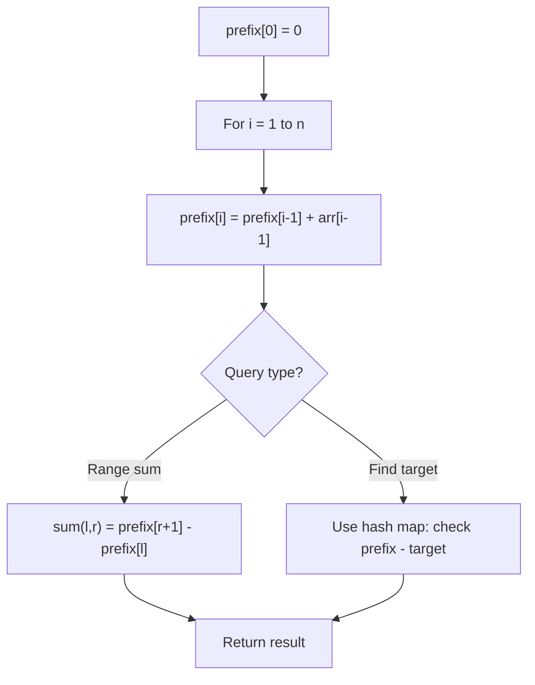

# Problem 1588: Sum of All Odd Length Subarrays

**Difficulty:** Easy  
**Tags:** Array, Math, Prefix Sum  
**Pattern:** Prefix Sum  
**Link:** [leetcode.com/problems/sum-of-all-odd-length-subarrays](https://leetcode.com/problems/sum-of-all-odd-length-subarrays/)

## Description

Given an array of positive integers `arr`, return *the sum of all possible **odd-length subarrays** of *`arr`.

A **subarray** is a contiguous subsequence of the array.

 

Example 1:

```

**Input:** arr = [1,4,2,5,3]
**Output:** 58
**Explanation: **The odd-length subarrays of arr and their sums are:
[1] = 1
[4] = 4
[2] = 2
[5] = 5
[3] = 3
[1,4,2] = 7
[4,2,5] = 11
[2,5,3] = 10
[1,4,2,5,3] = 15
If we add all these together we get 1 + 4 + 2 + 5 + 3 + 7 + 11 + 10 + 15 = 58
```

Example 2:

```

**Input:** arr = [1,2]
**Output:** 3
**Explanation: **There are only 2 subarrays of odd length, [1] and [2]. Their sum is 3.
```

Example 3:

```

**Input:** arr = [10,11,12]
**Output:** 66

```

 

**Constraints:**

	- `1 <= arr.length <= 100`
	- `1 <= arr[i] <= 1000`

 

**Follow up:**

Could you solve this problem in O(n) time complexity?

## Approach: Prefix Sum

Build a prefix sum array where prefix[i] = sum of elements 0..i-1. Any subarray sum [l..r] = prefix[r+1] - prefix[l]. Combine with hash map for O(n) subarray sum queries.

## Pseudocode

```
1. Build prefix sum array: prefix[0]=0, prefix[i]=prefix[i-1]+arr[i-1]
2. Use prefix sums to answer queries:
   - Subarray sum [l..r] = prefix[r+1] - prefix[l]
   - Or use hash map to find prefix[j]-prefix[i] == target
3. Return result
```

## Algorithm Flow



## Complexity Analysis

- **Time:** O(n)
- **Space:** O(n)

## Solution (Python3)

```python
class Solution:
    def sumOddLengthSubarrays(self, arr: List[int]) -> int:
        # Prefix sum approach - O(n) time, O(n) space
        prefix = {0: -1}
        curr_sum = 0
        result = 0
        target = arr if isinstance(arr, int) else 0
        for i, val in enumerate(arr):
            curr_sum += val
            if curr_sum - target in prefix:
                result = max(result, i - prefix[curr_sum - target])
            if curr_sum not in prefix:
                prefix[curr_sum] = i
        return result
```

## Solution (C++)

```cpp
#include <algorithm>
#include <string>
#include <unordered_map>
#include <vector>
using namespace std;

class Solution {
public:
    int sumOddLengthSubarrays(vector<int>& arr) {
        // Prefix sum approach - O(n) time, O(n) space
        unordered_map<int, int> prefix;
        prefix[0] = -1;
        int curr_sum = 0, result = 0;
        int target = arr;
        for (int i = 0; i < (int)arr.size(); i++) {
            curr_sum += arr[i];
            if (prefix.count(curr_sum - target)) {
                result = max(result, i - prefix[curr_sum - target]);
            }
            if (!prefix.count(curr_sum)) {
                prefix[curr_sum] = i;
            }
        }
        return result;
    }
};
```
