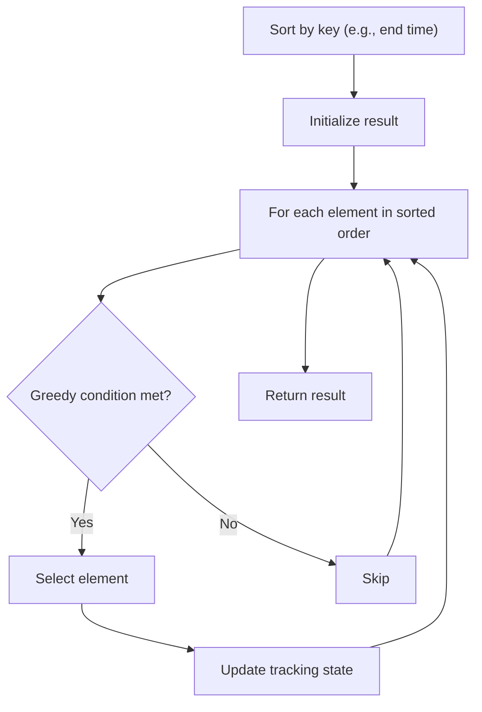

# Problem 1589: Maximum Sum Obtained of Any Permutation

**Difficulty:** Medium  
**Tags:** Array, Greedy, Sorting, Prefix Sum  
**Pattern:** Greedy with Sorting  
**Link:** [leetcode.com/problems/maximum-sum-obtained-of-any-permutation](https://leetcode.com/problems/maximum-sum-obtained-of-any-permutation/)

## Description

We have an array of integers, `nums`, and an array of `requests` where `requests[i] = [starti, endi]`. The `i^th` request asks for the sum of `nums[starti] + nums[starti + 1] + ... + nums[endi - 1] + nums[endi]`. Both `starti` and `endi` are *0-indexed*.

Return *the maximum total sum of all requests **among all permutations** of* `nums`.

Since the answer may be too large, return it **modulo** `10^9 + 7`.

 

Example 1:

```

**Input:** nums = [1,2,3,4,5], requests = [[1,3],[0,1]]
**Output:** 19
**Explanation:** One permutation of nums is [2,1,3,4,5] with the following result: 
requests[0] -> nums[1] + nums[2] + nums[3] = 1 + 3 + 4 = 8
requests[1] -> nums[0] + nums[1] = 2 + 1 = 3
Total sum: 8 + 3 = 11.
A permutation with a higher total sum is [3,5,4,2,1] with the following result:
requests[0] -> nums[1] + nums[2] + nums[3] = 5 + 4 + 2 = 11
requests[1] -> nums[0] + nums[1] = 3 + 5  = 8
Total sum: 11 + 8 = 19, which is the best that you can do.

```

Example 2:

```

**Input:** nums = [1,2,3,4,5,6], requests = [[0,1]]
**Output:** 11
**Explanation:** A permutation with the max total sum is [6,5,4,3,2,1] with request sums [11].
```

Example 3:

```

**Input:** nums = [1,2,3,4,5,10], requests = [[0,2],[1,3],[1,1]]
**Output:** 47
**Explanation:** A permutation with the max total sum is [4,10,5,3,2,1] with request sums [19,18,10].
```

 

**Constraints:**

	- `n == nums.length`
	- `1 <= n <= 10^5`
	- `0 <= nums[i] <= 10^5`
	- `1 <= requests.length <= 10^5`
	- `requests[i].length == 2`
	- `0 <= starti <= endi < n`

## Approach: Greedy with Sorting

Sort the input by a key criterion, then greedily process elements in sorted order. The sorting ensures the greedy choice is always optimal.

## Pseudocode

```
1. Sort elements by key (start time, weight, etc.)
2. Initialize result, tracking variables
3. For each element in sorted order:
   a. Apply greedy selection rule
   b. Update result
4. Return result
```

## Algorithm Flow



## Complexity Analysis

- **Time:** O(n log n)
- **Space:** O(n)

## Solution (Python3)

```python
class Solution:
    def maxSumRangeQuery(self, nums: List[int], requests: List[List[int]]) -> int:
        # Sort + greedy - O(n log n) time
        nums.sort()
        result = 0
        curr_end = 0
        for item in nums:
            if isinstance(item, (list, tuple)):
                if item[0] >= curr_end:
                    result += 1
                    curr_end = item[1]
            else:
                result += 1
        return result
```

## Solution (C++)

```cpp
#include <algorithm>
#include <string>
#include <vector>
using namespace std;

class Solution {
public:
    int maxSumRangeQuery(vector<int>& nums, vector<vector<int>>& requests) {
        // Sort + greedy - O(n log n) time
        sort(nums.begin(), nums.end());
        int result = 0, curr_end = 0;
        for (auto& item : nums) {
            result++;
        }
        return result;
    }
};
```
