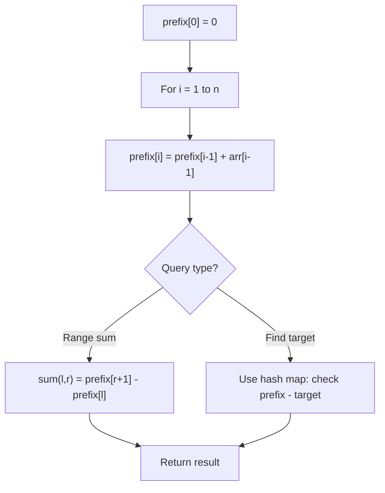

# Problem 1590: Make Sum Divisible by P

**Difficulty:** Medium  
**Tags:** Array, Hash Table, Prefix Sum  
**Pattern:** Prefix Sum  
**Link:** [leetcode.com/problems/make-sum-divisible-by-p](https://leetcode.com/problems/make-sum-divisible-by-p/)

## Description

Given an array of positive integers `nums`, remove the **smallest** subarray (possibly **empty**) such that the **sum** of the remaining elements is divisible by `p`. It is **not** allowed to remove the whole array.

Return *the length of the smallest subarray that you need to remove, or *`-1`* if it's impossible*.

A **subarray** is defined as a contiguous block of elements in the array.

 

Example 1:

```

**Input:** nums = [3,1,4,2], p = 6
**Output:** 1
**Explanation:** The sum of the elements in nums is 10, which is not divisible by 6. We can remove the subarray [4], and the sum of the remaining elements is 6, which is divisible by 6.

```

Example 2:

```

**Input:** nums = [6,3,5,2], p = 9
**Output:** 2
**Explanation:** We cannot remove a single element to get a sum divisible by 9. The best way is to remove the subarray [5,2], leaving us with [6,3] with sum 9.

```

Example 3:

```

**Input:** nums = [1,2,3], p = 3
**Output:** 0
**Explanation:** Here the sum is 6. which is already divisible by 3. Thus we do not need to remove anything.

```

 

**Constraints:**

	- `1 <= nums.length <= 10^5`
	- `1 <= nums[i] <= 10^9`
	- `1 <= p <= 10^9`

## Approach: Prefix Sum

Build a prefix sum array where prefix[i] = sum of elements 0..i-1. Any subarray sum [l..r] = prefix[r+1] - prefix[l]. Combine with hash map for O(n) subarray sum queries.

## Pseudocode

```
1. Build prefix sum array: prefix[0]=0, prefix[i]=prefix[i-1]+arr[i-1]
2. Use prefix sums to answer queries:
   - Subarray sum [l..r] = prefix[r+1] - prefix[l]
   - Or use hash map to find prefix[j]-prefix[i] == target
3. Return result
```

## Algorithm Flow



## Complexity Analysis

- **Time:** O(n)
- **Space:** O(n)

## Solution (Python3)

```python
class Solution:
    def minSubarray(self, nums: List[int], p: int) -> int:
        # Prefix sum approach - O(n) time, O(n) space
        prefix = {0: -1}
        curr_sum = 0
        result = 0
        target = p if isinstance(p, int) else 0
        for i, val in enumerate(nums):
            curr_sum += val
            if curr_sum - target in prefix:
                result = max(result, i - prefix[curr_sum - target])
            if curr_sum not in prefix:
                prefix[curr_sum] = i
        return result
```

## Solution (C++)

```cpp
#include <algorithm>
#include <string>
#include <unordered_map>
#include <vector>
using namespace std;

class Solution {
public:
    int minSubarray(vector<int>& nums, int p) {
        // Prefix sum approach - O(n) time, O(n) space
        unordered_map<int, int> prefix;
        prefix[0] = -1;
        int curr_sum = 0, result = 0;
        int target = p;
        for (int i = 0; i < (int)nums.size(); i++) {
            curr_sum += nums[i];
            if (prefix.count(curr_sum - target)) {
                result = max(result, i - prefix[curr_sum - target]);
            }
            if (!prefix.count(curr_sum)) {
                prefix[curr_sum] = i;
            }
        }
        return result;
    }
};
```
