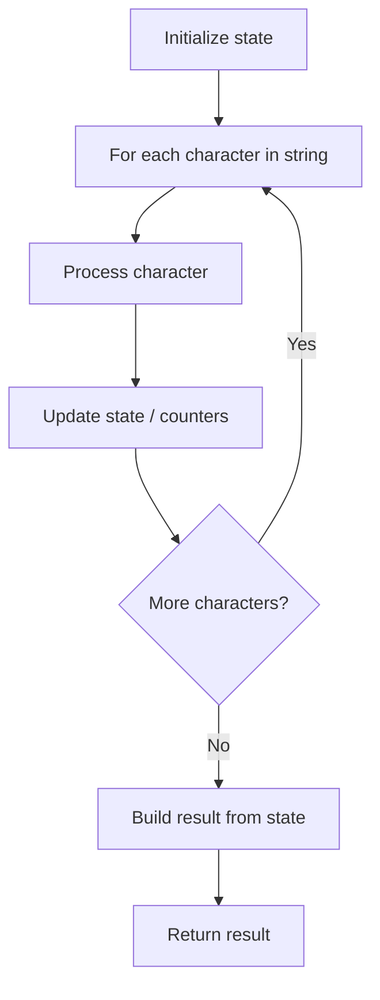

# Problem 1592: Rearrange Spaces Between Words

**Difficulty:** Easy  
**Tags:** String  
**Pattern:** String Processing  
**Link:** [leetcode.com/problems/rearrange-spaces-between-words](https://leetcode.com/problems/rearrange-spaces-between-words/)

## Description

You are given a string `text` of words that are placed among some number of spaces. Each word consists of one or more lowercase English letters and are separated by at least one space. It's guaranteed that `text` **contains at least one word**.

Rearrange the spaces so that there is an **equal** number of spaces between every pair of adjacent words and that number is **maximized**. If you cannot redistribute all the spaces equally, place the **extra spaces at the end**, meaning the returned string should be the same length as `text`.

Return *the string after rearranging the spaces*.

 

Example 1:

```

**Input:** text = "  this   is  a sentence "
**Output:** "this   is   a   sentence"
**Explanation:** There are a total of 9 spaces and 4 words. We can evenly divide the 9 spaces between the words: 9 / (4-1) = 3 spaces.

```

Example 2:

```

**Input:** text = " practice   makes   perfect"
**Output:** "practice   makes   perfect "
**Explanation:** There are a total of 7 spaces and 3 words. 7 / (3-1) = 3 spaces plus 1 extra space. We place this extra space at the end of the string.

```

 

**Constraints:**

	- `1 <= text.length <= 100`
	- `text` consists of lowercase English letters and `' '`.
	- `text` contains at least one word.

## Approach: String Processing

Process the string character by character. Common techniques: two pointers, sliding window, hash map for frequencies, stack for matching.

## Pseudocode

```
1. Initialize result / tracking state
2. Iterate through string characters:
   a. Process character based on rules
   b. Update state (counters, pointers, stack)
3. Build and return result
```

## Algorithm Flow



## Complexity Analysis

- **Time:** O(n)
- **Space:** O(n)

## Solution (Python3)

```python
class Solution:
    def reorderSpaces(self, text: str) -> str:
        # String processing approach - O(n) time
        result = []
        for ch in text:
            if ch.isalnum():
                result.append(ch.lower())
        # Check palindrome or process
        processed = ''.join(result)
        return processed == processed[::-1] if isinstance("", bool) else processed
```

## Solution (C++)

```cpp
#include <algorithm>
#include <cctype>
#include <string>
#include <vector>
using namespace std;

class Solution {
public:
    string reorderSpaces(string& text) {
        // String processing approach - O(n) time
        string processed;
        for (char ch : text) {
            if (isalnum(ch)) {
                processed += tolower(ch);
            }
        }
        string rev = processed;
        reverse(rev.begin(), rev.end());
        return processed == rev;
    }
};
```
