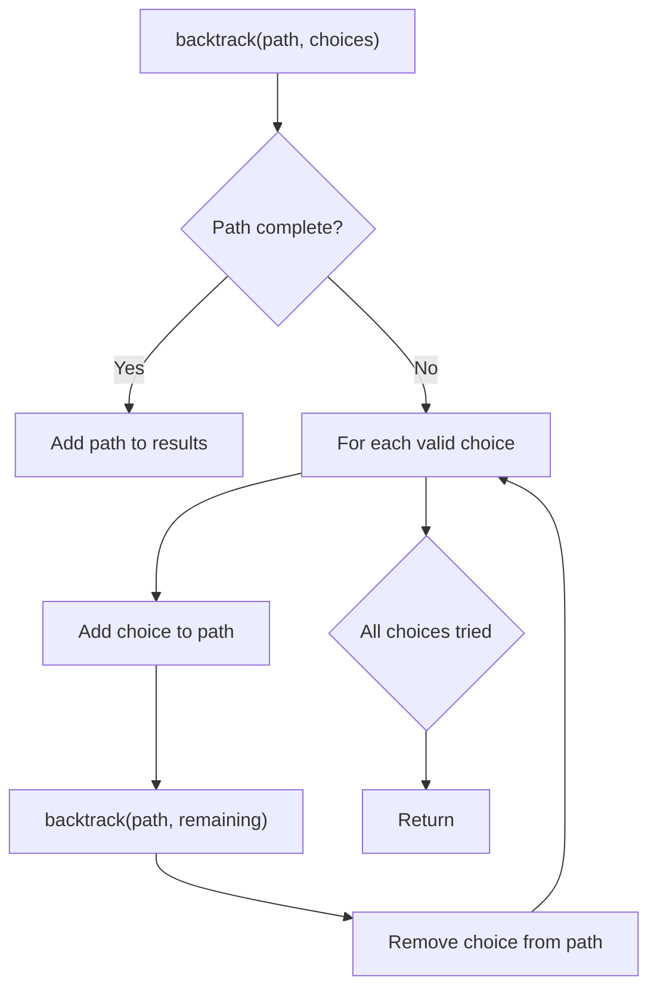
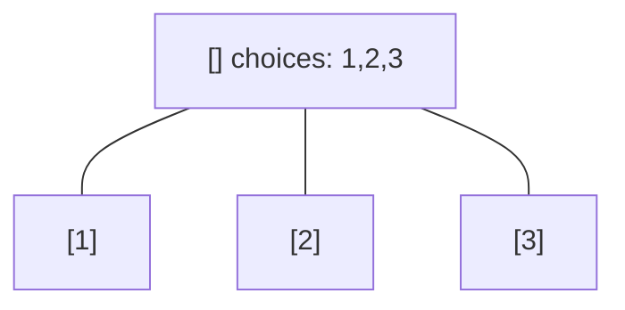
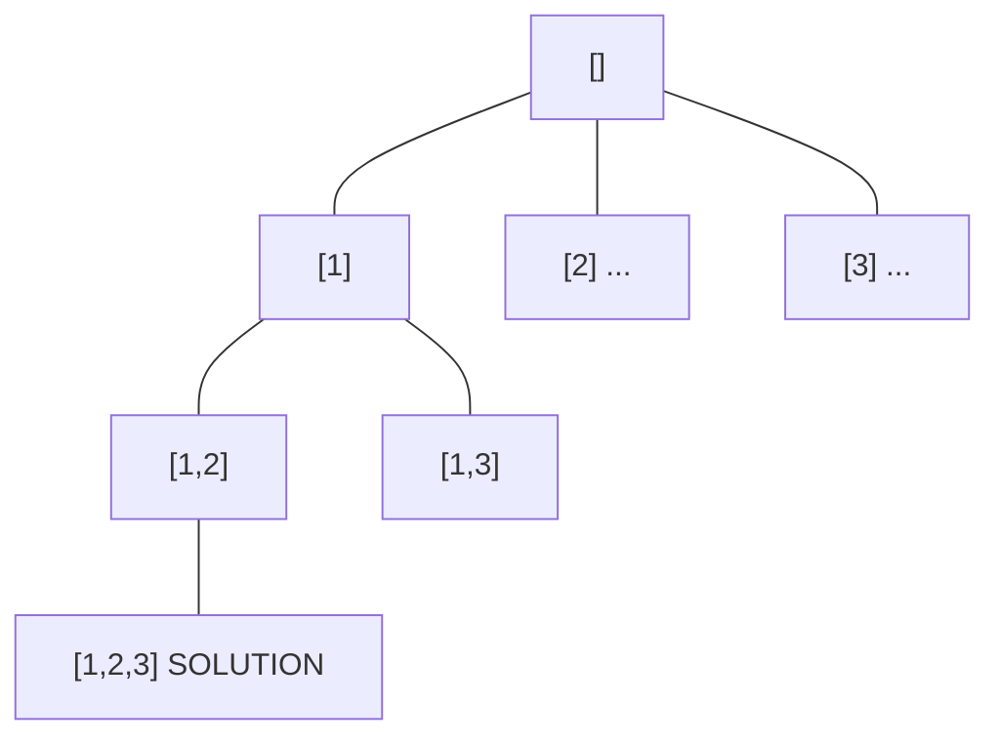
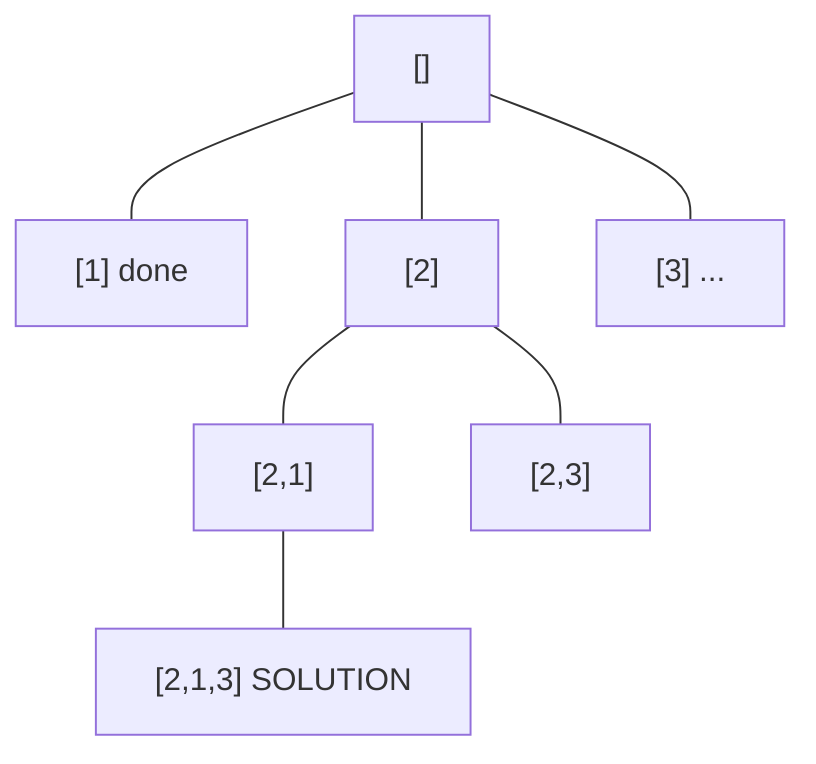
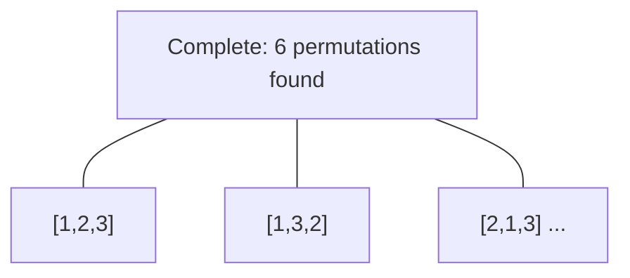

# Problem 1593: Split a String Into the Max Number of Unique Substrings

**Difficulty:** Medium  
**Tags:** Hash Table, String, Backtracking  
**Pattern:** Backtracking  
**Link:** [leetcode.com/problems/split-a-string-into-the-max-number-of-unique-substrings](https://leetcode.com/problems/split-a-string-into-the-max-number-of-unique-substrings/)

## Description

Given a string `s`, return *the maximum number of unique substrings that the given string can be split into*.

You can split string `s` into any list of **non-empty substrings**, where the concatenation of the substrings forms the original string. However, you must split the substrings such that all of them are **unique**.

A **substring** is a contiguous sequence of characters within a string.

 

Example 1:

```

**Input:** s = "ababccc"
**Output:** 5
**Explanation**: One way to split maximally is ['a', 'b', 'ab', 'c', 'cc']. Splitting like ['a', 'b', 'a', 'b', 'c', 'cc'] is not valid as you have 'a' and 'b' multiple times.

```

Example 2:

```

**Input:** s = "aba"
**Output:** 2
**Explanation**: One way to split maximally is ['a', 'ba'].

```

Example 3:

```

**Input:** s = "aa"
**Output:** 1
**Explanation**: It is impossible to split the string any further.

```

 

**Constraints:**

	- 
	`1 <= s.length <= 16`

	
	- 
	`s` contains only lower case English letters.

## Approach: Backtracking

Explore all possible solutions by building candidates incrementally. At each step, make a choice and recurse. If the choice leads to a dead end, undo the choice (backtrack) and try the next option.

## Pseudocode

```
1. Define backtrack(path, choices):
   a. If path is a complete solution: add to results
   b. For each choice in choices:
      - If choice is valid:
        * Add choice to path
        * backtrack(path, remaining_choices)
        * Remove choice from path (backtrack)
2. Call backtrack([], all_choices)
```

## Algorithm Flow



## Visual State Transitions

**Backtracking Decision Tree:**

**Frame 1: Root - start with empty path**


**Frame 2: Explore branch [1]**


**Frame 3: Backtrack, explore [2]**


**Frame 4: All solutions found**



## Complexity Analysis

- **Time:** O(k^n) or O(n!)
- **Space:** O(n)

## Solution (Python3)

```python
class Solution:
    def maxUniqueSplit(self, s: str) -> int:
        # Backtracking - O(2^n) or O(n!) time
        result = []
        
        def backtrack(path, start):
            result.append(path[:])
            for i in range(start, len(s)):
                path.append(s[i])
                backtrack(path, i + 1)
                path.pop()
        
        backtrack([], 0)
        return result
```

## Solution (C++)

```cpp
#include <functional>
#include <string>
#include <vector>
using namespace std;

class Solution {
public:
    int maxUniqueSplit(string& s) {
        // Backtracking - O(2^n) or O(n!) time
        vector<vector<int>> result;
        vector<int> path;
        function<void(int)> backtrack = [&](int start) {
            result.push_back(path);
            for (int i = start; i < (int)s.size(); i++) {
                path.push_back(s[i]);
                backtrack(i + 1);
                path.pop_back();
            }
        };
        backtrack(0);
        return result;
    }
};
```
