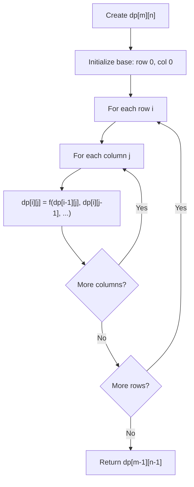
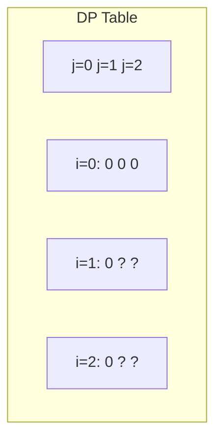
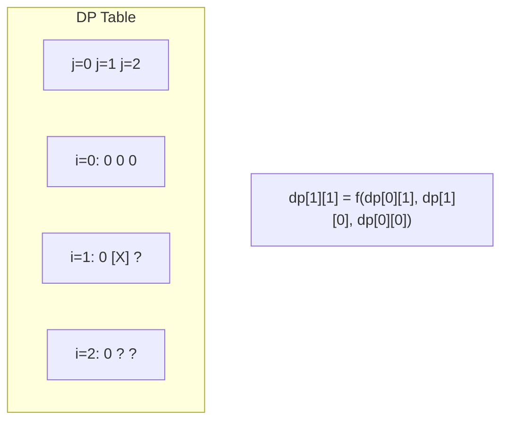
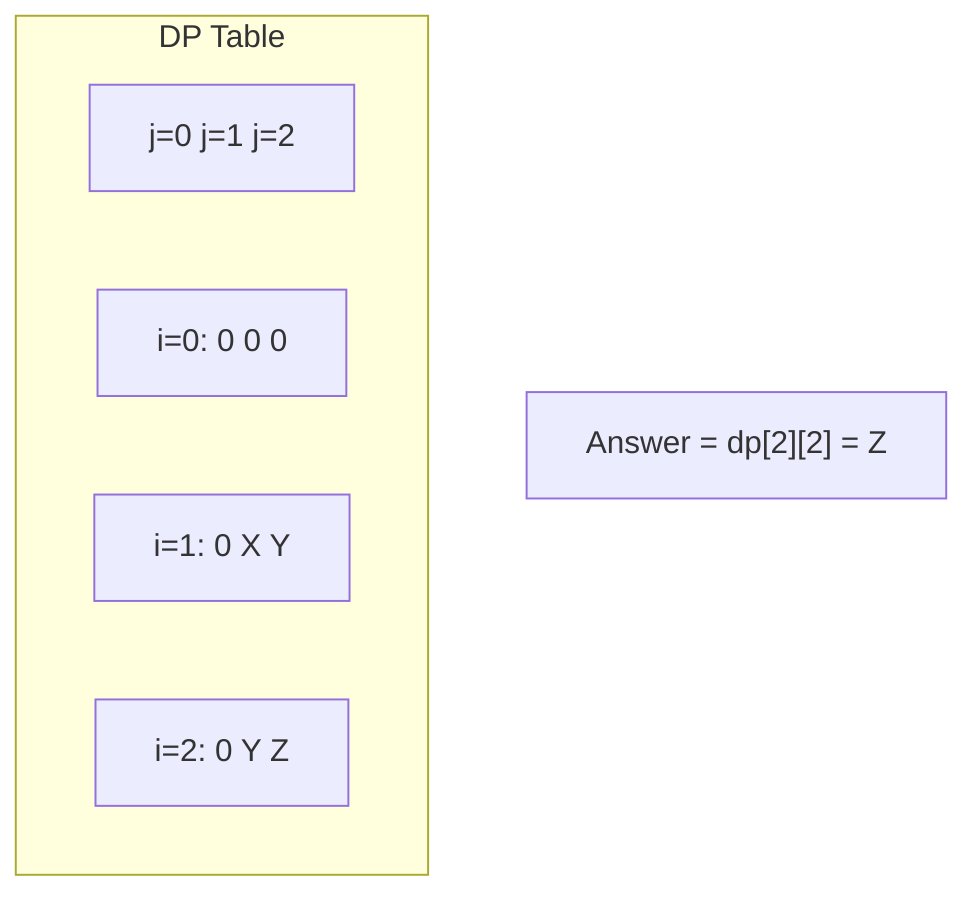

# Problem 1594: Maximum Non Negative Product in a Matrix

**Difficulty:** Medium  
**Tags:** Array, Dynamic Programming, Matrix  
**Pattern:** Dynamic Programming (2D Grid/Matrix)  
**Link:** [leetcode.com/problems/maximum-non-negative-product-in-a-matrix](https://leetcode.com/problems/maximum-non-negative-product-in-a-matrix/)

## Description

You are given a `m x n` matrix `grid`. Initially, you are located at the top-left corner `(0, 0)`, and in each step, you can only **move right or down** in the matrix.

Among all possible paths starting from the top-left corner `(0, 0)` and ending in the bottom-right corner `(m - 1, n - 1)`, find the path with the **maximum non-negative product**. The product of a path is the product of all integers in the grid cells visited along the path.

Return the *maximum non-negative product **modulo** *`10^9 + 7`. *If the maximum product is **negative**, return *`-1`.

Notice that the modulo is performed after getting the maximum product.

 

Example 1:

```

**Input:** grid = [[-1,-2,-3],[-2,-3,-3],[-3,-3,-2]]
**Output:** -1
**Explanation:** It is not possible to get non-negative product in the path from (0, 0) to (2, 2), so return -1.

```

Example 2:

```

**Input:** grid = [[1,-2,1],[1,-2,1],[3,-4,1]]
**Output:** 8
**Explanation:** Maximum non-negative product is shown (1 * 1 * -2 * -4 * 1 = 8).

```

Example 3:

```

**Input:** grid = [[1,3],[0,-4]]
**Output:** 0
**Explanation:** Maximum non-negative product is shown (1 * 0 * -4 = 0).

```

 

**Constraints:**

	- `m == grid.length`
	- `n == grid[i].length`
	- `1 <= m, n <= 15`
	- `-4 <= grid[i][j] <= 4`

## Approach: Dynamic Programming (2D Grid/Matrix)

Use a 2D DP table where dp[i][j] represents the optimal value for the subproblem defined by rows 0..i and columns 0..j. Fill row by row or column by column.

## Pseudocode

```
1. Create dp[m][n] table
2. Initialize base cases (first row, first column)
3. For i from 1 to m-1:
   For j from 1 to n-1:
     dp[i][j] = recurrence(dp[i-1][j], dp[i][j-1], dp[i-1][j-1])
4. Return dp[m-1][n-1]
```

## Algorithm Flow



## Visual State Transitions

**2D DP Table Build:**

**Frame 1: Initialize borders**


**Frame 2: Fill cell by cell**


**Frame 3: Table complete**



## Complexity Analysis

- **Time:** O(m * n)
- **Space:** O(m * n)

## Solution (Python3)

```python
class Solution:
    def maxProductPath(self, grid: List[List[int]]) -> int:
        # Dynamic programming (2D) - O(m*n) time and space
        if not grid:
            return 0
        m, n = len(grid), len(grid[0])
        dp = [[0] * (n + 1) for _ in range(m + 1)]
        for i in range(1, m + 1):
            for j in range(1, n + 1):
                dp[i][j] = max(dp[i-1][j], dp[i][j-1])
                # Add problem-specific transition
        return dp[m][n]
```

## Solution (C++)

```cpp
#include <algorithm>
#include <string>
#include <vector>
using namespace std;

class Solution {
public:
    int maxProductPath(vector<vector<int>>& grid) {
        // Dynamic programming (2D) - O(m*n) time and space
        if (grid.empty()) return 0;
        int m = grid.size(), n = grid[0].size();
        vector<vector<int>> dp(m + 1, vector<int>(n + 1, 0));
        for (int i = 1; i <= m; i++) {
            for (int j = 1; j <= n; j++) {
                dp[i][j] = max(dp[i-1][j], dp[i][j-1]);
            }
        }
        return dp[m][n];
    }
};
```
