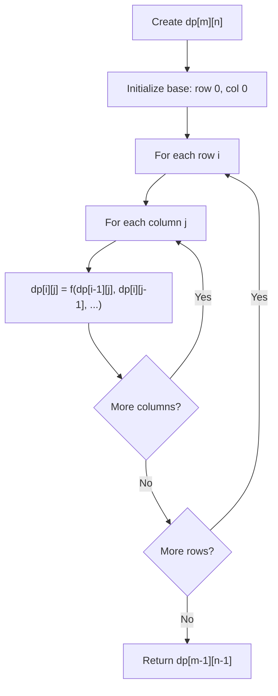
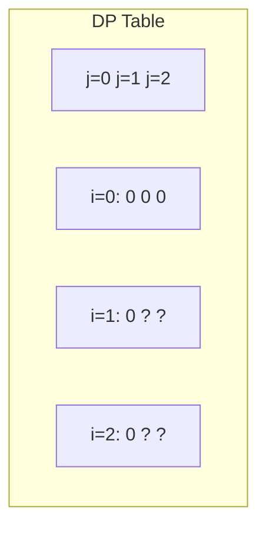
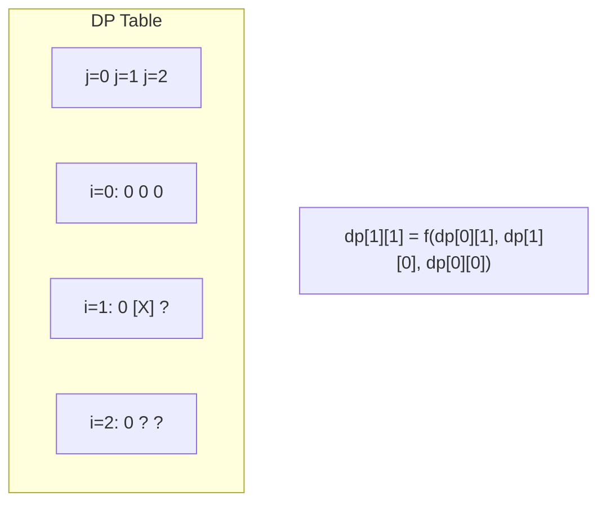
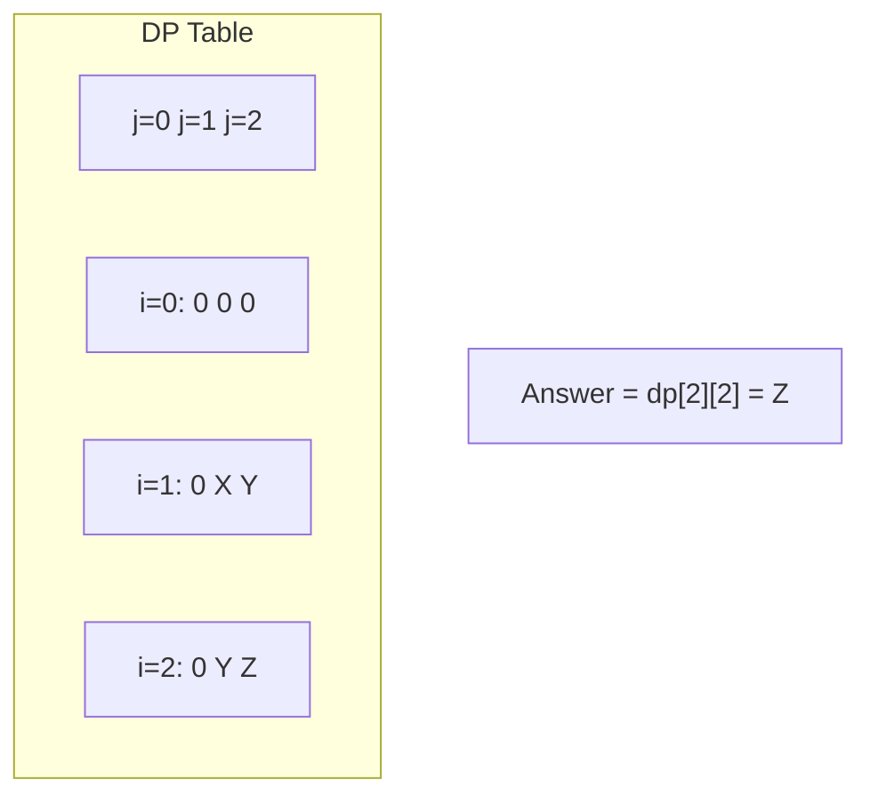

# Problem 1595: Minimum Cost to Connect Two Groups of Points

**Difficulty:** Hard  
**Tags:** Array, Dynamic Programming, Bit Manipulation, Matrix, Bitmask  
**Pattern:** Dynamic Programming (2D Grid/Matrix)  
**Link:** [leetcode.com/problems/minimum-cost-to-connect-two-groups-of-points](https://leetcode.com/problems/minimum-cost-to-connect-two-groups-of-points/)

## Description

You are given two groups of points where the first group has `size1` points, the second group has `size2` points, and `size1 >= size2`.

The `cost` of the connection between any two points are given in an `size1 x size2` matrix where `cost[i][j]` is the cost of connecting point `i` of the first group and point `j` of the second group. The groups are connected if **each point in both groups is connected to one or more points in the opposite group**. In other words, each point in the first group must be connected to at least one point in the second group, and each point in the second group must be connected to at least one point in the first group.

Return *the minimum cost it takes to connect the two groups*.

 

Example 1:

```

**Input:** cost = [[15, 96], [36, 2]]
**Output:** 17
**Explanation**: The optimal way of connecting the groups is:
1--A
2--B
This results in a total cost of 17.

```

Example 2:

```

**Input:** cost = [[1, 3, 5], [4, 1, 1], [1, 5, 3]]
**Output:** 4
**Explanation**: The optimal way of connecting the groups is:
1--A
2--B
2--C
3--A
This results in a total cost of 4.
Note that there are multiple points connected to point 2 in the first group and point A in the second group. This does not matter as there is no limit to the number of points that can be connected. We only care about the minimum total cost.

```

Example 3:

```

**Input:** cost = [[2, 5, 1], [3, 4, 7], [8, 1, 2], [6, 2, 4], [3, 8, 8]]
**Output:** 10

```

 

**Constraints:**

	- `size1 == cost.length`
	- `size2 == cost[i].length`
	- `1 <= size1, size2 <= 12`
	- `size1 >= size2`
	- `0 <= cost[i][j] <= 100`

## Approach: Dynamic Programming (2D Grid/Matrix)

Use a 2D DP table where dp[i][j] represents the optimal value for the subproblem defined by rows 0..i and columns 0..j. Fill row by row or column by column.

## Pseudocode

```
1. Create dp[m][n] table
2. Initialize base cases (first row, first column)
3. For i from 1 to m-1:
   For j from 1 to n-1:
     dp[i][j] = recurrence(dp[i-1][j], dp[i][j-1], dp[i-1][j-1])
4. Return dp[m-1][n-1]
```

## Algorithm Flow



## Visual State Transitions

**2D DP Table Build:**

**Frame 1: Initialize borders**


**Frame 2: Fill cell by cell**


**Frame 3: Table complete**



## Complexity Analysis

- **Time:** O(m * n)
- **Space:** O(m * n)

## Solution (Python3)

```python
class Solution:
    def connectTwoGroups(self, cost: List[List[int]]) -> int:
        # Dynamic programming (2D) - O(m*n) time and space
        if not cost:
            return 0
        m, n = len(cost), len(cost[0])
        dp = [[0] * (n + 1) for _ in range(m + 1)]
        for i in range(1, m + 1):
            for j in range(1, n + 1):
                dp[i][j] = max(dp[i-1][j], dp[i][j-1])
                # Add problem-specific transition
        return dp[m][n]
```

## Solution (C++)

```cpp
#include <algorithm>
#include <string>
#include <vector>
using namespace std;

class Solution {
public:
    int connectTwoGroups(vector<vector<int>>& cost) {
        // Dynamic programming (2D) - O(m*n) time and space
        if (cost.empty()) return 0;
        int m = cost.size(), n = cost[0].size();
        vector<vector<int>> dp(m + 1, vector<int>(n + 1, 0));
        for (int i = 1; i <= m; i++) {
            for (int j = 1; j <= n; j++) {
                dp[i][j] = max(dp[i-1][j], dp[i][j-1]);
            }
        }
        return dp[m][n];
    }
};
```
