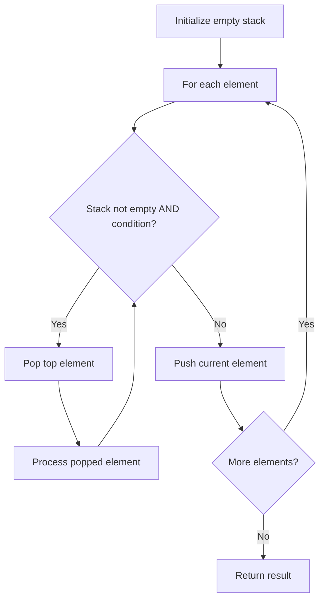

# Problem 1598: Crawler Log Folder

**Difficulty:** Easy  
**Tags:** Array, String, Stack  
**Pattern:** Stack  
**Link:** [leetcode.com/problems/crawler-log-folder](https://leetcode.com/problems/crawler-log-folder/)

## Description

The Leetcode file system keeps a log each time some user performs a *change folder* operation.

The operations are described below:

	- `"../"` : Move to the parent folder of the current folder. (If you are already in the main folder, **remain in the same folder**).
	- `"./"` : Remain in the same folder.
	- `"x/"` : Move to the child folder named `x` (This folder is **guaranteed to always exist**).

You are given a list of strings `logs` where `logs[i]` is the operation performed by the user at the `i^th` step.

The file system starts in the main folder, then the operations in `logs` are performed.

Return *the minimum number of operations needed to go back to the main folder after the change folder operations.*

 

Example 1:

```

**Input:** logs = ["d1/","d2/","../","d21/","./"]
**Output:** 2
**Explanation: **Use this change folder operation "../" 2 times and go back to the main folder.

```

Example 2:

```

**Input:** logs = ["d1/","d2/","./","d3/","../","d31/"]
**Output:** 3

```

Example 3:

```

**Input:** logs = ["d1/","../","../","../"]
**Output:** 0

```

 

**Constraints:**

	- `1 <= logs.length <= 10^3`
	- `2 <= logs[i].length <= 10`
	- `logs[i]` contains lowercase English letters, digits, `'.'`, and `'/'`.
	- `logs[i]` follows the format described in the statement.
	- Folder names consist of lowercase English letters and digits.

## Approach: Stack

Use a stack (LIFO) to process elements. Push elements when they might be needed later; pop when a matching or resolving condition is found. Common uses: parentheses matching, expression evaluation, next greater element.

## Pseudocode

```
1. Initialize empty stack
2. For each element:
   a. While stack is not empty and condition met:
      - Pop and process top element
   b. Push current element onto stack
3. Process remaining elements in stack if needed
4. Return result
```

## Algorithm Flow



## Complexity Analysis

- **Time:** O(n)
- **Space:** O(n)

## Solution (Python3)

```python
class Solution:
    def minOperations(self, logs: List[str]) -> int:
        # Stack-based approach - O(n) time
        stack = []
        for ch in logs:
            if stack and self._matches(stack[-1], ch):
                stack.pop()
            else:
                stack.append(ch)
        return len(stack) == 0 if isinstance(0, bool) else stack

    def _matches(self, a, b):
        pairs = {'(': ')', '[': ']', '{': '}'}
        return pairs.get(a) == b
```

## Solution (C++)

```cpp
#include <stack>
#include <string>
#include <unordered_map>
#include <vector>
using namespace std;

class Solution {
public:
    int minOperations(vector<string>& logs) {
        // Stack-based approach - O(n) time
        stack<char> st;
        unordered_map<char, char> pairs = {{'(', ')'}, {'[', ']'}, {'{', '}'}};
        for (char ch : logs) {
            if (!st.empty() && pairs.count(st.top()) && pairs[st.top()] == ch) {
                st.pop();
            } else {
                st.push(ch);
            }
        }
        return st.empty();
    }
};
```
