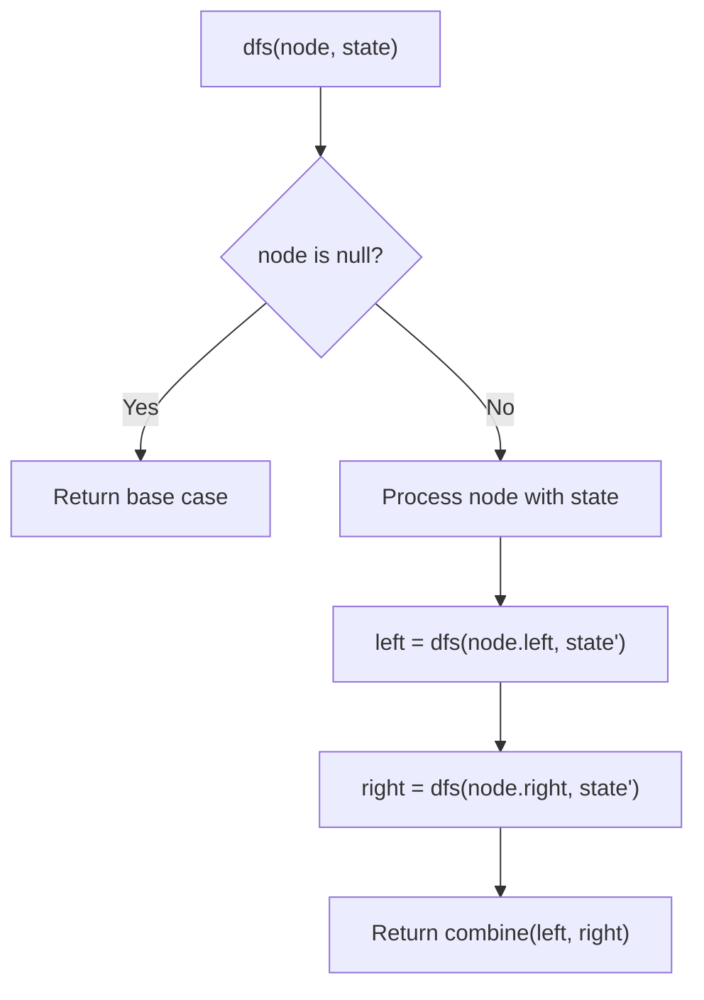
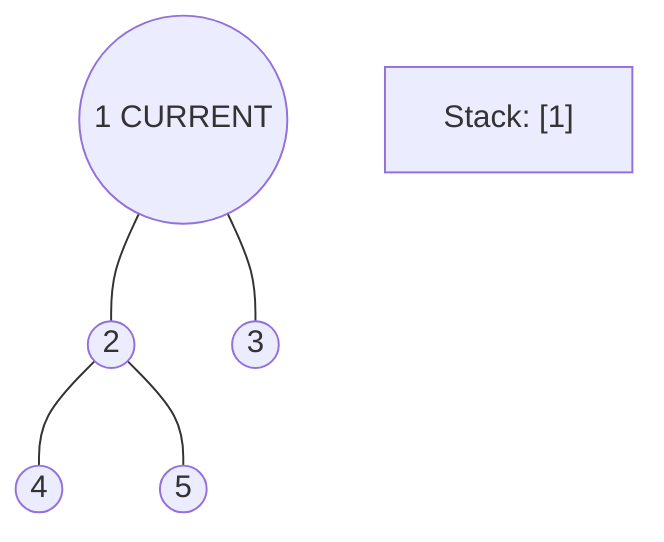
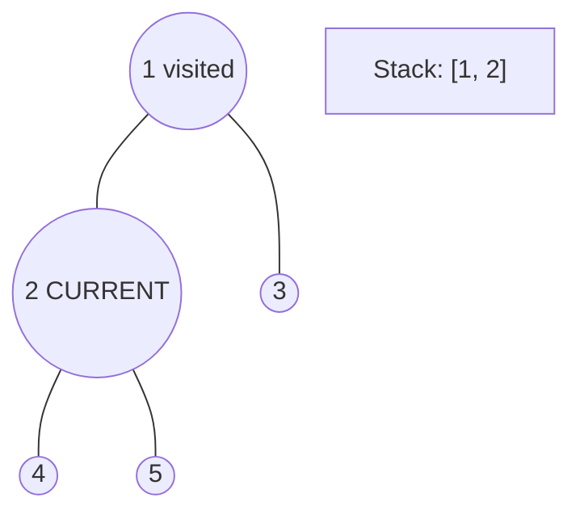
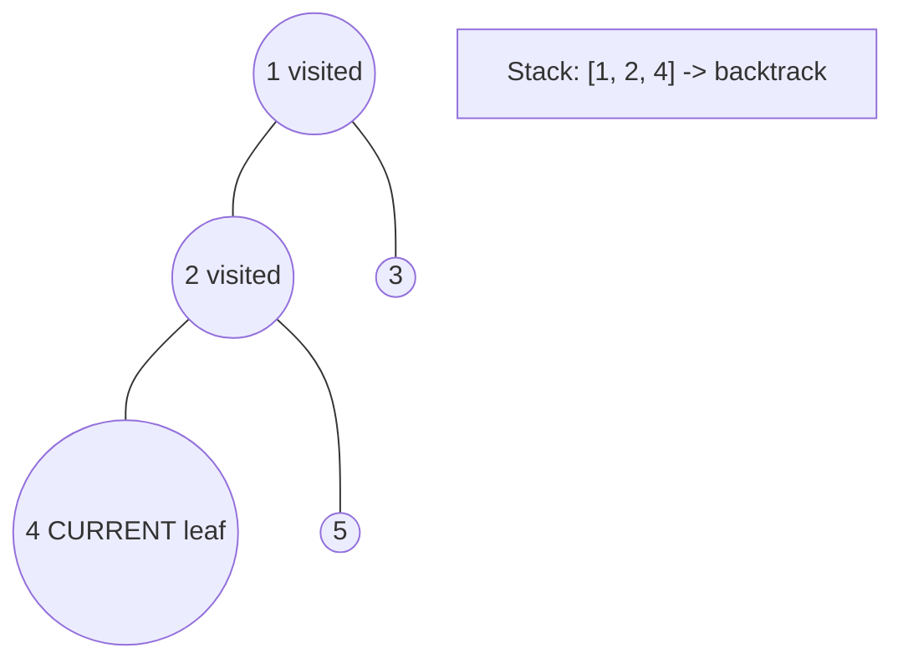
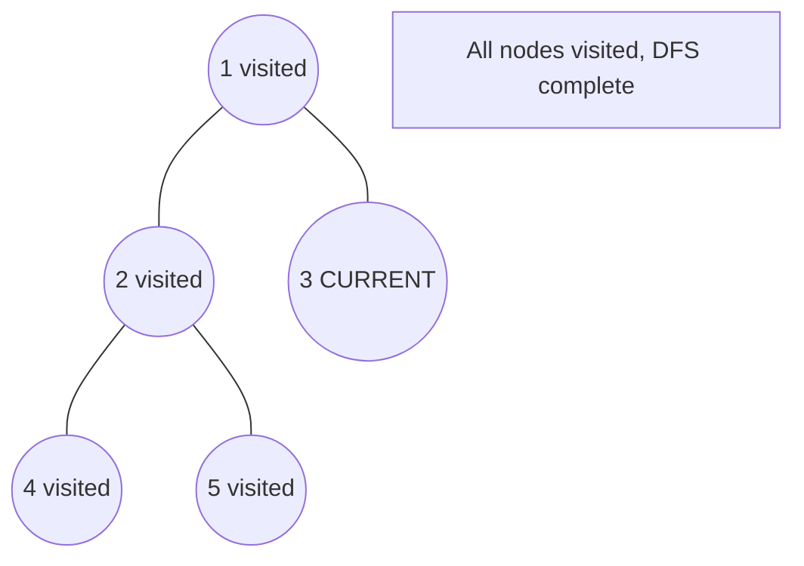

# Problem 1600: Throne Inheritance

**Difficulty:** Medium  
**Tags:** Hash Table, Tree, Depth-First Search, Design  
**Pattern:** DFS Tree Traversal  
**Link:** [leetcode.com/problems/throne-inheritance](https://leetcode.com/problems/throne-inheritance/)

## Description

A kingdom consists of a king, his children, his grandchildren, and so on. Every once in a while, someone in the family dies or a child is born.

The kingdom has a well-defined order of inheritance that consists of the king as the first member. Let's define the recursive function `Successor(x, curOrder)`, which given a person `x` and the inheritance order so far, returns who should be the next person after `x` in the order of inheritance.

```

Successor(x, curOrder):
    if x has no children or all of x's children are in curOrder:
        if x is the king return null
        else return Successor(x's parent, curOrder)
    else return x's oldest child who's not in curOrder

```

For example, assume we have a kingdom that consists of the king, his children Alice and Bob (Alice is older than Bob), and finally Alice's son Jack.

	- In the beginning, `curOrder` will be `["king"]`.
	- Calling `Successor(king, curOrder)` will return Alice, so we append to `curOrder` to get `["king", "Alice"]`.
	- Calling `Successor(Alice, curOrder)` will return Jack, so we append to `curOrder` to get `["king", "Alice", "Jack"]`.
	- Calling `Successor(Jack, curOrder)` will return Bob, so we append to `curOrder` to get `["king", "Alice", "Jack", "Bob"]`.
	- Calling `Successor(Bob, curOrder)` will return `null`. Thus the order of inheritance will be `["king", "Alice", "Jack", "Bob"]`.

Using the above function, we can always obtain a unique order of inheritance.

Implement the `ThroneInheritance` class:

	- `ThroneInheritance(string kingName)` Initializes an object of the `ThroneInheritance` class. The name of the king is given as part of the constructor.
	- `void birth(string parentName, string childName)` Indicates that `parentName` gave birth to `childName`.
	- `void death(string name)` Indicates the death of `name`. The death of the person doesn't affect the `Successor` function nor the current inheritance order. You can treat it as just marking the person as dead.
	- `string[] getInheritanceOrder()` Returns a list representing the current order of inheritance **excluding** dead people.

 

Example 1:

```

**Input**
["ThroneInheritance", "birth", "birth", "birth", "birth", "birth", "birth", "getInheritanceOrder", "death", "getInheritanceOrder"]
[["king"], ["king", "andy"], ["king", "bob"], ["king", "catherine"], ["andy", "matthew"], ["bob", "alex"], ["bob", "asha"], [null], ["bob"], [null]]
**Output**
[null, null, null, null, null, null, null, ["king", "andy", "matthew", "bob", "alex", "asha", "catherine"], null, ["king", "andy", "matthew", "alex", "asha", "catherine"]]

**Explanation**
ThroneInheritance t= new ThroneInheritance("king"); // order: **king**
t.birth("king", "andy"); // order: king > **andy**
t.birth("king", "bob"); // order: king > andy > **bob**
t.birth("king", "catherine"); // order: king > andy > bob > **catherine**
t.birth("andy", "matthew"); // order: king > andy > **matthew** > bob > catherine
t.birth("bob", "alex"); // order: king > andy > matthew > bob > **alex** > catherine
t.birth("bob", "asha"); // order: king > andy > matthew > bob > alex > **asha** > catherine
t.getInheritanceOrder(); // return ["king", "andy", "matthew", "bob", "alex", "asha", "catherine"]
t.death("bob"); // order: king > andy > matthew > **bob** > alex > asha > catherine
t.getInheritanceOrder(); // return ["king", "andy", "matthew", "alex", "asha", "catherine"]

```

 

**Constraints:**

	- `1 <= kingName.length, parentName.length, childName.length, name.length <= 15`
	- `kingName`, `parentName`, `childName`, and `name` consist of lowercase English letters only.
	- All arguments `childName` and `kingName` are **distinct**.
	- All `name` arguments of `death` will be passed to either the constructor or as `childName` to `birth` first.
	- For each call to `birth(parentName, childName)`, it is guaranteed that `parentName` is alive.
	- At most `10^5` calls will be made to `birth` and `death`.
	- At most `10` calls will be made to `getInheritanceOrder`.

## Approach: DFS Tree Traversal

Perform depth-first search on the tree. Recurse on left and right subtrees, combining results bottom-up. Track state (path, depth, sum) during traversal.

## Pseudocode

```
1. Define dfs(node, state):
   a. Base case: if null, return default
   b. Process node with current state
   c. left_result = dfs(node.left, updated_state)
   d. right_result = dfs(node.right, updated_state)
   e. Return combine(left_result, right_result)
2. Return dfs(root, initial_state)
```

## Algorithm Flow



## Visual State Transitions

**DFS Tree Traversal Step-by-Step:**

**Frame 1: Start at root**


**Frame 2: Go left - visit node 2**


**Frame 3: Go left - visit node 4 (leaf)**


**Frame 4: Backtrack, visit node 5, then node 3**



## Complexity Analysis

- **Time:** O(n)
- **Space:** O(h)

## Solution (Python3)

```python
class ThroneInheritance:
    def __init__(self, kingName: str):
        # Initialize data structure
        self.kingName = kingName

    def birth(self, parentName: str, childName: str) -> None:
        return None

    def death(self, name: str) -> None:
        return None

    def getInheritanceOrder(self) -> List[str]:
        return []

```

## Solution (C++)

```cpp
#include <algorithm>
#include <functional>
#include <string>
#include <vector>
using namespace std;

class ThroneInheritance {
public:
    ThroneInheritance(string& kingName) {
        // Initialize
    }

    void birth(string& parentName, string& childName) {
        return ;
    }

    void death(string& name) {
        return ;
    }

    vector<string> getInheritanceOrder() {
        return {};
    }

};
```
