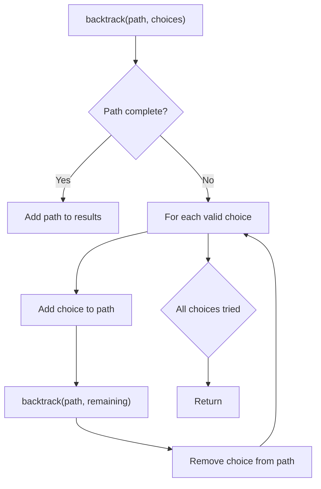
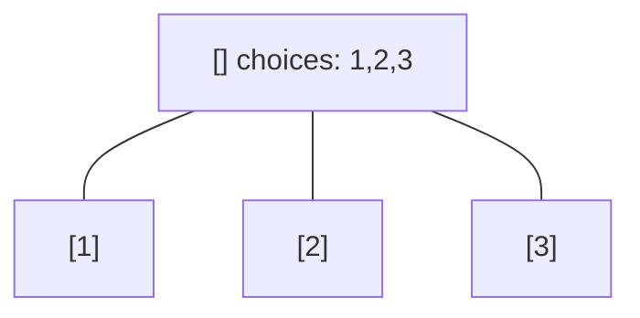
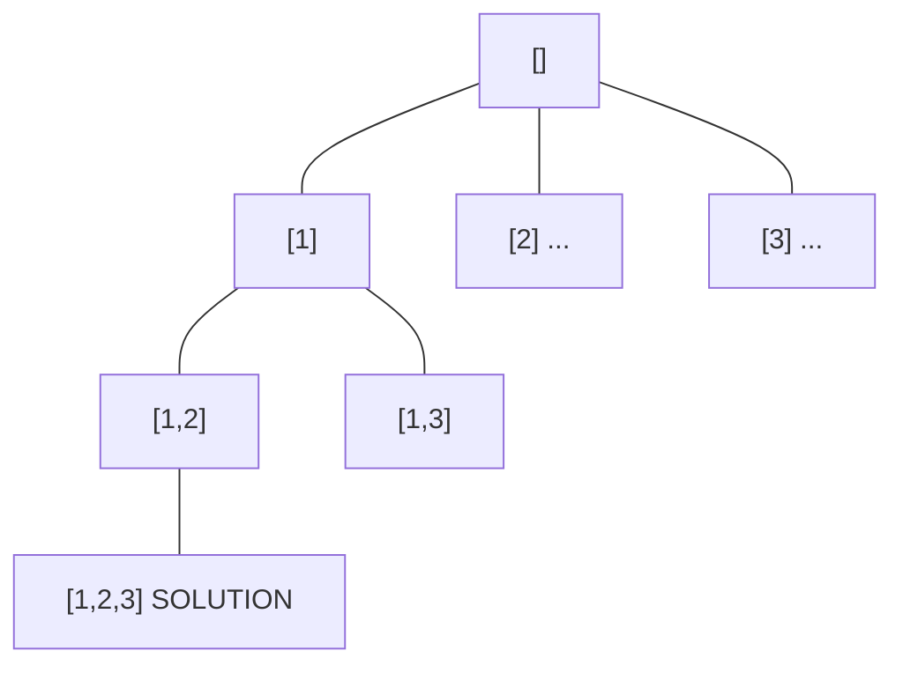
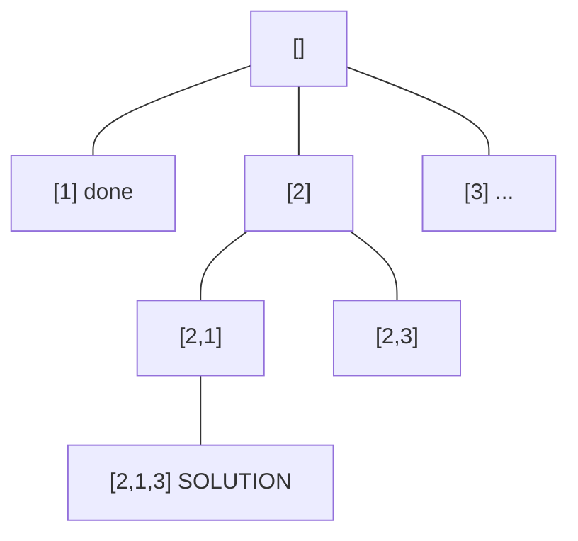
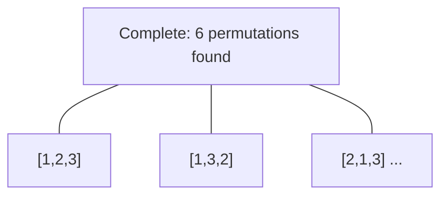

# Problem 1601: Maximum Number of Achievable Transfer Requests

**Difficulty:** Hard  
**Tags:** Array, Backtracking, Bit Manipulation, Enumeration  
**Pattern:** Backtracking  
**Link:** [leetcode.com/problems/maximum-number-of-achievable-transfer-requests](https://leetcode.com/problems/maximum-number-of-achievable-transfer-requests/)

## Description

We have `n` buildings numbered from `0` to `n - 1`. Each building has a number of employees. It's transfer season, and some employees want to change the building they reside in.

You are given an array `requests` where `requests[i] = [fromi, toi]` represents an employee's request to transfer from building `fromi` to building `toi`.

**All buildings are full**, so a list of requests is achievable only if for each building, the **net change in employee transfers is zero**. This means the number of employees **leaving** is **equal** to the number of employees **moving in**. For example if `n = 3` and two employees are leaving building `0`, one is leaving building `1`, and one is leaving building `2`, there should be two employees moving to building `0`, one employee moving to building `1`, and one employee moving to building `2`.

Return *the maximum number of achievable requests*.

 

Example 1:

```

**Input:** n = 5, requests = [[0,1],[1,0],[0,1],[1,2],[2,0],[3,4]]
**Output:** 5
**Explantion:** Let's see the requests:
From building 0 we have employees x and y and both want to move to building 1.
From building 1 we have employees a and b and they want to move to buildings 2 and 0 respectively.
From building 2 we have employee z and they want to move to building 0.
From building 3 we have employee c and they want to move to building 4.
From building 4 we don't have any requests.
We can achieve the requests of users x and b by swapping their places.
We can achieve the requests of users y, a and z by swapping the places in the 3 buildings.

```

Example 2:

```

**Input:** n = 3, requests = [[0,0],[1,2],[2,1]]
**Output:** 3
**Explantion:** Let's see the requests:
From building 0 we have employee x and they want to stay in the same building 0.
From building 1 we have employee y and they want to move to building 2.
From building 2 we have employee z and they want to move to building 1.
We can achieve all the requests. 
```

Example 3:

```

**Input:** n = 4, requests = [[0,3],[3,1],[1,2],[2,0]]
**Output:** 4

```

 

**Constraints:**

	- `1 <= n <= 20`
	- `1 <= requests.length <= 16`
	- `requests[i].length == 2`
	- `0 <= fromi, toi < n`

## Approach: Backtracking

Explore all possible solutions by building candidates incrementally. At each step, make a choice and recurse. If the choice leads to a dead end, undo the choice (backtrack) and try the next option.

## Pseudocode

```
1. Define backtrack(path, choices):
   a. If path is a complete solution: add to results
   b. For each choice in choices:
      - If choice is valid:
        * Add choice to path
        * backtrack(path, remaining_choices)
        * Remove choice from path (backtrack)
2. Call backtrack([], all_choices)
```

## Algorithm Flow



## Visual State Transitions

**Backtracking Decision Tree:**

**Frame 1: Root - start with empty path**


**Frame 2: Explore branch [1]**


**Frame 3: Backtrack, explore [2]**


**Frame 4: All solutions found**



## Complexity Analysis

- **Time:** O(k^n) or O(n!)
- **Space:** O(n)

## Solution (Python3)

```python
class Solution:
    def maximumRequests(self, n: int, requests: List[List[int]]) -> int:
        # Backtracking - O(2^n) or O(n!) time
        result = []
        
        def backtrack(path, start):
            result.append(path[:])
            for i in range(start, len(n)):
                path.append(n[i])
                backtrack(path, i + 1)
                path.pop()
        
        backtrack([], 0)
        return result
```

## Solution (C++)

```cpp
#include <functional>
#include <string>
#include <vector>
using namespace std;

class Solution {
public:
    int maximumRequests(int n, vector<vector<int>>& requests) {
        // Backtracking - O(2^n) or O(n!) time
        vector<vector<int>> result;
        vector<int> path;
        function<void(int)> backtrack = [&](int start) {
            result.push_back(path);
            for (int i = start; i < (int)n.size(); i++) {
                path.push_back(n[i]);
                backtrack(i + 1);
                path.pop_back();
            }
        };
        backtrack(0);
        return result;
    }
};
```
