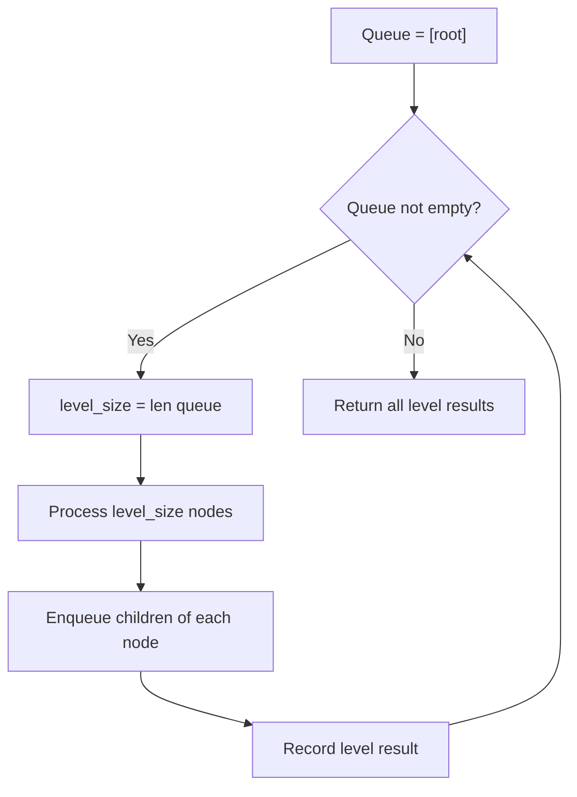

# Problem 1602: Find Nearest Right Node in Binary Tree

**Difficulty:** Medium  
**Tags:** Tree, Breadth-First Search, Binary Tree  
**Pattern:** BFS Level-Order Traversal  
**Link:** [leetcode.com/problems/find-nearest-right-node-in-binary-tree](https://leetcode.com/problems/find-nearest-right-node-in-binary-tree/)

## Description

*(Premium problem -- description requires LeetCode subscription)*

## Approach: BFS Level-Order Traversal

Traverse the tree level by level using a queue. Process all nodes at the current depth before moving to the next level.

## Pseudocode

```
1. If root is null, return empty
2. Queue = [root]
3. While queue not empty:
   a. level_size = len(queue)
   b. For i in range(level_size):
      - node = dequeue
      - Process node
      - Enqueue node.left, node.right if not null
4. Return result
```

## Algorithm Flow



## Complexity Analysis

- **Time:** O(n)
- **Space:** O(w)

## Solution (Python3)

```python
class Solution:
    pass
```

## Solution (C++)

```cpp
class Solution {
public:
    // Design problem stub
};
```
