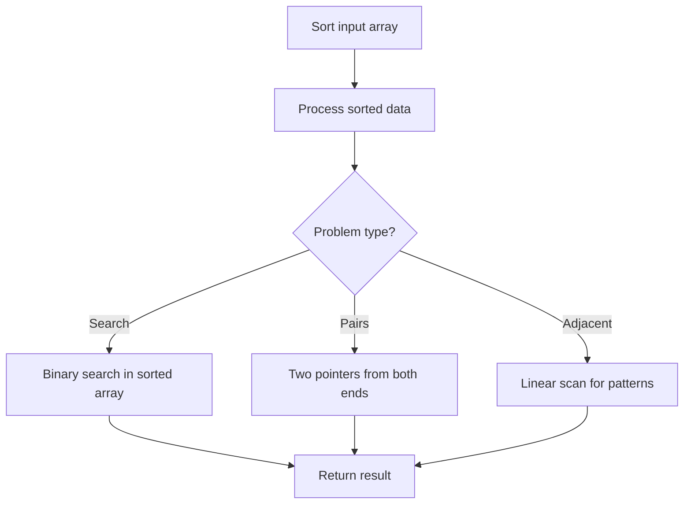

# Problem 1604: Alert Using Same Key-Card Three or More Times in a One Hour Period

**Difficulty:** Medium  
**Tags:** Array, Hash Table, String, Sorting  
**Pattern:** Sorting  
**Link:** [leetcode.com/problems/alert-using-same-key-card-three-or-more-times-in-a-one-hour-period](https://leetcode.com/problems/alert-using-same-key-card-three-or-more-times-in-a-one-hour-period/)

## Description

LeetCode company workers use key-cards to unlock office doors. Each time a worker uses their key-card, the security system saves the worker's name and the time when it was used. The system emits an **alert** if any worker uses the key-card **three or more times** in a one-hour period.

You are given a list of strings `keyName` and `keyTime` where `[keyName[i], keyTime[i]]` corresponds to a person's name and the time when their key-card was used **in a** **single day**.

Access times are given in the **24-hour time format "HH:MM"**, such as `"23:51"` and `"09:49"`.

Return a *list of unique worker names who received an alert for frequent keycard use*. Sort the names in **ascending order alphabetically**.

Notice that `"10:00"` - `"11:00"` is considered to be within a one-hour period, while `"22:51"` - `"23:52"` is not considered to be within a one-hour period.

 

Example 1:

```

**Input:** keyName = ["daniel","daniel","daniel","luis","luis","luis","luis"], keyTime = ["10:00","10:40","11:00","09:00","11:00","13:00","15:00"]
**Output:** ["daniel"]
**Explanation:** "daniel" used the keycard 3 times in a one-hour period ("10:00","10:40", "11:00").

```

Example 2:

```

**Input:** keyName = ["alice","alice","alice","bob","bob","bob","bob"], keyTime = ["12:01","12:00","18:00","21:00","21:20","21:30","23:00"]
**Output:** ["bob"]
**Explanation:** "bob" used the keycard 3 times in a one-hour period ("21:00","21:20", "21:30").

```

 

**Constraints:**

	- `1 <= keyName.length, keyTime.length <= 10^5`
	- `keyName.length == keyTime.length`
	- `keyTime[i]` is in the format **"HH:MM"**.
	- `[keyName[i], keyTime[i]]` is **unique**.
	- `1 <= keyName[i].length <= 10`
	- `keyName[i] contains only lowercase English letters.`

## Approach: Sorting

Sort the data to enable efficient processing. After sorting, use techniques like binary search, two pointers, or linear scan to solve the problem.

## Pseudocode

```
1. Sort the input array
2. Process sorted data:
   - Use binary search for lookups
   - Use two pointers for pair finding
   - Scan for adjacent patterns
3. Return result
```

## Algorithm Flow



## Complexity Analysis

- **Time:** O(n log n)
- **Space:** O(n)

## Solution (Python3)

```python
class Solution:
    def alertNames(self, keyName: List[str], keyTime: List[str]) -> List[str]:
        # Sort-based approach - O(n log n) time
        keyName.sort(key=lambda x: x[0] if isinstance(x, (list, tuple)) else x)
        result = [keyName[0]]
        for i in range(1, len(keyName)):
            curr = keyName[i]
            if isinstance(curr, (list, tuple)) and isinstance(result[-1], (list, tuple)):
                if curr[0] <= result[-1][1]:
                    result[-1] = [result[-1][0], max(result[-1][1], curr[1])]
                else:
                    result.append(curr)
            else:
                result.append(curr)
        return result
```

## Solution (C++)

```cpp
#include <algorithm>
#include <string>
#include <vector>
using namespace std;

class Solution {
public:
    vector<string> alertNames(vector<string>& keyName, vector<string>& keyTime) {
        // Sort-based approach - O(n log n) time
        sort(keyName.begin(), keyName.end());
        vector<vector<int>> result;
        result.push_back(keyName[0]);
        for (int i = 1; i < (int)keyName.size(); i++) {
            if (keyName[i][0] <= result.back()[1]) {
                result.back()[1] = max(result.back()[1], keyName[i][1]);
            } else {
                result.push_back(keyName[i]);
            }
        }
        return result;
    }
};
```
