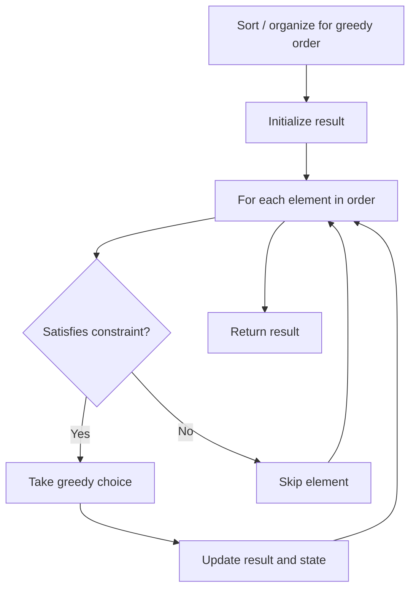

# Problem 1605: Find Valid Matrix Given Row and Column Sums

**Difficulty:** Medium  
**Tags:** Array, Greedy, Matrix  
**Pattern:** Greedy  
**Link:** [leetcode.com/problems/find-valid-matrix-given-row-and-column-sums](https://leetcode.com/problems/find-valid-matrix-given-row-and-column-sums/)

## Description

You are given two arrays `rowSum` and `colSum` of non-negative integers where `rowSum[i]` is the sum of the elements in the `i^th` row and `colSum[j]` is the sum of the elements of the `j^th` column of a 2D matrix. In other words, you do not know the elements of the matrix, but you do know the sums of each row and column.

Find any matrix of **non-negative** integers of size `rowSum.length x colSum.length` that satisfies the `rowSum` and `colSum` requirements.

Return *a 2D array representing **any** matrix that fulfills the requirements*. It's guaranteed that **at least one **matrix that fulfills the requirements exists.

 

Example 1:

```

**Input:** rowSum = [3,8], colSum = [4,7]
**Output:** [[3,0],
         [1,7]]
**Explanation:** 
0th row: 3 + 0 = 3 == rowSum[0]
1st row: 1 + 7 = 8 == rowSum[1]
0th column: 3 + 1 = 4 == colSum[0]
1st column: 0 + 7 = 7 == colSum[1]
The row and column sums match, and all matrix elements are non-negative.
Another possible matrix is: [[1,2],
                             [3,5]]

```

Example 2:

```

**Input:** rowSum = [5,7,10], colSum = [8,6,8]
**Output:** [[0,5,0],
         [6,1,0],
         [2,0,8]]

```

 

**Constraints:**

	- `1 <= rowSum.length, colSum.length <= 500`
	- `0 <= rowSum[i], colSum[i] <= 10^8`
	- `sum(rowSum) == sum(colSum)`

## Approach: Greedy

Make the locally optimal choice at each step, trusting it leads to a global optimum. Greedy works when the problem has the greedy-choice property and optimal substructure.

## Pseudocode

```
1. Sort or organize data for greedy ordering
2. Initialize result
3. For each element in greedy order:
   a. If element satisfies constraint:
      - Take the greedy choice
      - Update result and state
4. Return result
```

## Algorithm Flow



## Complexity Analysis

- **Time:** O(n log n)
- **Space:** O(1)

## Solution (Python3)

```python
class Solution:
    def restoreMatrix(self, rowSum: List[int], colSum: List[int]) -> List[List[int]]:
        # Greedy approach - O(n) time
        result = 0
        curr_max = 0
        for i in range(len(rowSum)):
            if isinstance(rowSum[i], int):
                curr_max = max(curr_max, rowSum[i])
                result = max(result, curr_max)
            else:
                result += 1
        return result
```

## Solution (C++)

```cpp
#include <algorithm>
#include <string>
#include <vector>
using namespace std;

class Solution {
public:
    vector<vector<int>> restoreMatrix(vector<int>& rowSum, vector<int>& colSum) {
        // Greedy approach - O(n) time
        int result = 0, curr_max = 0;
        for (int i = 0; i < (int)rowSum.size(); i++) {
            curr_max = max(curr_max, rowSum[i]);
            result = max(result, curr_max);
        }
        return result;
    }
};
```
