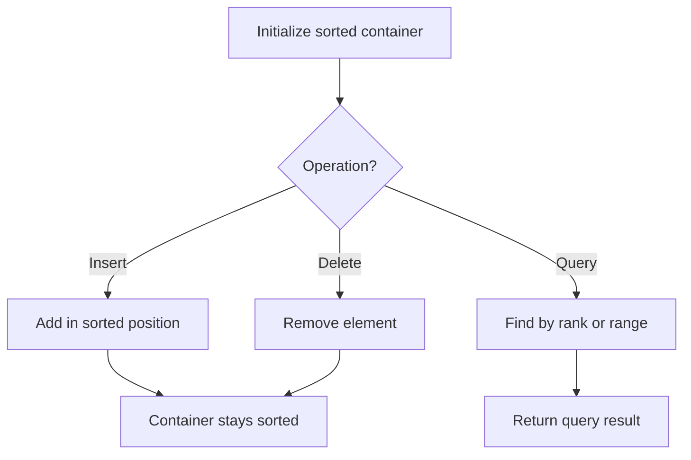

# Problem 1606: Find Servers That Handled Most Number of Requests

**Difficulty:** Hard  
**Tags:** Array, Heap (Priority Queue), Simulation, Ordered Set  
**Pattern:** Ordered Set / SortedList  
**Link:** [leetcode.com/problems/find-servers-that-handled-most-number-of-requests](https://leetcode.com/problems/find-servers-that-handled-most-number-of-requests/)

## Description

You have `k` servers numbered from `0` to `k-1` that are being used to handle multiple requests simultaneously. Each server has infinite computational capacity but **cannot handle more than one request at a time**. The requests are assigned to servers according to a specific algorithm:

	- The `i^th` (0-indexed) request arrives.
	- If all servers are busy, the request is dropped (not handled at all).
	- If the `(i % k)^th` server is available, assign the request to that server.
	- Otherwise, assign the request to the next available server (wrapping around the list of servers and starting from 0 if necessary). For example, if the `i^th` server is busy, try to assign the request to the `(i+1)^th` server, then the `(i+2)^th` server, and so on.

You are given a **strictly increasing** array `arrival` of positive integers, where `arrival[i]` represents the arrival time of the `i^th` request, and another array `load`, where `load[i]` represents the load of the `i^th` request (the time it takes to complete). Your goal is to find the **busiest server(s)**. A server is considered **busiest** if it handled the most number of requests successfully among all the servers.

Return *a list containing the IDs (0-indexed) of the **busiest server(s)***. You may return the IDs in any order.

 

Example 1:

```

**Input:** k = 3, arrival = [1,2,3,4,5], load = [5,2,3,3,3] 
**Output:** [1] 
**Explanation:** 
All of the servers start out available.
The first 3 requests are handled by the first 3 servers in order.
Request 3 comes in. Server 0 is busy, so it's assigned to the next available server, which is 1.
Request 4 comes in. It cannot be handled since all servers are busy, so it is dropped.
Servers 0 and 2 handled one request each, while server 1 handled two requests. Hence server 1 is the busiest server.

```

Example 2:

```

**Input:** k = 3, arrival = [1,2,3,4], load = [1,2,1,2]
**Output:** [0]
**Explanation:** 
The first 3 requests are handled by first 3 servers.
Request 3 comes in. It is handled by server 0 since the server is available.
Server 0 handled two requests, while servers 1 and 2 handled one request each. Hence server 0 is the busiest server.

```

Example 3:

```

**Input:** k = 3, arrival = [1,2,3], load = [10,12,11]
**Output:** [0,1,2]
**Explanation:** Each server handles a single request, so they are all considered the busiest.

```

 

**Constraints:**

	- `1 <= k <= 10^5`
	- `1 <= arrival.length, load.length <= 10^5`
	- `arrival.length == load.length`
	- `1 <= arrival[i], load[i] <= 10^9`
	- `arrival` is **strictly increasing**.

## Approach: Ordered Set / SortedList

Maintain elements in sorted order for efficient insertion, deletion, and rank queries. Use balanced BST, skip list, or sorted container.

## Pseudocode

```
1. Initialize sorted container
2. For each operation:
   - Insert: add element in sorted position O(log n)
   - Delete: remove element O(log n)
   - Query: find kth element, count, or range O(log n)
3. Return results
```

## Algorithm Flow



## Complexity Analysis

- **Time:** O(n log n)
- **Space:** O(n)

## Solution (Python3)

```python
class Solution:
    def busiestServers(self, k: int, arrival: List[int], load: List[int]) -> List[int]:
        # Ordered set / SortedList - O(n log n) time
        from sortedcontainers import SortedList
        sl = SortedList()
        result = 0
        for val in k:
            pos = sl.bisect_left(val)
            if pos < len(sl):
                result = max(result, sl[pos] - val)
            sl.add(val)
        return result
```

## Solution (C++)

```cpp
#include <algorithm>
#include <set>
#include <string>
#include <vector>
using namespace std;

class Solution {
public:
    vector<int> busiestServers(int k, vector<int>& arrival, vector<int>& load) {
        // Ordered set - O(n log n) time
        set<int> ordered;
        int result = 0;
        for (int val : k) {
            auto it = ordered.lower_bound(val);
            if (it != ordered.end()) {
                result = max(result, *it - val);
            }
            ordered.insert(val);
        }
        return result;
    }
};
```
