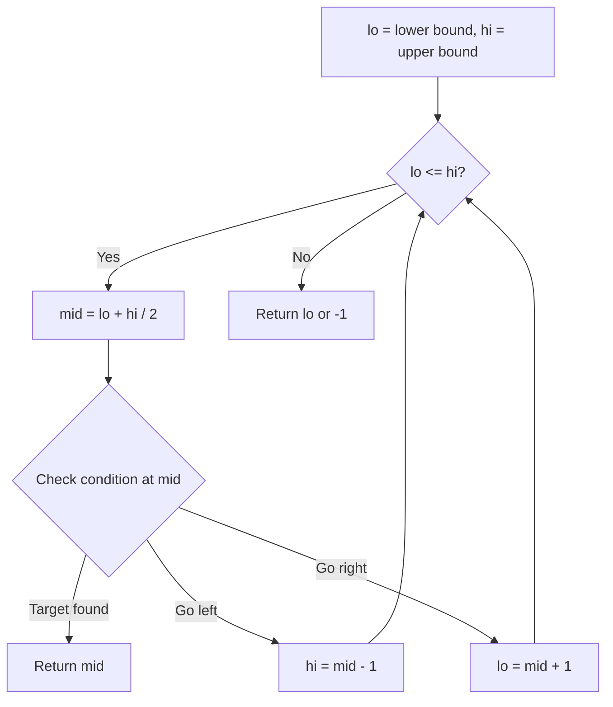
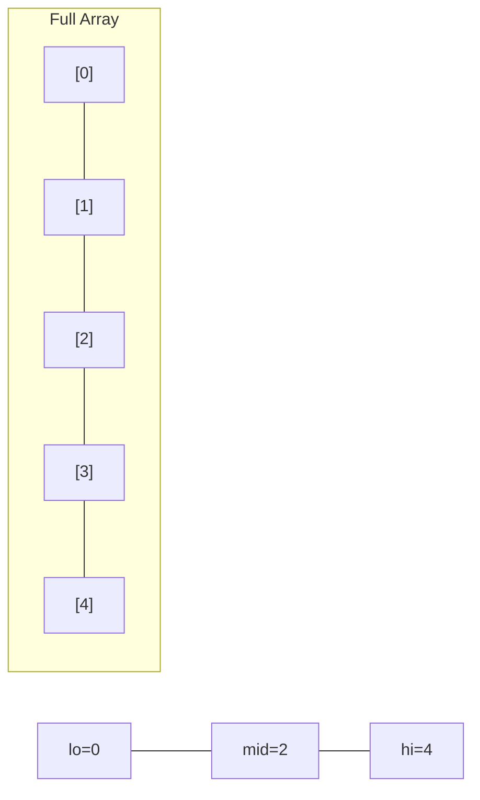
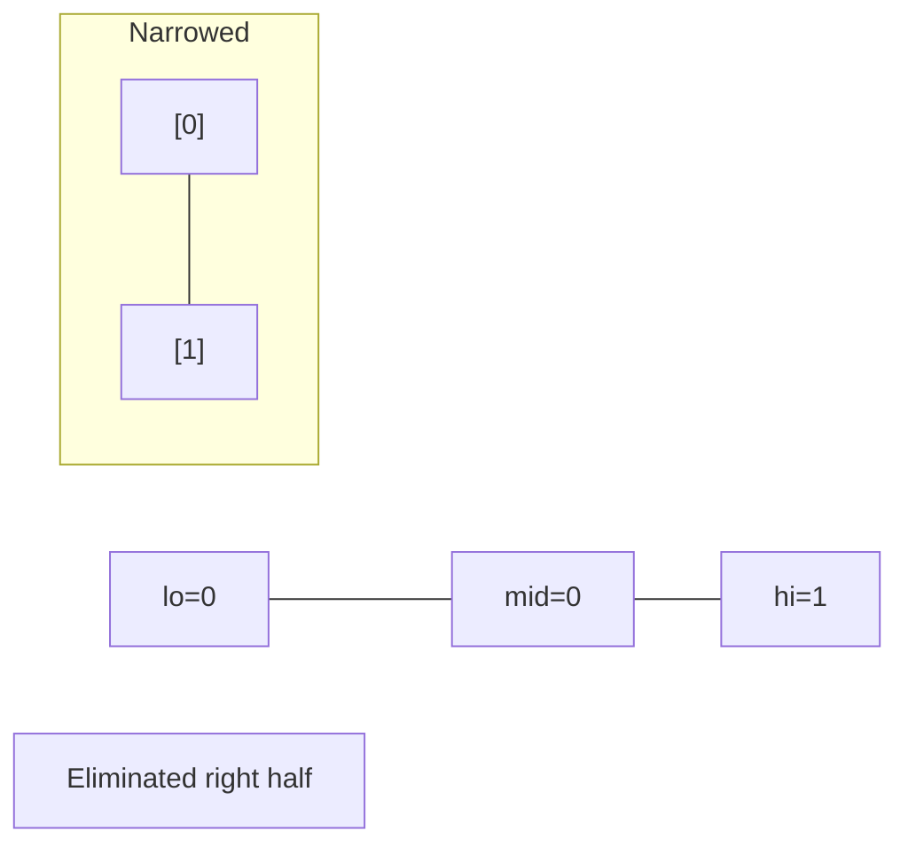
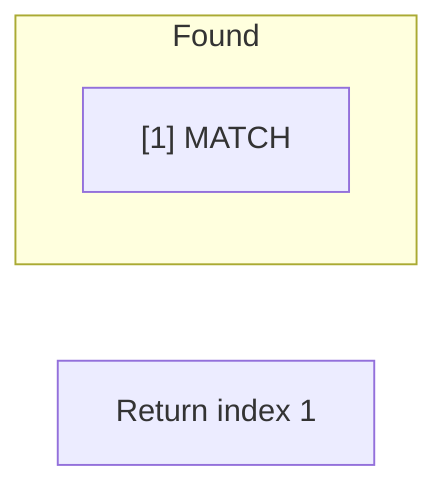

# Problem 1608: Special Array With X Elements Greater Than or Equal X

**Difficulty:** Easy  
**Tags:** Array, Binary Search, Sorting  
**Pattern:** Binary Search  
**Link:** [leetcode.com/problems/special-array-with-x-elements-greater-than-or-equal-x](https://leetcode.com/problems/special-array-with-x-elements-greater-than-or-equal-x/)

## Description

You are given an array `nums` of non-negative integers. `nums` is considered **special** if there exists a number `x` such that there are **exactly** `x` numbers in `nums` that are **greater than or equal to** `x`.

Notice that `x` **does not** have to be an element in `nums`.

Return `x` *if the array is **special**, otherwise, return *`-1`. It can be proven that if `nums` is special, the value for `x` is **unique**.

 

Example 1:

```

**Input:** nums = [3,5]
**Output:** 2
**Explanation:** There are 2 values (3 and 5) that are greater than or equal to 2.

```

Example 2:

```

**Input:** nums = [0,0]
**Output:** -1
**Explanation:** No numbers fit the criteria for x.
If x = 0, there should be 0 numbers >= x, but there are 2.
If x = 1, there should be 1 number >= x, but there are 0.
If x = 2, there should be 2 numbers >= x, but there are 0.
x cannot be greater since there are only 2 numbers in nums.

```

Example 3:

```

**Input:** nums = [0,4,3,0,4]
**Output:** 3
**Explanation:** There are 3 values that are greater than or equal to 3.

```

 

**Constraints:**

	- `1 <= nums.length <= 100`
	- `0 <= nums[i] <= 1000`

## Approach: Binary Search

Use binary search to halve the search space each iteration. Define the search range [lo, hi], compute mid, and decide which half to keep based on the problem's monotonic condition.

## Pseudocode

```
1. lo = lower_bound, hi = upper_bound
2. While lo <= hi (or lo < hi):
   a. mid = (lo + hi) // 2
   b. If condition(mid) is satisfied: record answer, search left half
   c. Else: search right half
3. Return answer
```

## Algorithm Flow



## Visual State Transitions

**Binary Search Step-by-Step:**

**Frame 1: Initial search space**


**Frame 2: Compare mid, narrow search**


**Frame 3: Found target**



## Complexity Analysis

- **Time:** O(log n)
- **Space:** O(1)

## Solution (Python3)

```python
class Solution:
    def specialArray(self, nums: List[int]) -> int:
        # Binary search - O(log n) time, O(1) space
        lo, hi = 0, len(nums) - 1
        while lo <= hi:
            mid = lo + (hi - lo) // 2
            if nums[mid] == nums:
                return mid
            elif nums[mid] < nums:
                lo = mid + 1
            else:
                hi = mid - 1
        return 0
```

## Solution (C++)

```cpp
#include <string>
#include <vector>
using namespace std;

class Solution {
public:
    int specialArray(vector<int>& nums) {
        // Binary search - O(log n) time, O(1) space
        int lo = 0, hi = nums.size() - 1;
        while (lo <= hi) {
            int mid = lo + (hi - lo) / 2;
            if (nums[mid] == nums) {
                return mid;
            } else if (nums[mid] < nums) {
                lo = mid + 1;
            } else {
                hi = mid - 1;
            }
        }
        return 0;
    }
};
```
