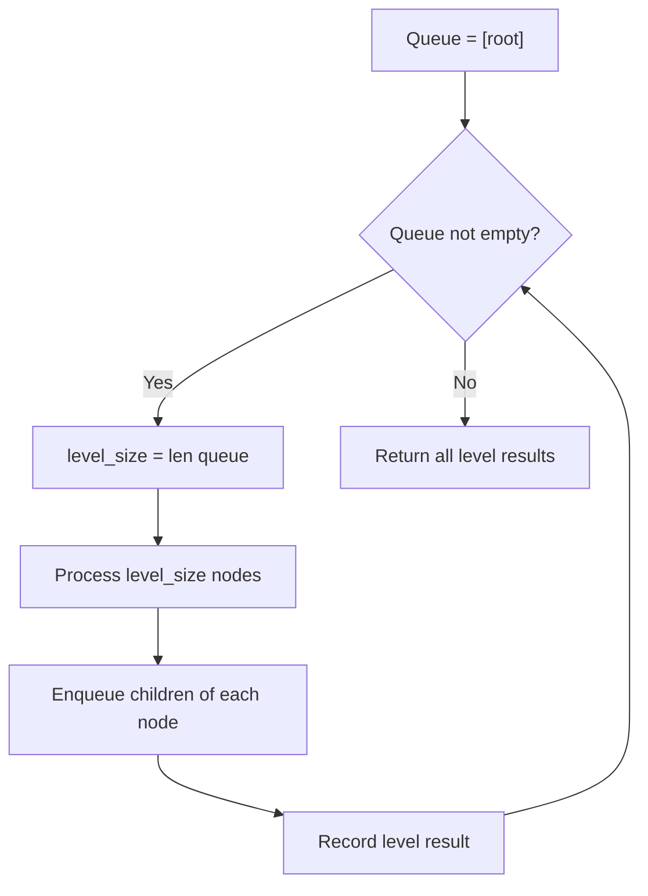

# Problem 1609: Even Odd Tree

**Difficulty:** Medium  
**Tags:** Tree, Breadth-First Search, Binary Tree  
**Pattern:** BFS Level-Order Traversal  
**Link:** [leetcode.com/problems/even-odd-tree](https://leetcode.com/problems/even-odd-tree/)

## Description

A binary tree is named **Even-Odd** if it meets the following conditions:

	- The root of the binary tree is at level index `0`, its children are at level index `1`, their children are at level index `2`, etc.
	- For every **even-indexed** level, all nodes at the level have **odd** integer values in **strictly increasing** order (from left to right).
	- For every **odd-indexed** level, all nodes at the level have **even** integer values in **strictly decreasing** order (from left to right).

Given the `root` of a binary tree, *return *`true`* if the binary tree is **Even-Odd**, otherwise return *`false`*.*

 

Example 1:

```

**Input:** root = [1,10,4,3,null,7,9,12,8,6,null,null,2]
**Output:** true
**Explanation:** The node values on each level are:
Level 0: [1]
Level 1: [10,4]
Level 2: [3,7,9]
Level 3: [12,8,6,2]
Since levels 0 and 2 are all odd and increasing and levels 1 and 3 are all even and decreasing, the tree is Even-Odd.

```

Example 2:

```

**Input:** root = [5,4,2,3,3,7]
**Output:** false
**Explanation:** The node values on each level are:
Level 0: [5]
Level 1: [4,2]
Level 2: [3,3,7]
Node values in level 2 must be in strictly increasing order, so the tree is not Even-Odd.

```

Example 3:

```

**Input:** root = [5,9,1,3,5,7]
**Output:** false
**Explanation:** Node values in the level 1 should be even integers.

```

 

**Constraints:**

	- The number of nodes in the tree is in the range `[1, 10^5]`.
	- `1 <= Node.val <= 10^6`

## Approach: BFS Level-Order Traversal

Traverse the tree level by level using a queue. Process all nodes at the current depth before moving to the next level.

## Pseudocode

```
1. If root is null, return empty
2. Queue = [root]
3. While queue not empty:
   a. level_size = len(queue)
   b. For i in range(level_size):
      - node = dequeue
      - Process node
      - Enqueue node.left, node.right if not null
4. Return result
```

## Algorithm Flow



## Complexity Analysis

- **Time:** O(n)
- **Space:** O(w)

## Solution (Python3)

```python
class Solution:
    def isEvenOddTree(self, root: Optional[TreeNode]) -> bool:
        # BFS level-order traversal - O(n) time, O(n) space
        from collections import deque
        if not root:
            return False
        result = []
        queue = deque([root])
        while queue:
            level = []
            for _ in range(len(queue)):
                node = queue.popleft()
                level.append(node.val)
                if node.left:
                    queue.append(node.left)
                if node.right:
                    queue.append(node.right)
            result.append(level)
        return result
```

## Solution (C++)

```cpp
#include <queue>
#include <string>
#include <vector>
using namespace std;

class Solution {
public:
    bool isEvenOddTree(TreeNode* root) {
        // BFS level-order traversal - O(n) time, O(n) space
        vector<vector<int>> result;
        if (!root) return result;
        queue<TreeNode*> q;
        q.push(root);
        while (!q.empty()) {
            int sz = q.size();
            vector<int> level;
            for (int i = 0; i < sz; i++) {
                TreeNode* node = q.front(); q.pop();
                level.push_back(node->val);
                if (node->left) q.push(node->left);
                if (node->right) q.push(node->right);
            }
            result.push_back(level);
        }
        return result;
    }
};
```
