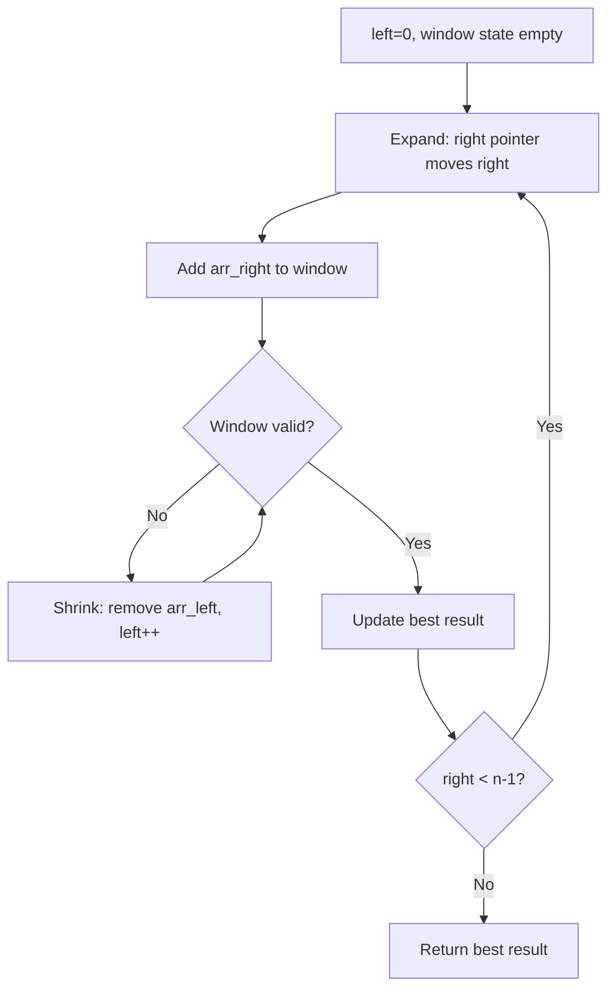
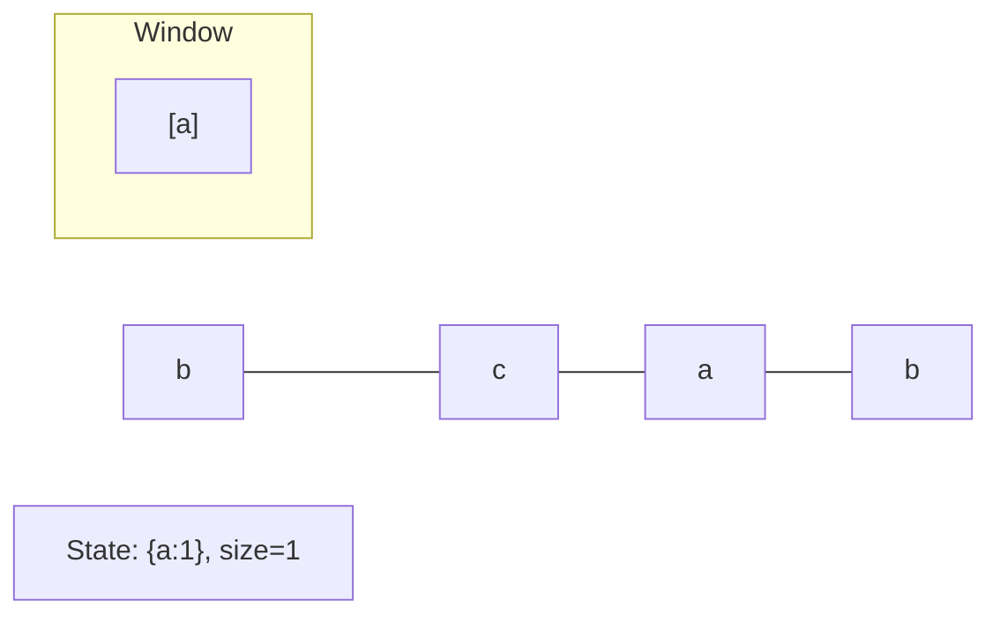
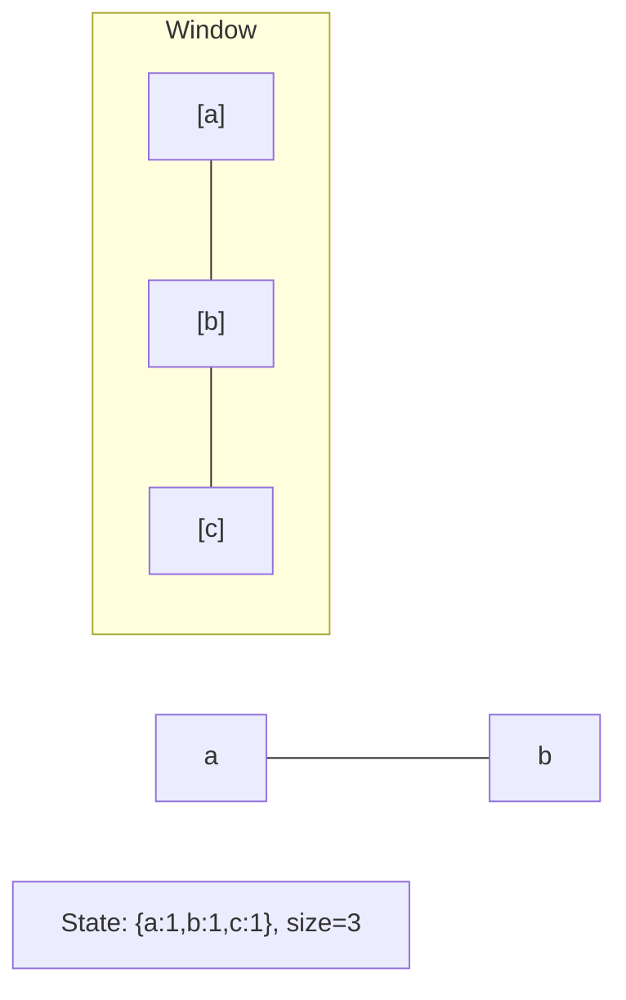
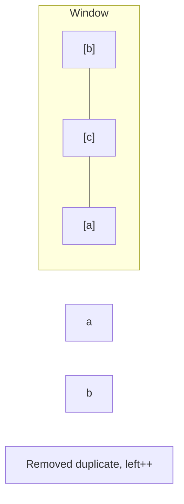
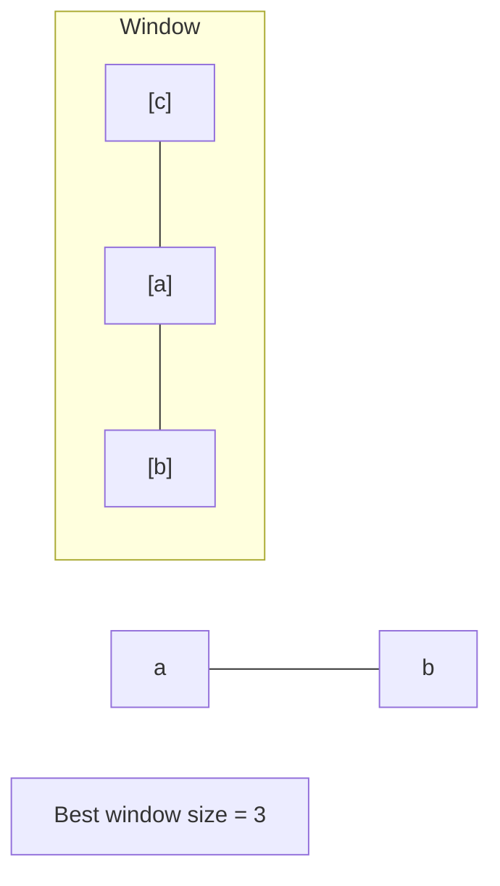

# Problem 1610: Maximum Number of Visible Points

**Difficulty:** Hard  
**Tags:** Array, Math, Geometry, Sliding Window, Sorting  
**Pattern:** Sliding Window  
**Link:** [leetcode.com/problems/maximum-number-of-visible-points](https://leetcode.com/problems/maximum-number-of-visible-points/)

## Description

You are given an array `points`, an integer `angle`, and your `location`, where `location = [posx, posy]` and `points[i] = [xi, yi]` both denote **integral coordinates** on the X-Y plane.

Initially, you are facing directly east from your position. You **cannot move** from your position, but you can **rotate**. In other words, `posx` and `posy` cannot be changed. Your field of view in **degrees** is represented by `angle`, determining how wide you can see from any given view direction. Let `d` be the amount in degrees that you rotate counterclockwise. Then, your field of view is the **inclusive** range of angles `[d - angle/2, d + angle/2]`.

Your browser does not support the video tag or this video format.

You can **see** some set of points if, for each point, the **angle** formed by the point, your position, and the immediate east direction from your position is **in your field of view**.

There can be multiple points at one coordinate. There may be points at your location, and you can always see these points regardless of your rotation. Points do not obstruct your vision to other points.

Return *the maximum number of points you can see*.

 

Example 1:

```

**Input:** points = [[2,1],[2,2],[3,3]], angle = 90, location = [1,1]
**Output:** 3
**Explanation:** The shaded region represents your field of view. All points can be made visible in your field of view, including [3,3] even though [2,2] is in front and in the same line of sight.

```

Example 2:

```

**Input:** points = [[2,1],[2,2],[3,4],[1,1]], angle = 90, location = [1,1]
**Output:** 4
**Explanation:** All points can be made visible in your field of view, including the one at your location.

```

Example 3:

```

**Input:** points = [[1,0],[2,1]], angle = 13, location = [1,1]
**Output:** 1
**Explanation:** You can only see one of the two points, as shown above.

```

 

**Constraints:**

	- `1 <= points.length <= 10^5`
	- `points[i].length == 2`
	- `location.length == 2`
	- `0 <= angle < 360`
	- `0 <= posx, posy, xi, yi <= 100`

## Approach: Sliding Window

Maintain a window over the data using two pointers. Expand the right boundary to include new elements, and shrink the left boundary when the window constraint is violated. Track the optimal window.

## Pseudocode

```
1. Initialize left = 0, result = initial_value
2. For right in range(n):
   a. Add element at right to window state
   b. While window is invalid:
      - Remove element at left from window state
      - left++
   c. Update result = best of (result, window size/value)
3. Return result
```

## Algorithm Flow



## Visual State Transitions

**Sliding Window Step-by-Step:**

**Frame 1: Initial window (left=0, right=0)**


**Frame 2: Expand right (right=2)**


**Frame 3: Violation - shrink left**


**Frame 4: Continue expanding**



## Complexity Analysis

- **Time:** O(n)
- **Space:** O(k)

## Solution (Python3)

```python
class Solution:
    def visiblePoints(self, points: List[List[int]], angle: int, location: List[int]) -> int:
        # Sliding window approach - O(n) time, O(k) space
        from collections import defaultdict
        window = defaultdict(int)
        left = 0
        result = 0
        for right in range(len(points)):
            window[points[right]] += 1
            while len(window) > (angle if isinstance(angle, int) else len(points)):
                window[points[left]] -= 1
                if window[points[left]] == 0:
                    del window[points[left]]
                left += 1
            result = max(result, right - left + 1)
        return result
```

## Solution (C++)

```cpp
#include <algorithm>
#include <string>
#include <unordered_map>
#include <vector>
using namespace std;

class Solution {
public:
    int visiblePoints(vector<vector<int>>& points, int angle, vector<int>& location) {
        // Sliding window approach - O(n) time, O(k) space
        unordered_map<char, int> window;
        int left = 0, result = 0;
        for (int right = 0; right < points.size(); right++) {
            window[points[right]]++;
            while ((int)window.size() > angle) {
                window[points[left]]--;
                if (window[points[left]] == 0)
                    window.erase(points[left]);
                left++;
            }
            result = max(result, right - left + 1);
        }
        return result;
    }
};
```
