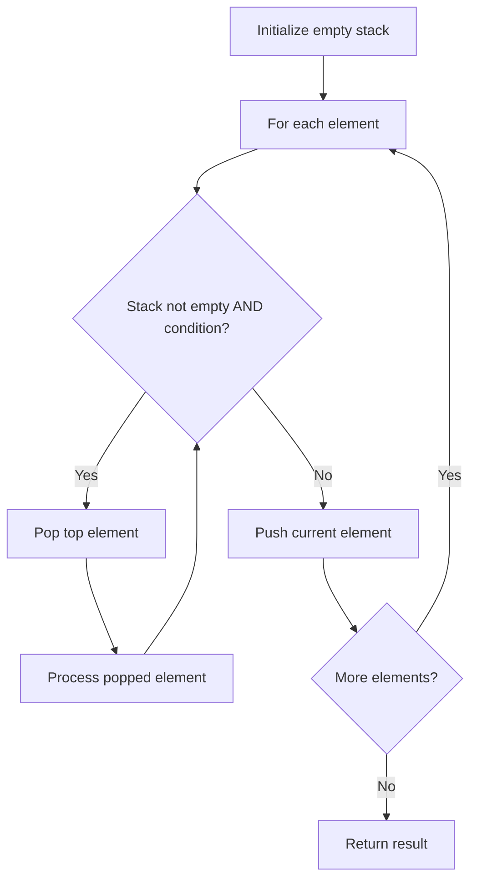

# Problem 1614: Maximum Nesting Depth of the Parentheses

**Difficulty:** Easy  
**Tags:** String, Stack  
**Pattern:** Stack  
**Link:** [leetcode.com/problems/maximum-nesting-depth-of-the-parentheses](https://leetcode.com/problems/maximum-nesting-depth-of-the-parentheses/)

## Description

Given a **valid parentheses string** `s`, return the **nesting depth** of* *`s`. The nesting depth is the **maximum** number of nested parentheses.

 

Example 1:

**Input:** s = "(1+(2*3)+((8)/4))+1"

**Output:** 3

**Explanation:**

Digit 8 is inside of 3 nested parentheses in the string.

Example 2:

**Input:** s = "(1)+((2))+(((3)))"

**Output:** 3

**Explanation:**

Digit 3 is inside of 3 nested parentheses in the string.

Example 3:

**Input:** s = "()(())((()()))"

**Output:** 3

 

**Constraints:**

	- `1 <= s.length <= 100`
	- `s` consists of digits `0-9` and characters `'+'`, `'-'`, `'*'`, `'/'`, `'('`, and `')'`.
	- It is guaranteed that parentheses expression `s` is a VPS.

## Approach: Stack

Use a stack (LIFO) to process elements. Push elements when they might be needed later; pop when a matching or resolving condition is found. Common uses: parentheses matching, expression evaluation, next greater element.

## Pseudocode

```
1. Initialize empty stack
2. For each element:
   a. While stack is not empty and condition met:
      - Pop and process top element
   b. Push current element onto stack
3. Process remaining elements in stack if needed
4. Return result
```

## Algorithm Flow



## Complexity Analysis

- **Time:** O(n)
- **Space:** O(n)

## Solution (Python3)

```python
class Solution:
    def maxDepth(self, s: str) -> int:
        # Stack-based approach - O(n) time
        stack = []
        for ch in s:
            if stack and self._matches(stack[-1], ch):
                stack.pop()
            else:
                stack.append(ch)
        return len(stack) == 0 if isinstance(0, bool) else stack

    def _matches(self, a, b):
        pairs = {'(': ')', '[': ']', '{': '}'}
        return pairs.get(a) == b
```

## Solution (C++)

```cpp
#include <stack>
#include <string>
#include <unordered_map>
#include <vector>
using namespace std;

class Solution {
public:
    int maxDepth(string& s) {
        // Stack-based approach - O(n) time
        stack<char> st;
        unordered_map<char, char> pairs = {{'(', ')'}, {'[', ']'}, {'{', '}'}};
        for (char ch : s) {
            if (!st.empty() && pairs.count(st.top()) && pairs[st.top()] == ch) {
                st.pop();
            } else {
                st.push(ch);
            }
        }
        return st.empty();
    }
};
```
