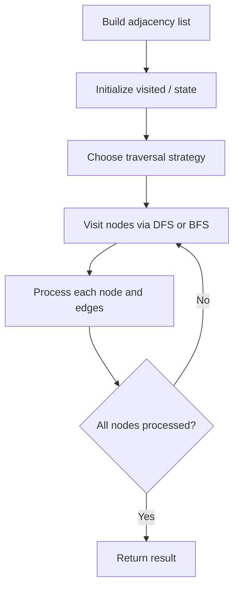

# Problem 1615: Maximal Network Rank

**Difficulty:** Medium  
**Tags:** Graph Theory  
**Pattern:** Graph Algorithm  
**Link:** [leetcode.com/problems/maximal-network-rank](https://leetcode.com/problems/maximal-network-rank/)

## Description

There is an infrastructure of `n` cities with some number of `roads` connecting these cities. Each `roads[i] = [ai, bi]` indicates that there is a bidirectional road between cities `ai` and `bi`.

The **network rank*** *of **two different cities** is defined as the total number of **directly** connected roads to **either** city. If a road is directly connected to both cities, it is only counted **once**.

The **maximal network rank **of the infrastructure is the **maximum network rank** of all pairs of different cities.

Given the integer `n` and the array `roads`, return *the **maximal network rank** of the entire infrastructure*.

 

Example 1:

****

```

**Input:** n = 4, roads = [[0,1],[0,3],[1,2],[1,3]]
**Output:** 4
**Explanation:** The network rank of cities 0 and 1 is 4 as there are 4 roads that are connected to either 0 or 1. The road between 0 and 1 is only counted once.

```

Example 2:

****

```

**Input:** n = 5, roads = [[0,1],[0,3],[1,2],[1,3],[2,3],[2,4]]
**Output:** 5
**Explanation:** There are 5 roads that are connected to cities 1 or 2.

```

Example 3:

```

**Input:** n = 8, roads = [[0,1],[1,2],[2,3],[2,4],[5,6],[5,7]]
**Output:** 5
**Explanation:** The network rank of 2 and 5 is 5. Notice that all the cities do not have to be connected.

```

 

**Constraints:**

	- `2 <= n <= 100`
	- `0 <= roads.length <= n * (n - 1) / 2`
	- `roads[i].length == 2`
	- `0 <= ai, bi <= n-1`
	- `ai != bi`
	- Each pair of cities has **at most one** road connecting them.

## Approach: Graph Algorithm

Build an adjacency list/matrix from the input. Apply graph traversal (DFS/BFS), shortest path, or connectivity algorithm as needed.

## Pseudocode

```
1. Build adjacency list from edges
2. Initialize visited/distance arrays
3. Apply traversal algorithm:
   - DFS/BFS for reachability
   - Dijkstra/Bellman-Ford for shortest path
   - Union-Find for connectivity
4. Return result
```

## Algorithm Flow



## Complexity Analysis

- **Time:** O(V + E)
- **Space:** O(V + E)

## Solution (Python3)

```python
class Solution:
    def maximalNetworkRank(self, n: int, roads: List[List[int]]) -> int:
        # Graph traversal - O(V+E) time
        from collections import defaultdict
        graph = defaultdict(list)
        # Build adjacency list from input
        n = len(n) if isinstance(n, list) else n
        visited = [False] * n
        result = 0
        
        def dfs(node):
            visited[node] = True
            for neighbor in graph[node]:
                if not visited[neighbor]:
                    dfs(neighbor)
        
        for i in range(n):
            if not visited[i]:
                dfs(i)
                result += 1
        return result
```

## Solution (C++)

```cpp
#include <functional>
#include <string>
#include <vector>
using namespace std;

class Solution {
public:
    int maximalNetworkRank(int n, vector<vector<int>>& roads) {
        // Graph traversal - O(V+E) time
        int n = n.size();
        vector<vector<int>> graph(n);
        vector<bool> visited(n, false);
        int result = 0;
        function<void(int)> dfs = [&](int node) {
            visited[node] = true;
            for (int neighbor : graph[node]) {
                if (!visited[neighbor]) dfs(neighbor);
            }
        };
        for (int i = 0; i < n; i++) {
            if (!visited[i]) {
                dfs(i);
                result++;
            }
        }
        return result;
    }
};
```
