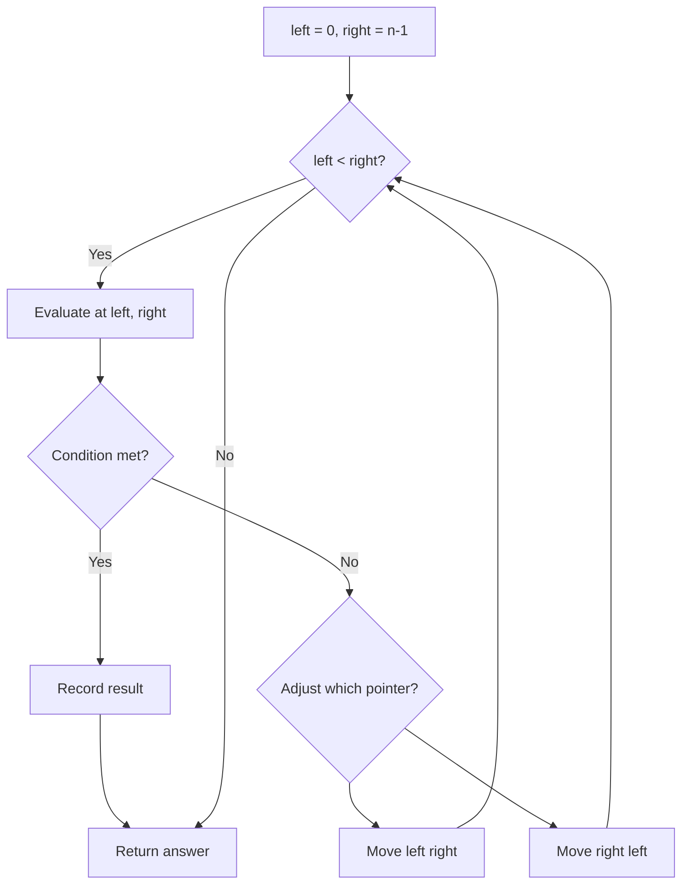
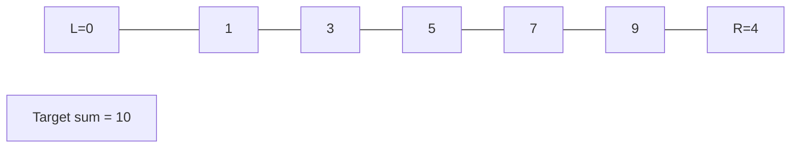
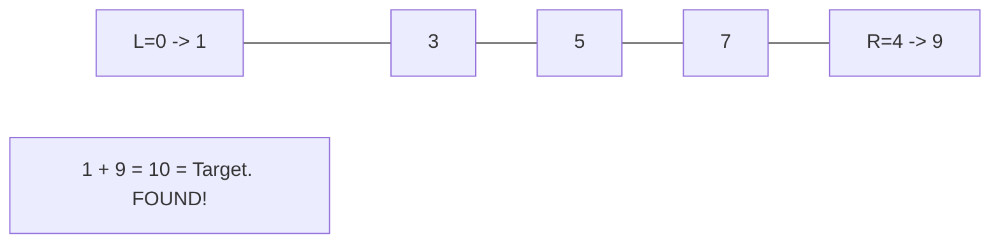

# Problem 1616: Split Two Strings to Make Palindrome

**Difficulty:** Medium  
**Tags:** Two Pointers, String  
**Pattern:** Two Pointers  
**Link:** [leetcode.com/problems/split-two-strings-to-make-palindrome](https://leetcode.com/problems/split-two-strings-to-make-palindrome/)

## Description

You are given two strings `a` and `b` of the same length. Choose an index and split both strings **at the same index**, splitting `a` into two strings: `aprefix` and `asuffix` where `a = aprefix + asuffix`, and splitting `b` into two strings: `bprefix` and `bsuffix` where `b = bprefix + bsuffix`. Check if `aprefix + bsuffix` or `bprefix + asuffix` forms a palindrome.

When you split a string `s` into `sprefix` and `ssuffix`, either `ssuffix` or `sprefix` is allowed to be empty. For example, if `s = "abc"`, then `"" + "abc"`, `"a" + "bc"`, `"ab" + "c"` , and `"abc" + ""` are valid splits.

Return `true`* if it is possible to form** a palindrome string, otherwise return *`false`.

**Notice** that `x + y` denotes the concatenation of strings `x` and `y`.

 

Example 1:

```

**Input:** a = "x", b = "y"
**Output:** true
**Explaination:** If either a or b are palindromes the answer is true since you can split in the following way:
aprefix = "", asuffix = "x"
bprefix = "", bsuffix = "y"
Then, aprefix + bsuffix = "" + "y" = "y", which is a palindrome.

```

Example 2:

```

**Input:** a = "xbdef", b = "xecab"
**Output:** false

```

Example 3:

```

**Input:** a = "ulacfd", b = "jizalu"
**Output:** true
**Explaination:** Split them at index 3:
aprefix = "ula", asuffix = "cfd"
bprefix = "jiz", bsuffix = "alu"
Then, aprefix + bsuffix = "ula" + "alu" = "ulaalu", which is a palindrome.

```

 

**Constraints:**

	- `1 <= a.length, b.length <= 10^5`
	- `a.length == b.length`
	- `a` and `b` consist of lowercase English letters

## Approach: Two Pointers

Use two pointers moving through the data structure. Depending on the problem, pointers may move toward each other (converging), in the same direction (fast/slow), or independently.

## Pseudocode

```
1. Initialize left = 0, right = n-1 (or two independent pointers)
2. While pointers haven't crossed:
   a. Evaluate condition at pointer positions
   b. Move left pointer right or right pointer left
3. Return result
```

## Algorithm Flow



## Visual State Transitions

**Two Pointer Convergence:**

**Frame 1: Initialize pointers**


**Frame 2: Sum = 1+9 = 10, found!**



## Complexity Analysis

- **Time:** O(n)
- **Space:** O(1)

## Solution (Python3)

```python
class Solution:
    def checkPalindromeFormation(self, a: str, b: str) -> bool:
        # Two pointer approach - O(n) time, O(1) space
        left, right = 0, len(a) - 1
        while left < right:
            curr = a[left] + a[right]
            if curr == b:
                return [left, right]
            elif curr < b:
                left += 1
            else:
                right -= 1
        return False
```

## Solution (C++)

```cpp
#include <string>
#include <vector>
using namespace std;

class Solution {
public:
    bool checkPalindromeFormation(string& a, string& b) {
        // Two pointer approach - O(n) time, O(1) space
        int left = 0, right = a.size() - 1;
        while (left < right) {
            int curr = a[left] + a[right];
            if (curr == b) {
                return {left, right};
            } else if (curr < b) {
                left++;
            } else {
                right--;
            }
        }
        return false;
    }
};
```
