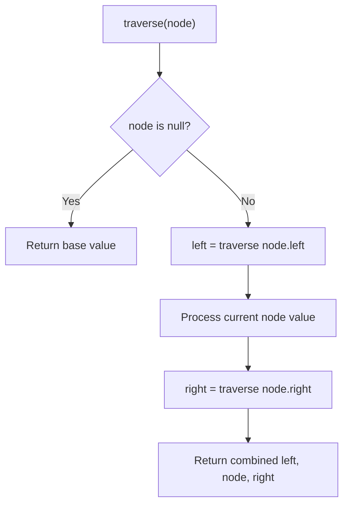

# Problem 1617: Count Subtrees With Max Distance Between Cities

**Difficulty:** Hard  
**Tags:** Dynamic Programming, Bit Manipulation, Tree, Enumeration, Bitmask  
**Pattern:** Tree Traversal  
**Link:** [leetcode.com/problems/count-subtrees-with-max-distance-between-cities](https://leetcode.com/problems/count-subtrees-with-max-distance-between-cities/)

## Description

There are `n` cities numbered from `1` to `n`. You are given an array `edges` of size `n-1`, where `edges[i] = [ui, vi]` represents a bidirectional edge between cities `ui` and `vi`. There exists a unique path between each pair of cities. In other words, the cities form a **tree**.


A **subtree** is a subset of cities where every city is reachable from every other city in the subset, where the path between each pair passes through only the cities from the subset. Two subtrees are different if there is a city in one subtree that is not present in the other.


For each `d` from `1` to `n-1`, find the number of subtrees in which the **maximum distance** between any two cities in the subtree is equal to `d`.


Return *an array of size* `n-1` *where the *`d^th`* **element **(1-indexed)** is the number of subtrees in which the **maximum distance** between any two cities is equal to *`d`.


**Notice** that the **distance** between the two cities is the number of edges in the path between them.


 

Example 1:


****


```

**Input:** n = 4, edges = [[1,2],[2,3],[2,4]]
**Output:** [3,4,0]
Explanation:
The subtrees with subsets {1,2}, {2,3} and {2,4} have a max distance of 1.
The subtrees with subsets {1,2,3}, {1,2,4}, {2,3,4} and {1,2,3,4} have a max distance of 2.
No subtree has two nodes where the max distance between them is 3.

```


Example 2:


```

**Input:** n = 2, edges = [[1,2]]
**Output:** [1]

```


Example 3:


```

**Input:** n = 3, edges = [[1,2],[2,3]]
**Output:** [2,1]

```


 

**Constraints:**


	- `2 <= n <= 15`
	- `edges.length == n-1`
	- `edges[i].length == 2`
	- `1 <= ui, vi <= n`
	- All pairs `(ui, vi)` are distinct.

## Approach: Tree Traversal

Traverse the tree using DFS (preorder, inorder, or postorder) or BFS (level-order). At each node, compute or accumulate a value and recurse on children.

## Pseudocode

```
1. Define recursive function traverse(node):
   a. Base case: if node is null, return default
   b. Recurse on left child
   c. Process current node
   d. Recurse on right child
   e. Return combined result
2. Call traverse(root)
```

## Algorithm Flow



## Complexity Analysis

- **Time:** O(n)
- **Space:** O(h)

## Solution (Python3)

```python
class Solution:
    def countSubgraphsForEachDiameter(self, n: int, edges: List[List[int]]) -> List[int]:
        # Tree traversal - O(n) time, O(h) space
        result = []
        def traverse(node):
            if not node:
                return
            result.append(node.val)
            traverse(node.left)
            traverse(node.right)
        traverse(n)
        return result if isinstance([], list) else result[0] if result else []
```

## Solution (C++)

```cpp
#include <functional>
#include <string>
#include <vector>
using namespace std;

class Solution {
public:
    vector<int> countSubgraphsForEachDiameter(int n, vector<vector<int>>& edges) {
        // Tree traversal - O(n) time, O(h) space
        vector<int> result;
        function<void(TreeNode*)> traverse = [&](TreeNode* node) {
            if (!node) return;
            result.push_back(node->val);
            traverse(node->left);
            traverse(node->right);
        };
        traverse(n);
        return result;
    }
};
```
