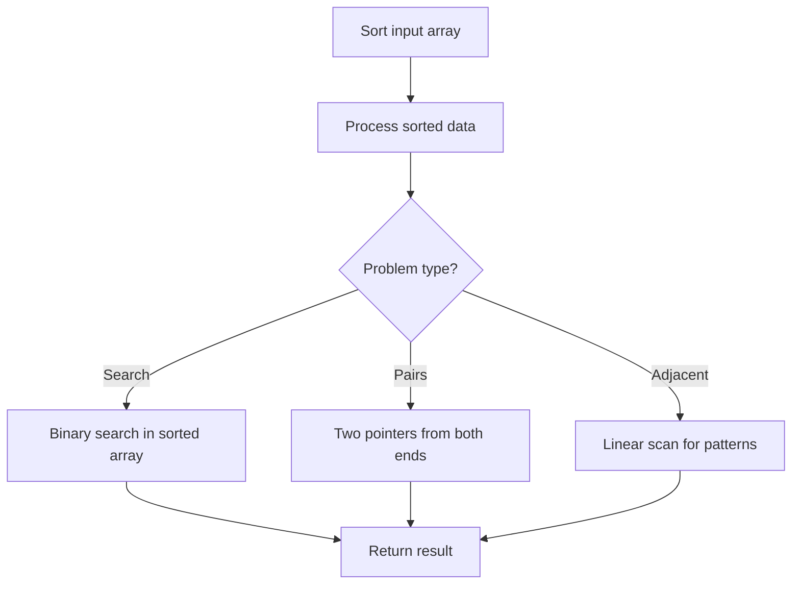

# Problem 1619: Mean of Array After Removing Some Elements

**Difficulty:** Easy  
**Tags:** Array, Sorting  
**Pattern:** Sorting  
**Link:** [leetcode.com/problems/mean-of-array-after-removing-some-elements](https://leetcode.com/problems/mean-of-array-after-removing-some-elements/)

## Description

Given an integer array `arr`, return *the mean of the remaining integers after removing the smallest `5%` and the largest `5%` of the elements.*

Answers within `10^-5` of the **actual answer** will be considered accepted.

 

Example 1:

```

**Input:** arr = [1,2,2,2,2,2,2,2,2,2,2,2,2,2,2,2,2,2,2,3]
**Output:** 2.00000
**Explanation:** After erasing the minimum and the maximum values of this array, all elements are equal to 2, so the mean is 2.

```

Example 2:

```

**Input:** arr = [6,2,7,5,1,2,0,3,10,2,5,0,5,5,0,8,7,6,8,0]
**Output:** 4.00000

```

Example 3:

```

**Input:** arr = [6,0,7,0,7,5,7,8,3,4,0,7,8,1,6,8,1,1,2,4,8,1,9,5,4,3,8,5,10,8,6,6,1,0,6,10,8,2,3,4]
**Output:** 4.77778

```

 

**Constraints:**

	- `20 <= arr.length <= 1000`
	- `arr.length`** ****is a multiple** of `20`.
	- `0 <= arr[i] <= 10^5`

## Approach: Sorting

Sort the data to enable efficient processing. After sorting, use techniques like binary search, two pointers, or linear scan to solve the problem.

## Pseudocode

```
1. Sort the input array
2. Process sorted data:
   - Use binary search for lookups
   - Use two pointers for pair finding
   - Scan for adjacent patterns
3. Return result
```

## Algorithm Flow



## Complexity Analysis

- **Time:** O(n log n)
- **Space:** O(n)

## Solution (Python3)

```python
class Solution:
    def trimMean(self, arr: List[int]) -> float:
        # Sort-based approach - O(n log n) time
        arr.sort(key=lambda x: x[0] if isinstance(x, (list, tuple)) else x)
        result = [arr[0]]
        for i in range(1, len(arr)):
            curr = arr[i]
            if isinstance(curr, (list, tuple)) and isinstance(result[-1], (list, tuple)):
                if curr[0] <= result[-1][1]:
                    result[-1] = [result[-1][0], max(result[-1][1], curr[1])]
                else:
                    result.append(curr)
            else:
                result.append(curr)
        return result
```

## Solution (C++)

```cpp
#include <algorithm>
#include <string>
#include <vector>
using namespace std;

class Solution {
public:
    double trimMean(vector<int>& arr) {
        // Sort-based approach - O(n log n) time
        sort(arr.begin(), arr.end());
        vector<vector<int>> result;
        result.push_back(arr[0]);
        for (int i = 1; i < (int)arr.size(); i++) {
            if (arr[i][0] <= result.back()[1]) {
                result.back()[1] = max(result.back()[1], arr[i][1]);
            } else {
                result.push_back(arr[i]);
            }
        }
        return result;
    }
};
```
