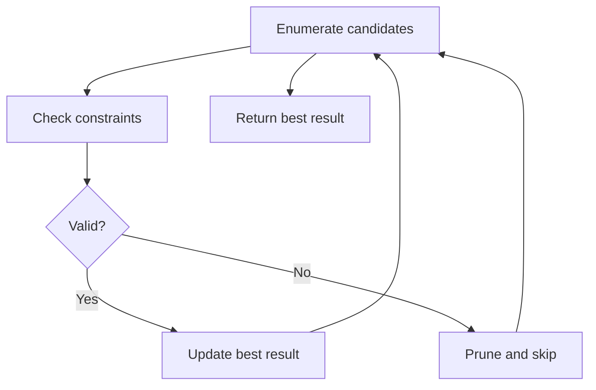

# Problem 1620: Coordinate With Maximum Network Quality

**Difficulty:** Medium  
**Tags:** Array, Enumeration  
**Pattern:** Enumeration  
**Link:** [leetcode.com/problems/coordinate-with-maximum-network-quality](https://leetcode.com/problems/coordinate-with-maximum-network-quality/)

## Description

You are given an array of network towers `towers`, where `towers[i] = [xi, yi, qi]` denotes the `i^th` network tower with location `(xi, yi)` and quality factor `qi`. All the coordinates are **integral coordinates** on the X-Y plane, and the distance between the two coordinates is the **Euclidean distance**.

You are also given an integer `radius` where a tower is **reachable** if the distance is **less than or equal to** `radius`. Outside that distance, the signal becomes garbled, and the tower is **not reachable**.

The signal quality of the `i^th` tower at a coordinate `(x, y)` is calculated with the formula `⌊qi / (1 + d)⌋`, where `d` is the distance between the tower and the coordinate. The **network quality** at a coordinate is the sum of the signal qualities from all the **reachable** towers.

Return *the array *`[cx, cy]`* representing the **integral** coordinate *`(cx, cy)`* where the **network quality** is maximum. If there are multiple coordinates with the same **network quality**, return the lexicographically minimum **non-negative** coordinate.*

**Note:**

	- A coordinate `(x1, y1)` is lexicographically smaller than `(x2, y2)` if either:

	
		`x1 < x2`, or
		- `x1 == x2` and `y1 < y2`.
	
	
	- `⌊val⌋` is the greatest integer less than or equal to `val` (the floor function).

 

Example 1:

```

**Input:** towers = [[1,2,5],[2,1,7],[3,1,9]], radius = 2
**Output:** [2,1]
**Explanation:** At coordinate (2, 1) the total quality is 13.
- Quality of 7 from (2, 1) results in ⌊7 / (1 + sqrt(0)⌋ = ⌊7⌋ = 7
- Quality of 5 from (1, 2) results in ⌊5 / (1 + sqrt(2)⌋ = ⌊2.07⌋ = 2
- Quality of 9 from (3, 1) results in ⌊9 / (1 + sqrt(1)⌋ = ⌊4.5⌋ = 4
No other coordinate has a higher network quality.
```

Example 2:

```

**Input:** towers = [[23,11,21]], radius = 9
**Output:** [23,11]
**Explanation:** Since there is only one tower, the network quality is highest right at the tower's location.

```

Example 3:

```

**Input:** towers = [[1,2,13],[2,1,7],[0,1,9]], radius = 2
**Output:** [1,2]
**Explanation:** Coordinate (1, 2) has the highest network quality.

```

 

**Constraints:**

	- `1 <= towers.length <= 50`
	- `towers[i].length == 3`
	- `0 <= xi, yi, qi <= 50`
	- `1 <= radius <= 50`

## Approach: Enumeration

Enumerate all possible candidates or subsets and check each one. Apply pruning to skip invalid branches early.

## Pseudocode

```
1. For each candidate / subset:
   a. Check if it satisfies constraints
   b. If valid: update best result
   c. Prune impossible branches
2. Return best result
```

## Algorithm Flow



## Complexity Analysis

- **Time:** O(n^2) or O(2^n)
- **Space:** O(n)

## Solution (Python3)

```python
class Solution:
    def bestCoordinate(self, towers: List[List[int]], radius: int) -> List[int]:
        # Enumeration approach - try all valid candidates
        result = []
        for i in range(len(towers) if isinstance(towers, list) else towers):
            # Check if candidate i is valid
            valid = True
            if valid:
                result = i
                break
        return result
```

## Solution (C++)

```cpp
#include <string>
#include <vector>
using namespace std;

class Solution {
public:
    vector<int> bestCoordinate(vector<vector<int>>& towers, int radius) {
        // Enumeration approach
        int n = towers.size();
        for (int i = 0; i < n; i++) {
            // Check if candidate is valid
            bool valid = true;
            if (valid) return i;
        }
        return {};
    }
};
```
