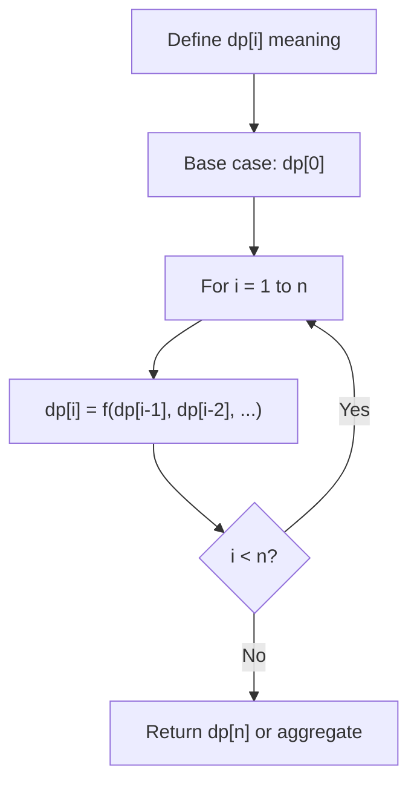
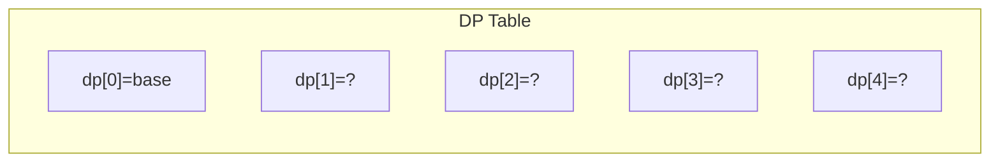
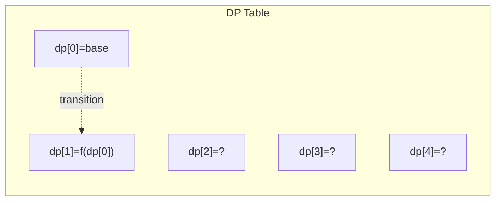
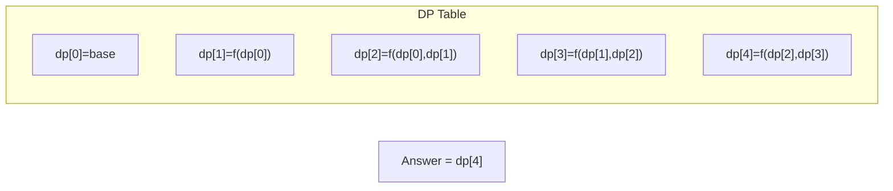

# Problem 1621: Number of Sets of K Non-Overlapping Line Segments

**Difficulty:** Medium  
**Tags:** Math, Dynamic Programming, Combinatorics, Prefix Sum  
**Pattern:** Dynamic Programming (1D)  
**Link:** [leetcode.com/problems/number-of-sets-of-k-non-overlapping-line-segments](https://leetcode.com/problems/number-of-sets-of-k-non-overlapping-line-segments/)

## Description

Given `n` points on a 1-D plane, where the `i^th` point (from `0` to `n-1`) is at `x = i`, find the number of ways we can draw **exactly** `k` **non-overlapping** line segments such that each segment covers two or more points. The endpoints of each segment must have **integral coordinates**. The `k` line segments **do not** have to cover all `n` points, and they are **allowed** to share endpoints.

Return *the number of ways we can draw *`k`* non-overlapping line segments**.* Since this number can be huge, return it **modulo** `10^9 + 7`.

 

Example 1:

```

**Input:** n = 4, k = 2
**Output:** 5
**Explanation:** The two line segments are shown in red and blue.
The image above shows the 5 different ways {(0,2),(2,3)}, {(0,1),(1,3)}, {(0,1),(2,3)}, {(1,2),(2,3)}, {(0,1),(1,2)}.

```

Example 2:

```

**Input:** n = 3, k = 1
**Output:** 3
**Explanation:** The 3 ways are {(0,1)}, {(0,2)}, {(1,2)}.

```

Example 3:

```

**Input:** n = 30, k = 7
**Output:** 796297179
**Explanation:** The total number of possible ways to draw 7 line segments is 3796297200. Taking this number modulo 109 + 7 gives us 796297179.

```

 

**Constraints:**

	- `2 <= n <= 1000`
	- `1 <= k <= n-1`

## Approach: Dynamic Programming (1D)

Break the problem into overlapping subproblems. Define dp[i] as the optimal value for the subproblem ending at or considering index i. Build the solution bottom-up, using previously computed dp values.

## Pseudocode

```
1. Define dp[i] = optimal value for subproblem i
2. Base case: dp[0] = initial value
3. For i from 1 to n:
   a. dp[i] = recurrence(dp[i-1], dp[i-2], ...)
4. Return dp[n] or max/min of dp
```

## Algorithm Flow



## Visual State Transitions

**1D Dynamic Programming Table Build:**

**Frame 1: Initialize base cases**


**Frame 2: Fill dp[1] from dp[0]**


**Frame 3: Fill remaining cells**



## Complexity Analysis

- **Time:** O(n)
- **Space:** O(n)

## Solution (Python3)

```python
class Solution:
    def numberOfSets(self, n: int, k: int) -> int:
        # Dynamic programming (1D) - O(n) time, O(n) space
        if not n:
            return 0
        n = len(n) if isinstance(n, list) else n
        dp = [0] * (n + 1)
        dp[0] = 1  # base case
        for i in range(1, n + 1):
            dp[i] = dp[i-1]  # transition (customize per problem)
            if i >= 2:
                dp[i] += dp[i-2]
        return dp[n]
```

## Solution (C++)

```cpp
#include <string>
#include <vector>
using namespace std;

class Solution {
public:
    int numberOfSets(int n, int k) {
        // Dynamic programming (1D) - O(n) time, O(n) space
        int n = n;
        if (n <= 0) return 0;
        vector<int> dp(n + 1, 0);
        dp[0] = 1;
        for (int i = 1; i <= n; i++) {
            dp[i] = dp[i-1];
            if (i >= 2) dp[i] += dp[i-2];
        }
        return dp[n];
    }
};
```
