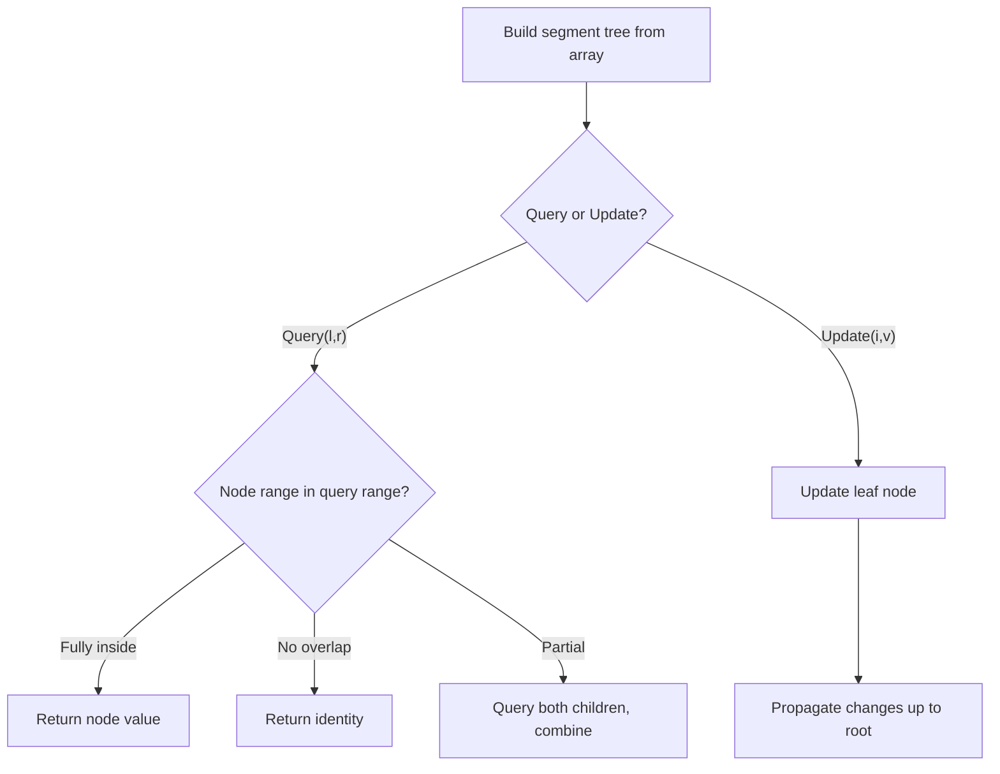

# Problem 1622: Fancy Sequence

**Difficulty:** Hard  
**Tags:** Math, Design, Segment Tree  
**Pattern:** Segment Tree  
**Link:** [leetcode.com/problems/fancy-sequence](https://leetcode.com/problems/fancy-sequence/)

## Description

Write an API that generates fancy sequences using the `append`, `addAll`, and `multAll` operations.

Implement the `Fancy` class:

	- `Fancy()` Initializes the object with an empty sequence.
	- `void append(val)` Appends an integer `val` to the end of the sequence.
	- `void addAll(inc)` Increments all existing values in the sequence by an integer `inc`.
	- `void multAll(m)` Multiplies all existing values in the sequence by an integer `m`.
	- `int getIndex(idx)` Gets the current value at index `idx` (0-indexed) of the sequence **modulo** `10^9 + 7`. If the index is greater or equal than the length of the sequence, return `-1`.

 

Example 1:

```

**Input**
["Fancy", "append", "addAll", "append", "multAll", "getIndex", "addAll", "append", "multAll", "getIndex", "getIndex", "getIndex"]
[[], [2], [3], [7], [2], [0], [3], [10], [2], [0], [1], [2]]
**Output**
[null, null, null, null, null, 10, null, null, null, 26, 34, 20]

**Explanation**
Fancy fancy = new Fancy();
fancy.append(2);   // fancy sequence: [2]
fancy.addAll(3);   // fancy sequence: [2+3] -> [5]
fancy.append(7);   // fancy sequence: [5, 7]
fancy.multAll(2);  // fancy sequence: [5*2, 7*2] -> [10, 14]
fancy.getIndex(0); // return 10
fancy.addAll(3);   // fancy sequence: [10+3, 14+3] -> [13, 17]
fancy.append(10);  // fancy sequence: [13, 17, 10]
fancy.multAll(2);  // fancy sequence: [13*2, 17*2, 10*2] -> [26, 34, 20]
fancy.getIndex(0); // return 26
fancy.getIndex(1); // return 34
fancy.getIndex(2); // return 20

```

 

**Constraints:**

	- `1 <= val, inc, m <= 100`
	- `0 <= idx <= 10^5`
	- At most `10^5` calls total will be made to `append`, `addAll`, `multAll`, and `getIndex`.

## Approach: Segment Tree

Build a segment tree for range queries (sum, min, max) with point or range updates. Each node covers a range; queries are answered by combining relevant segments.

## Pseudocode

```
1. Build segment tree from array (O(n))
2. Query(l, r):
   - If node range within [l,r]: return node value
   - If no overlap: return identity
   - Else: combine query(left_child) and query(right_child)
3. Update(i, val): update leaf and propagate up
```

## Algorithm Flow



## Complexity Analysis

- **Time:** O(n log n) build, O(log n) query/update
- **Space:** O(n)

## Solution (Python3)

```python
class Fancy:
    def __init__(self):
        # Initialize data structure
        pass

    def append(self, val: int) -> None:
        return None

    def addAll(self, inc: int) -> None:
        return None

    def multAll(self, m: int) -> None:
        return None

    def getIndex(self, idx: int) -> int:
        return 0

```

## Solution (C++)

```cpp
#include <functional>
#include <string>
#include <vector>
using namespace std;

class Fancy {
public:
    Fancy() {
        // Initialize
    }

    void append(int val) {
        return ;
    }

    void addAll(int inc) {
        return ;
    }

    void multAll(int m) {
        return ;
    }

    int getIndex(int idx) {
        return 0;
    }

};
```
