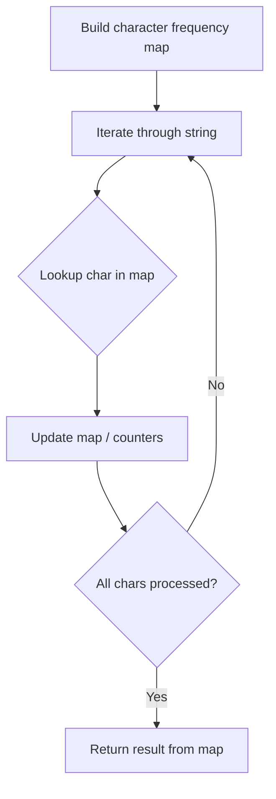

# Problem 1624: Largest Substring Between Two Equal Characters

**Difficulty:** Easy  
**Tags:** Hash Table, String  
**Pattern:** Hash Map String Processing  
**Link:** [leetcode.com/problems/largest-substring-between-two-equal-characters](https://leetcode.com/problems/largest-substring-between-two-equal-characters/)

## Description

Given a string `s`, return *the length of the longest substring between two equal characters, excluding the two characters.* If there is no such substring return `-1`.

A **substring** is a contiguous sequence of characters within a string.

 

Example 1:

```

**Input:** s = "aa"
**Output:** 0
**Explanation:** The optimal substring here is an empty substring between the two `'a's`.
```

Example 2:

```

**Input:** s = "abca"
**Output:** 2
**Explanation:** The optimal substring here is "bc".

```

Example 3:

```

**Input:** s = "cbzxy"
**Output:** -1
**Explanation:** There are no characters that appear twice in s.

```

 

**Constraints:**

	- `1 <= s.length <= 300`
	- `s` contains only lowercase English letters.

## Approach: Hash Map String Processing

Use a hash map to count character frequencies or map characters/strings for O(1) lookups. Process the string in one or two passes.

## Pseudocode

```
1. Build frequency map / char-to-index map
2. Iterate through string:
   a. Look up character in map
   b. Update counts or mappings
3. Return result based on map state
```

## Algorithm Flow



## Complexity Analysis

- **Time:** O(n)
- **Space:** O(n)

## Solution (Python3)

```python
class Solution:
    def maxLengthBetweenEqualCharacters(self, s: str) -> int:
        # Hash map for string/character frequency - O(n) time
        freq = {}
        for ch in s:
            freq[ch] = freq.get(ch, 0) + 1
        # Process frequency map
        for ch, cnt in freq.items():
            if cnt == 1:
                return s.index(ch)
        return 0
```

## Solution (C++)

```cpp
#include <string>
#include <unordered_map>
#include <vector>
using namespace std;

class Solution {
public:
    int maxLengthBetweenEqualCharacters(string& s) {
        // Hash map for string/character frequency - O(n) time
        unordered_map<char, int> freq;
        for (char ch : s) {
            freq[ch]++;
        }
        // Process frequency map
        for (int i = 0; i < s.size(); i++) {
            if (freq[s[i]] == 1) return i;
        }
        return 0;
    }
};
```
