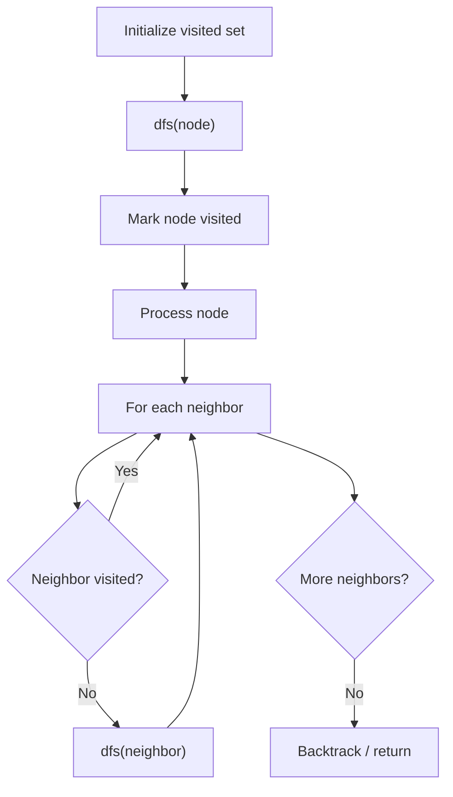

# Problem 1625: Lexicographically Smallest String After Applying Operations

**Difficulty:** Medium  
**Tags:** String, Depth-First Search, Breadth-First Search, Enumeration  
**Pattern:** DFS Graph Traversal  
**Link:** [leetcode.com/problems/lexicographically-smallest-string-after-applying-operations](https://leetcode.com/problems/lexicographically-smallest-string-after-applying-operations/)

## Description

You are given a string `s` of **even length** consisting of digits from `0` to `9`, and two integers `a` and `b`.

You can apply either of the following two operations any number of times and in any order on `s`:

	- Add `a` to all odd indices of `s` **(0-indexed)**. Digits post `9` are cycled back to `0`. For example, if `s = "3456"` and `a = 5`, `s` becomes `"3951"`.
	- Rotate `s` to the right by `b` positions. For example, if `s = "3456"` and `b = 1`, `s` becomes `"6345"`.

Return *the **lexicographically smallest** string you can obtain by applying the above operations any number of times on* `s`.

A string `a` is lexicographically smaller than a string `b` (of the same length) if in the first position where `a` and `b` differ, string `a` has a letter that appears earlier in the alphabet than the corresponding letter in `b`. For example, `"0158"` is lexicographically smaller than `"0190"` because the first position they differ is at the third letter, and `'5'` comes before `'9'`.

 

Example 1:

```

**Input:** s = "5525", a = 9, b = 2
**Output:** "2050"
**Explanation:** We can apply the following operations:
Start:  "5525"
Rotate: "2555"
Add:    "2454"
Add:    "2353"
Rotate: "5323"
Add:    "5222"
Add:    "5121"
Rotate: "2151"
Add:    "2050"​​​​​
There is no way to obtain a string that is lexicographically smaller than "2050".

```

Example 2:

```

**Input:** s = "74", a = 5, b = 1
**Output:** "24"
**Explanation:** We can apply the following operations:
Start:  "74"
Rotate: "47"
​​​​​​​Add:    "42"
​​​​​​​Rotate: "24"​​​​​​​​​​​​
There is no way to obtain a string that is lexicographically smaller than "24".

```

Example 3:

```

**Input:** s = "0011", a = 4, b = 2
**Output:** "0011"
**Explanation:** There are no sequence of operations that will give us a lexicographically smaller string than "0011".

```

 

**Constraints:**

	- `2 <= s.length <= 100`
	- `s.length` is even.
	- `s` consists of digits from `0` to `9` only.
	- `1 <= a <= 9`
	- `1 <= b <= s.length - 1`

## Approach: DFS Graph Traversal

Explore the graph depth-first using recursion or a stack. Mark nodes as visited to avoid cycles. Process each node and explore all unvisited neighbors.

## Pseudocode

```
1. Initialize visited set
2. Define dfs(node):
   a. Mark node as visited
   b. Process node
   c. For each neighbor of node:
      - If not visited: dfs(neighbor)
3. Call dfs(start) for each unvisited node
```

## Algorithm Flow



## Complexity Analysis

- **Time:** O(V + E)
- **Space:** O(V)

## Solution (Python3)

```python
class Solution:
    def findLexSmallestString(self, s: str, a: int, b: int) -> str:
        # DFS on graph - O(V+E) time
        visited = set()
        result = []
        
        def dfs(node):
            if node in visited:
                return
            visited.add(node)
            result.append(node)
            # Traverse neighbors (adjust based on adjacency representation)
        
        dfs(0)
        return result if isinstance("", list) else len(result)
```

## Solution (C++)

```cpp
#include <functional>
#include <string>
#include <vector>
using namespace std;

class Solution {
public:
    string findLexSmallestString(string& s, int a, int b) {
        // DFS on graph - O(V+E) time
        vector<bool> visited(s.size(), false);
        vector<int> result;
        function<void(int)> dfs = [&](int node) {
            if (visited[node]) return;
            visited[node] = true;
            result.push_back(node);
            // Traverse neighbors
        };
        dfs(0);
        return result;
    }
};
```
