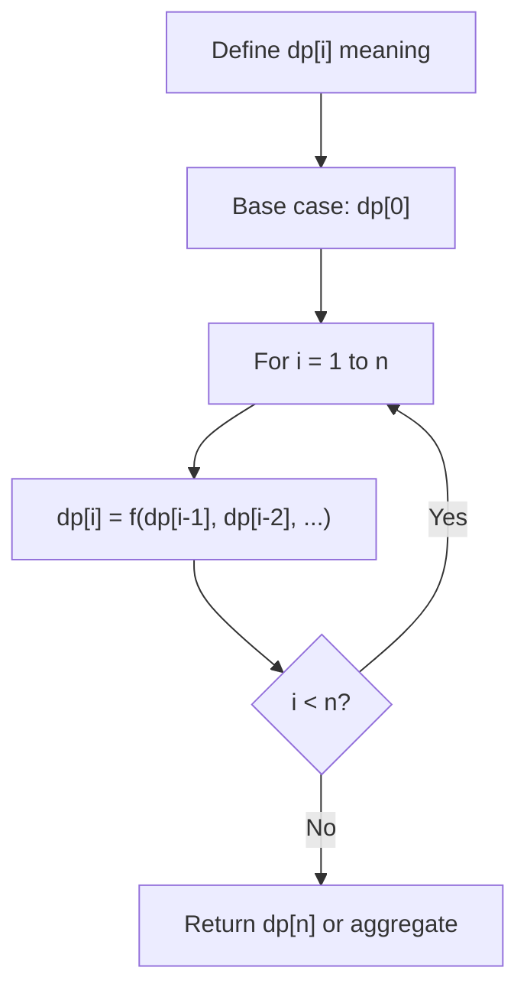
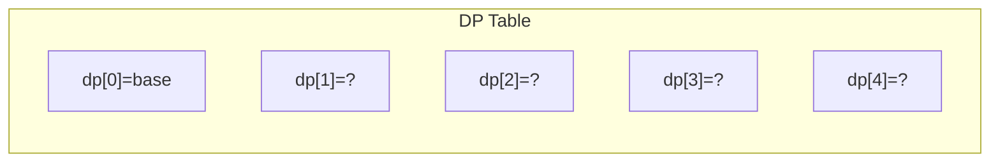
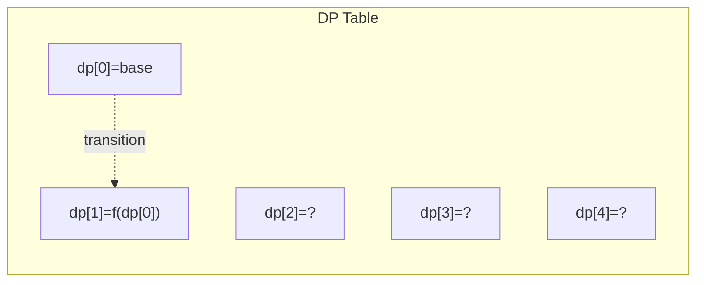
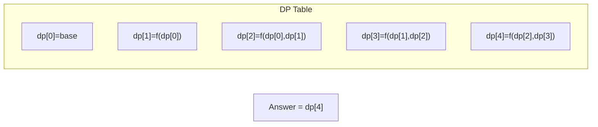

# Problem 1626: Best Team With No Conflicts

**Difficulty:** Medium  
**Tags:** Array, Dynamic Programming, Sorting  
**Pattern:** Dynamic Programming (1D)  
**Link:** [leetcode.com/problems/best-team-with-no-conflicts](https://leetcode.com/problems/best-team-with-no-conflicts/)

## Description

You are the manager of a basketball team. For the upcoming tournament, you want to choose the team with the highest overall score. The score of the team is the **sum** of scores of all the players in the team.

However, the basketball team is not allowed to have **conflicts**. A **conflict** exists if a younger player has a **strictly higher** score than an older player. A conflict does **not** occur between players of the same age.

Given two lists, `scores` and `ages`, where each `scores[i]` and `ages[i]` represents the score and age of the `i^th` player, respectively, return *the highest overall score of all possible basketball teams*.

 

Example 1:

```

**Input:** scores = [1,3,5,10,15], ages = [1,2,3,4,5]
**Output:** 34
**Explanation:** You can choose all the players.

```

Example 2:

```

**Input:** scores = [4,5,6,5], ages = [2,1,2,1]
**Output:** 16
**Explanation:** It is best to choose the last 3 players. Notice that you are allowed to choose multiple people of the same age.

```

Example 3:

```

**Input:** scores = [1,2,3,5], ages = [8,9,10,1]
**Output:** 6
**Explanation:** It is best to choose the first 3 players. 

```

 

**Constraints:**

	- `1 <= scores.length, ages.length <= 1000`
	- `scores.length == ages.length`
	- `1 <= scores[i] <= 10^6`
	- `1 <= ages[i] <= 1000`

## Approach: Dynamic Programming (1D)

Break the problem into overlapping subproblems. Define dp[i] as the optimal value for the subproblem ending at or considering index i. Build the solution bottom-up, using previously computed dp values.

## Pseudocode

```
1. Define dp[i] = optimal value for subproblem i
2. Base case: dp[0] = initial value
3. For i from 1 to n:
   a. dp[i] = recurrence(dp[i-1], dp[i-2], ...)
4. Return dp[n] or max/min of dp
```

## Algorithm Flow



## Visual State Transitions

**1D Dynamic Programming Table Build:**

**Frame 1: Initialize base cases**


**Frame 2: Fill dp[1] from dp[0]**


**Frame 3: Fill remaining cells**



## Complexity Analysis

- **Time:** O(n)
- **Space:** O(n)

## Solution (Python3)

```python
class Solution:
    def bestTeamScore(self, scores: List[int], ages: List[int]) -> int:
        # Dynamic programming (1D) - O(n) time, O(n) space
        if not scores:
            return 0
        n = len(scores) if isinstance(scores, list) else scores
        dp = [0] * (n + 1)
        dp[0] = 1  # base case
        for i in range(1, n + 1):
            dp[i] = dp[i-1]  # transition (customize per problem)
            if i >= 2:
                dp[i] += dp[i-2]
        return dp[n]
```

## Solution (C++)

```cpp
#include <string>
#include <vector>
using namespace std;

class Solution {
public:
    int bestTeamScore(vector<int>& scores, vector<int>& ages) {
        // Dynamic programming (1D) - O(n) time, O(n) space
        int n = scores;
        if (n <= 0) return 0;
        vector<int> dp(n + 1, 0);
        dp[0] = 1;
        for (int i = 1; i <= n; i++) {
            dp[i] = dp[i-1];
            if (i >= 2) dp[i] += dp[i-2];
        }
        return dp[n];
    }
};
```
