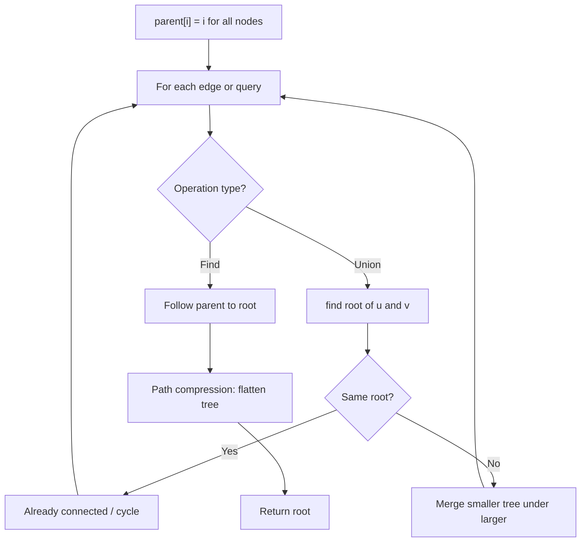
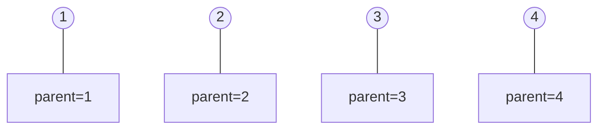
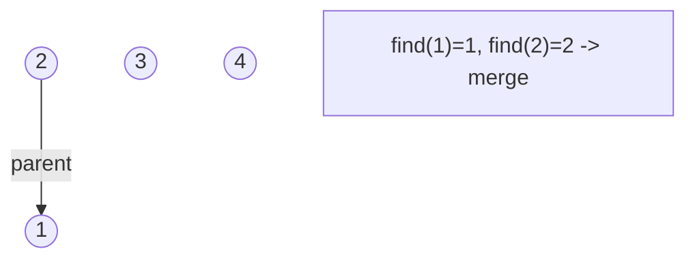
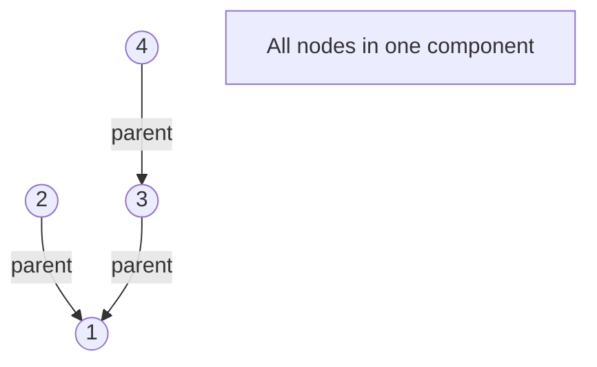
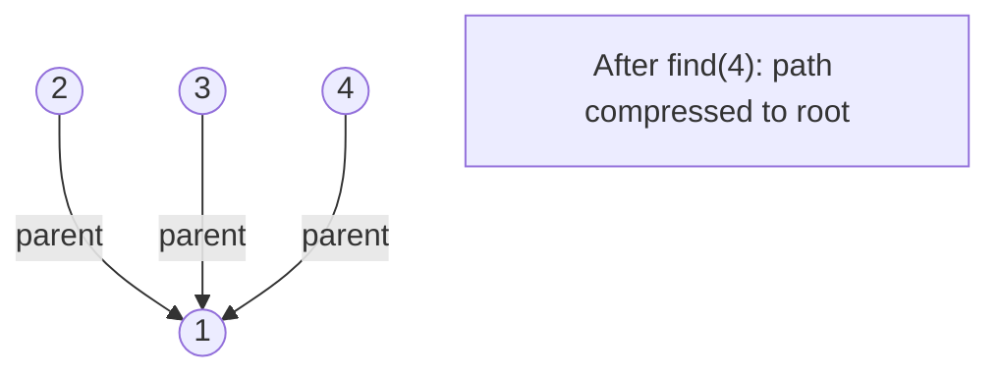

# Problem 1627: Graph Connectivity With Threshold

**Difficulty:** Hard  
**Tags:** Array, Math, Union-Find, Number Theory  
**Pattern:** Union-Find / Disjoint Set  
**Link:** [leetcode.com/problems/graph-connectivity-with-threshold](https://leetcode.com/problems/graph-connectivity-with-threshold/)

## Description

We have `n` cities labeled from `1` to `n`. Two different cities with labels `x` and `y` are directly connected by a bidirectional road if and only if `x` and `y` share a common divisor **strictly greater** than some `threshold`. More formally, cities with labels `x` and `y` have a road between them if there exists an integer `z` such that all of the following are true:

	- `x % z == 0`,
	- `y % z == 0`, and
	- `z > threshold`.

Given the two integers, `n` and `threshold`, and an array of `queries`, you must determine for each `queries[i] = [ai, bi]` if cities `ai` and `bi` are connected directly or indirectly. (i.e. there is some path between them).

Return *an array *`answer`*, where *`answer.length == queries.length`* and *`answer[i]`* is *`true`* if for the *`i^th`* query, there is a path between *`ai`* and *`bi`*, or *`answer[i]`* is *`false`* if there is no path.*

 

Example 1:

```

**Input:** n = 6, threshold = 2, queries = [[1,4],[2,5],[3,6]]
**Output:** [false,false,true]
**Explanation:** The divisors for each number:
1:   1
2:   1, 2
3:   1, 3
4:   1, 2, 4
5:   1, 5
6:   1, 2, 3, 6
Using the underlined divisors above the threshold, only cities 3 and 6 share a common divisor, so they are the
only ones directly connected. The result of each query:
[1,4]   1 is not connected to 4
[2,5]   2 is not connected to 5
[3,6]   3 is connected to 6 through path 3--6

```

Example 2:

```

**Input:** n = 6, threshold = 0, queries = [[4,5],[3,4],[3,2],[2,6],[1,3]]
**Output:** [true,true,true,true,true]
**Explanation:** The divisors for each number are the same as the previous example. However, since the threshold is 0,
all divisors can be used. Since all numbers share 1 as a divisor, all cities are connected.

```

Example 3:

```

**Input:** n = 5, threshold = 1, queries = [[4,5],[4,5],[3,2],[2,3],[3,4]]
**Output:** [false,false,false,false,false]
**Explanation:** Only cities 2 and 4 share a common divisor 2 which is strictly greater than the threshold 1, so they are the only ones directly connected.
Please notice that there can be multiple queries for the same pair of nodes [x, y], and that the query [x, y] is equivalent to the query [y, x].

```

 

**Constraints:**

	- `2 <= n <= 10^4`
	- `0 <= threshold <= n`
	- `1 <= queries.length <= 10^5`
	- `queries[i].length == 2`
	- `1 <= ai, bi <= cities`
	- `ai != bi`

## Approach: Union-Find / Disjoint Set

Use Union-Find with path compression and union by rank to efficiently manage connected components. Find(x) returns the root of x's component; Union(x,y) merges two components.

## Pseudocode

```
1. parent[i] = i for all nodes (each is its own set)
2. find(x): follow parent pointers to root (with path compression)
3. union(x, y): merge sets of x and y by rank
4. Process edges/operations:
   a. For each edge (u, v): union(u, v)
5. Answer queries using find()
```

## Algorithm Flow



## Visual State Transitions

**Union-Find Step-by-Step:**

**Frame 1: Initial - each node is own parent**


**Frame 2: Union(1,2) - merge components**


**Frame 3: Union(3,4) then Union(2,3)**


**Frame 4: Path compression on find(4)**



## Complexity Analysis

- **Time:** O(n * alpha(n))
- **Space:** O(n)

## Solution (Python3)

```python
class Solution:
    def areConnected(self, n: int, threshold: int, queries: List[List[int]]) -> List[bool]:
        # Union Find (Disjoint Set Union) - O(n * alpha(n))
        parent = list(range(len(n) + 1 if isinstance(n, list) else n + 1))
        rank = [0] * len(parent)
        
        def find(x):
            if parent[x] != x:
                parent[x] = find(parent[x])
            return parent[x]
        
        def union(x, y):
            px, py = find(x), find(y)
            if px == py:
                return False
            if rank[px] < rank[py]:
                px, py = py, px
            parent[py] = px
            if rank[px] == rank[py]:
                rank[px] += 1
            return True
        
        components = len(parent)
        # Process edges/connections
        return components
```

## Solution (C++)

```cpp
#include <functional>
#include <numeric>
#include <string>
#include <vector>
using namespace std;

class Solution {
public:
    vector<bool> areConnected(int n, int threshold, vector<vector<int>>& queries) {
        // Union Find (DSU) - O(n * alpha(n))
        int n = n.size();
        vector<int> parent(n + 1), rnk(n + 1, 0);
        iota(parent.begin(), parent.end(), 0);
        function<int(int)> find = [&](int x) -> int {
            return parent[x] == x ? x : parent[x] = find(parent[x]);
        };
        auto unite = [&](int x, int y) -> bool {
            int px = find(x), py = find(y);
            if (px == py) return false;
            if (rnk[px] < rnk[py]) swap(px, py);
            parent[py] = px;
            if (rnk[px] == rnk[py]) rnk[px]++;
            return true;
        };
        int components = n;
        return components;
    }
};
```
