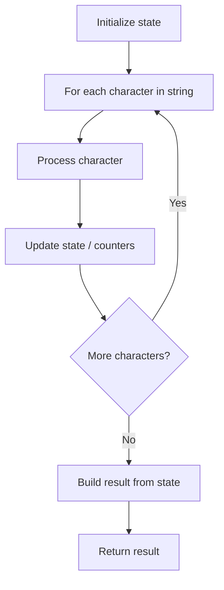

# Problem 1629: Slowest Key

**Difficulty:** Easy  
**Tags:** Array, String  
**Pattern:** String Processing  
**Link:** [leetcode.com/problems/slowest-key](https://leetcode.com/problems/slowest-key/)

## Description

A newly designed keypad was tested, where a tester pressed a sequence of `n` keys, one at a time.

You are given a string `keysPressed` of length `n`, where `keysPressed[i]` was the `i^th` key pressed in the testing sequence, and a sorted list `releaseTimes`, where `releaseTimes[i]` was the time the `i^th` key was released. Both arrays are **0-indexed**. The `0^th` key was pressed at the time `0`, and every subsequent key was pressed at the **exact** time the previous key was released.

The tester wants to know the key of the keypress that had the **longest duration**. The `i^th`^ keypress had a **duration** of `releaseTimes[i] - releaseTimes[i - 1]`, and the `0^th` keypress had a duration of `releaseTimes[0]`.

Note that the same key could have been pressed multiple times during the test, and these multiple presses of the same key **may not** have had the same **duration**.

*Return the key of the keypress that had the **longest duration**. If there are multiple such keypresses, return the lexicographically largest key of the keypresses.*

 

Example 1:

```

**Input:** releaseTimes = [9,29,49,50], keysPressed = "cbcd"
**Output:** "c"
**Explanation:** The keypresses were as follows:
Keypress for 'c' had a duration of 9 (pressed at time 0 and released at time 9).
Keypress for 'b' had a duration of 29 - 9 = 20 (pressed at time 9 right after the release of the previous character and released at time 29).
Keypress for 'c' had a duration of 49 - 29 = 20 (pressed at time 29 right after the release of the previous character and released at time 49).
Keypress for 'd' had a duration of 50 - 49 = 1 (pressed at time 49 right after the release of the previous character and released at time 50).
The longest of these was the keypress for 'b' and the second keypress for 'c', both with duration 20.
'c' is lexicographically larger than 'b', so the answer is 'c'.

```

Example 2:

```

**Input:** releaseTimes = [12,23,36,46,62], keysPressed = "spuda"
**Output:** "a"
**Explanation:** The keypresses were as follows:
Keypress for 's' had a duration of 12.
Keypress for 'p' had a duration of 23 - 12 = 11.
Keypress for 'u' had a duration of 36 - 23 = 13.
Keypress for 'd' had a duration of 46 - 36 = 10.
Keypress for 'a' had a duration of 62 - 46 = 16.
The longest of these was the keypress for 'a' with duration 16.
```

 

**Constraints:**

	- `releaseTimes.length == n`
	- `keysPressed.length == n`
	- `2 <= n <= 1000`
	- `1 <= releaseTimes[i] <= 10^9`
	- `releaseTimes[i] < releaseTimes[i+1]`
	- `keysPressed` contains only lowercase English letters.

## Approach: String Processing

Process the string character by character. Common techniques: two pointers, sliding window, hash map for frequencies, stack for matching.

## Pseudocode

```
1. Initialize result / tracking state
2. Iterate through string characters:
   a. Process character based on rules
   b. Update state (counters, pointers, stack)
3. Build and return result
```

## Algorithm Flow



## Complexity Analysis

- **Time:** O(n)
- **Space:** O(n)

## Solution (Python3)

```python
class Solution:
    def slowestKey(self, releaseTimes: List[int], keysPressed: str) -> str:
        # String processing approach - O(n) time
        result = []
        for ch in releaseTimes:
            if ch.isalnum():
                result.append(ch.lower())
        # Check palindrome or process
        processed = ''.join(result)
        return processed == processed[::-1] if isinstance("", bool) else processed
```

## Solution (C++)

```cpp
#include <algorithm>
#include <cctype>
#include <string>
#include <vector>
using namespace std;

class Solution {
public:
    string slowestKey(vector<int>& releaseTimes, string& keysPressed) {
        // String processing approach - O(n) time
        string processed;
        for (char ch : releaseTimes) {
            if (isalnum(ch)) {
                processed += tolower(ch);
            }
        }
        string rev = processed;
        reverse(rev.begin(), rev.end());
        return processed == rev;
    }
};
```
