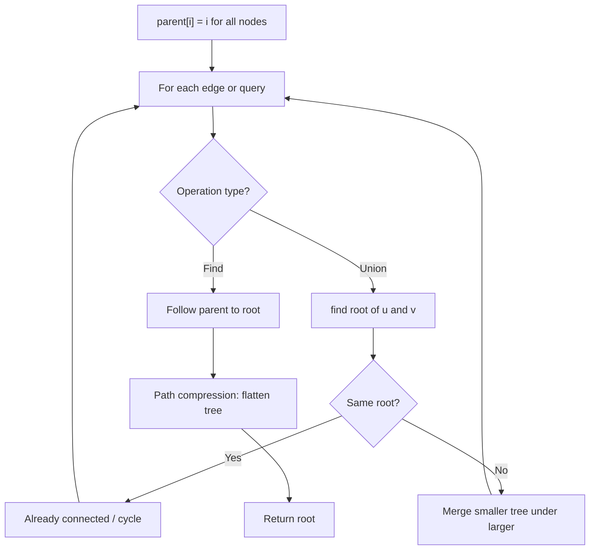
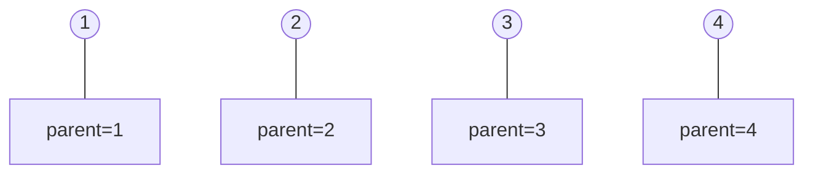
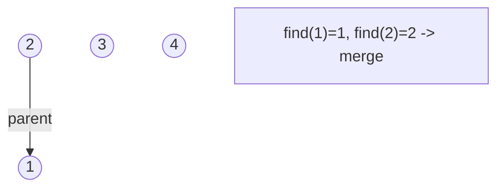
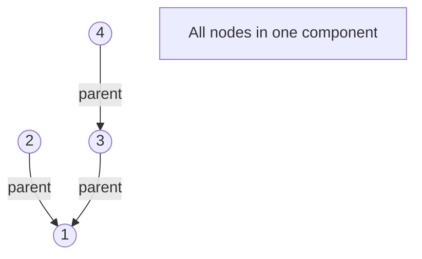
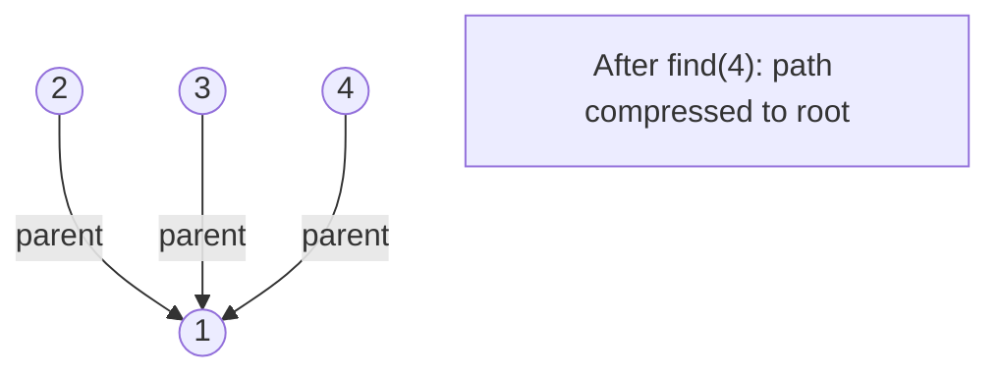

# Problem 1631: Path With Minimum Effort

**Difficulty:** Medium  
**Tags:** Array, Binary Search, Depth-First Search, Breadth-First Search, Union-Find, Heap (Priority Queue), Matrix  
**Pattern:** Dijkstra / Graph  
**Link:** [leetcode.com/problems/path-with-minimum-effort](https://leetcode.com/problems/path-with-minimum-effort/)

## Description

You are a hiker preparing for an upcoming hike. You are given `heights`, a 2D array of size `rows x columns`, where `heights[row][col]` represents the height of cell `(row, col)`. You are situated in the top-left cell, `(0, 0)`, and you hope to travel to the bottom-right cell, `(rows-1, columns-1)` (i.e., **0-indexed**). You can move **up**, **down**, **left**, or **right**, and you wish to find a route that requires the minimum **effort**.

A route's **effort** is the **maximum absolute difference**** **in heights between two consecutive cells of the route.

Return *the minimum **effort** required to travel from the top-left cell to the bottom-right cell.*

 

Example 1:

```

**Input:** heights = [[1,2,2],[3,8,2],[5,3,5]]
**Output:** 2
**Explanation:** The route of [1,3,5,3,5] has a maximum absolute difference of 2 in consecutive cells.
This is better than the route of [1,2,2,2,5], where the maximum absolute difference is 3.

```

Example 2:

```

**Input:** heights = [[1,2,3],[3,8,4],[5,3,5]]
**Output:** 1
**Explanation:** The route of [1,2,3,4,5] has a maximum absolute difference of 1 in consecutive cells, which is better than route [1,3,5,3,5].

```

Example 3:

```

**Input:** heights = [[1,2,1,1,1],[1,2,1,2,1],[1,2,1,2,1],[1,2,1,2,1],[1,1,1,2,1]]
**Output:** 0
**Explanation:** This route does not require any effort.

```

 

**Constraints:**

	- `rows == heights.length`
	- `columns == heights[i].length`
	- `1 <= rows, columns <= 100`
	- `1 <= heights[i][j] <= 10^6`

## Approach: Dijkstra / Graph

Modified Dijkstra: minimize maximum absolute difference along path.

## Pseudocode

```
1. parent[i] = i for all nodes (each is its own set)
2. find(x): follow parent pointers to root (with path compression)
3. union(x, y): merge sets of x and y by rank
4. Process edges/operations:
   a. For each edge (u, v): union(u, v)
5. Answer queries using find()
```

## Algorithm Flow



## Visual State Transitions

**Union-Find Step-by-Step:**

**Frame 1: Initial - each node is own parent**


**Frame 2: Union(1,2) - merge components**


**Frame 3: Union(3,4) then Union(2,3)**


**Frame 4: Path compression on find(4)**



## Complexity Analysis

- **Time:** O(mn log(mn))
- **Space:** O(mn)

## Solution (Python3)

```python
import heapq

class Solution:
    def minimumEffortPath(self, heights):
        m, n = len(heights), len(heights[0])
        dist = [[float('inf')] * n for _ in range(m)]
        dist[0][0] = 0
        heap = [(0, 0, 0)]
        while heap:
            effort, r, c = heapq.heappop(heap)
            if r == m-1 and c == n-1:
                return effort
            if effort > dist[r][c]:
                continue
            for dr, dc in [(-1,0),(1,0),(0,-1),(0,1)]:
                nr, nc = r+dr, c+dc
                if 0 <= nr < m and 0 <= nc < n:
                    new_effort = max(effort, abs(heights[r][c] - heights[nr][nc]))
                    if new_effort < dist[nr][nc]:
                        dist[nr][nc] = new_effort
                        heapq.heappush(heap, (new_effort, nr, nc))
        return 0
```

## Solution (C++)

```cpp
#include <functional>
#include <numeric>
#include <string>
#include <vector>
using namespace std;

class Solution {
public:
    int minimumEffortPath(vector<vector<int>>& heights) {
        // Union Find (DSU) - O(n * alpha(n))
        int n = heights.size();
        vector<int> parent(n + 1), rnk(n + 1, 0);
        iota(parent.begin(), parent.end(), 0);
        function<int(int)> find = [&](int x) -> int {
            return parent[x] == x ? x : parent[x] = find(parent[x]);
        };
        auto unite = [&](int x, int y) -> bool {
            int px = find(x), py = find(y);
            if (px == py) return false;
            if (rnk[px] < rnk[py]) swap(px, py);
            parent[py] = px;
            if (rnk[px] == rnk[py]) rnk[px]++;
            return true;
        };
        int components = n;
        return components;
    }
};
```
