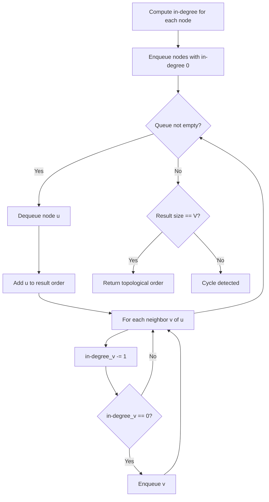
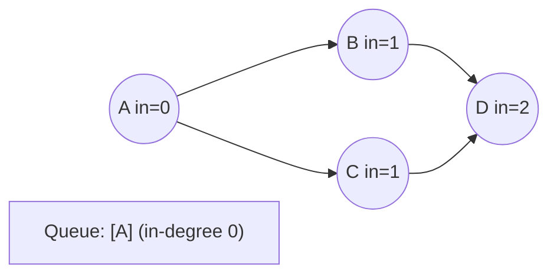
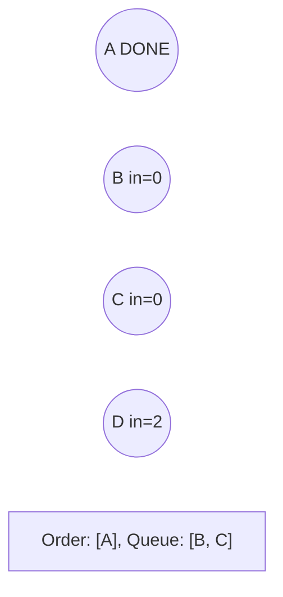
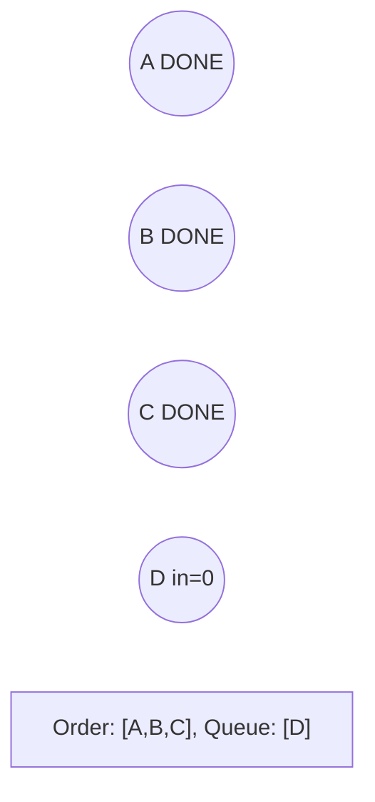
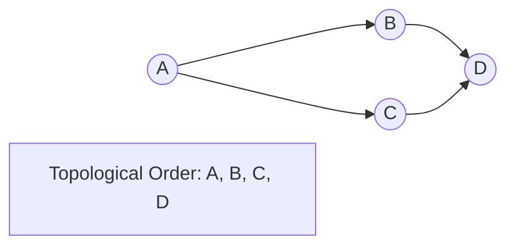

# Problem 1632: Rank Transform of a Matrix

**Difficulty:** Hard  
**Tags:** Array, Union-Find, Graph Theory, Topological Sort, Sorting, Matrix  
**Pattern:** Topological Sort  
**Link:** [leetcode.com/problems/rank-transform-of-a-matrix](https://leetcode.com/problems/rank-transform-of-a-matrix/)

## Description

Given an `m x n` `matrix`, return *a new matrix *`answer`* where *`answer[row][col]`* is the ****rank** of *`matrix[row][col]`.

The **rank** is an **integer** that represents how large an element is compared to other elements. It is calculated using the following rules:

	- The rank is an integer starting from `1`.
	- If two elements `p` and `q` are in the **same row or column**, then:
	
		If `p < q` then `rank(p) < rank(q)`
		- If `p == q` then `rank(p) == rank(q)`
		- If `p > q` then `rank(p) > rank(q)`
	
	
	- The **rank** should be as **small** as possible.

The test cases are generated so that `answer` is unique under the given rules.

 

Example 1:

```

**Input:** matrix = [[1,2],[3,4]]
**Output:** [[1,2],[2,3]]
**Explanation:**
The rank of matrix[0][0] is 1 because it is the smallest integer in its row and column.
The rank of matrix[0][1] is 2 because matrix[0][1] > matrix[0][0] and matrix[0][0] is rank 1.
The rank of matrix[1][0] is 2 because matrix[1][0] > matrix[0][0] and matrix[0][0] is rank 1.
The rank of matrix[1][1] is 3 because matrix[1][1] > matrix[0][1], matrix[1][1] > matrix[1][0], and both matrix[0][1] and matrix[1][0] are rank 2.

```

Example 2:

```

**Input:** matrix = [[7,7],[7,7]]
**Output:** [[1,1],[1,1]]

```

Example 3:

```

**Input:** matrix = [[20,-21,14],[-19,4,19],[22,-47,24],[-19,4,19]]
**Output:** [[4,2,3],[1,3,4],[5,1,6],[1,3,4]]

```

 

**Constraints:**

	- `m == matrix.length`
	- `n == matrix[i].length`
	- `1 <= m, n <= 500`
	- `-10^9 <= matrix[row][col] <= 10^9`

## Approach: Topological Sort

Order nodes in a DAG so every edge u->v has u before v. Use Kahn's algorithm (BFS with in-degree tracking) or DFS-based ordering.

## Pseudocode

```
1. Compute in-degree for every node
2. Enqueue all nodes with in-degree 0
3. While queue not empty:
   a. Dequeue node u, add to result order
   b. For each neighbor v of u:
      - Decrease in-degree of v
      - If in-degree becomes 0: enqueue v
4. If result size != V: cycle exists
5. Return topological order
```

## Algorithm Flow



## Visual State Transitions

**Topological Sort (Kahn's Algorithm):**

**Frame 1: Compute in-degrees**


**Frame 2: Process A, reduce neighbors**


**Frame 3: Process B and C**


**Frame 4: Complete**



## Complexity Analysis

- **Time:** O(V + E)
- **Space:** O(V + E)

## Solution (Python3)

```python
class Solution:
    def matrixRankTransform(self, matrix: List[List[int]]) -> List[List[int]]:
        # Topological sort (Kahn's algorithm) - O(V+E)
        from collections import deque, defaultdict
        graph = defaultdict(list)
        n = matrix if isinstance(matrix, int) else len(matrix)
        indegree = [0] * n
        # Build graph from prerequisites
        prereqs = matrix if isinstance(matrix, list) else matrix
        for edge in prereqs:
            if isinstance(edge, (list, tuple)) and len(edge) >= 2:
                graph[edge[1]].append(edge[0])
                indegree[edge[0]] += 1
        queue = deque([i for i in range(n) if indegree[i] == 0])
        order = []
        while queue:
            node = queue.popleft()
            order.append(node)
            for neighbor in graph[node]:
                indegree[neighbor] -= 1
                if indegree[neighbor] == 0:
                    queue.append(neighbor)
        return len(order) == n if isinstance([], bool) else order
```

## Solution (C++)

```cpp
#include <queue>
#include <string>
#include <vector>
using namespace std;

class Solution {
public:
    vector<vector<int>> matrixRankTransform(vector<vector<int>>& matrix) {
        // Topological sort (Kahn's) - O(V+E)
        int n = matrix;
        vector<vector<int>> graph(n);
        vector<int> indegree(n, 0);
        for (auto& edge : matrix) {
            graph[edge[1]].push_back(edge[0]);
            indegree[edge[0]]++;
        }
        queue<int> q;
        for (int i = 0; i < n; i++)
            if (indegree[i] == 0) q.push(i);
        vector<int> order;
        while (!q.empty()) {
            int node = q.front(); q.pop();
            order.push_back(node);
            for (int neighbor : graph[node]) {
                if (--indegree[neighbor] == 0) q.push(neighbor);
            }
        }
        return order.size() == n;
    }
};
```
