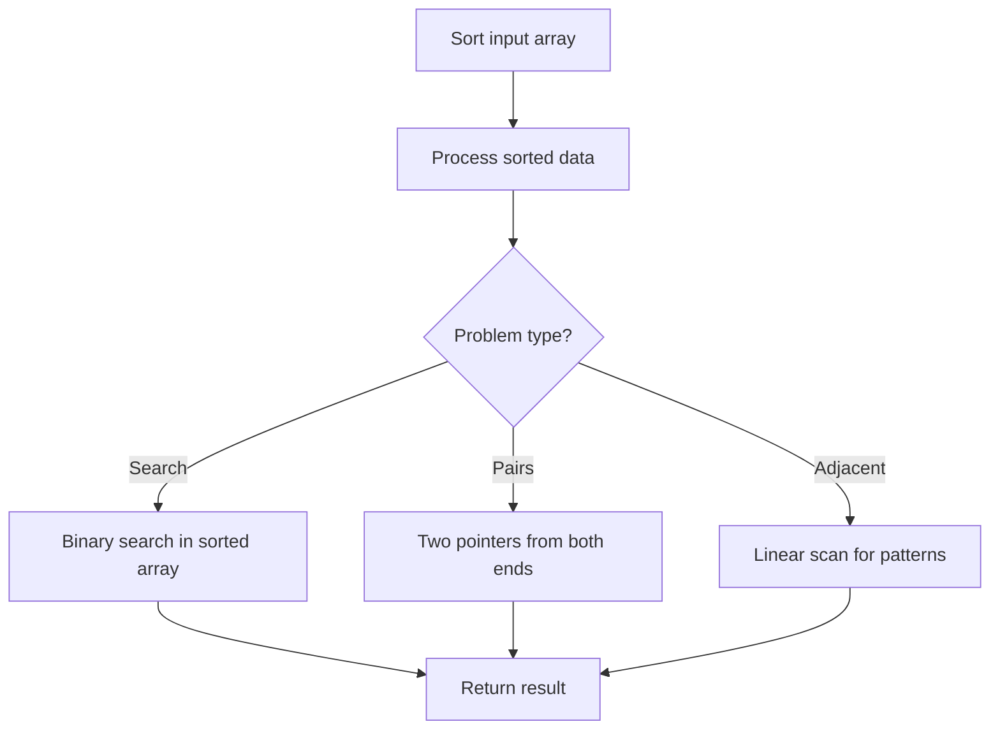

# Problem 1637: Widest Vertical Area Between Two Points Containing No Points

**Difficulty:** Easy  
**Tags:** Array, Sorting  
**Pattern:** Sorting  
**Link:** [leetcode.com/problems/widest-vertical-area-between-two-points-containing-no-points](https://leetcode.com/problems/widest-vertical-area-between-two-points-containing-no-points/)

## Description

Given `n` `points` on a 2D plane where `points[i] = [xi, yi]`, Return* the **widest vertical area** between two points such that no points are inside the area.*

A **vertical area** is an area of fixed-width extending infinitely along the y-axis (i.e., infinite height). The **widest vertical area** is the one with the maximum width.

Note that points **on the edge** of a vertical area **are not** considered included in the area.

 

Example 1:

​

```

**Input:** points = [[8,7],[9,9],[7,4],[9,7]]
**Output:** 1
**Explanation:** Both the red and the blue area are optimal.

```

Example 2:

```

**Input:** points = [[3,1],[9,0],[1,0],[1,4],[5,3],[8,8]]
**Output:** 3

```

 

**Constraints:**

	- `n == points.length`
	- `2 <= n <= 10^5`
	- `points[i].length == 2`
	- `0 <= xi, yi <= 10^9`

## Approach: Sorting

Sort the data to enable efficient processing. After sorting, use techniques like binary search, two pointers, or linear scan to solve the problem.

## Pseudocode

```
1. Sort the input array
2. Process sorted data:
   - Use binary search for lookups
   - Use two pointers for pair finding
   - Scan for adjacent patterns
3. Return result
```

## Algorithm Flow



## Complexity Analysis

- **Time:** O(n log n)
- **Space:** O(n)

## Solution (Python3)

```python
class Solution:
    def maxWidthOfVerticalArea(self, points: List[List[int]]) -> int:
        # Sort-based approach - O(n log n) time
        points.sort(key=lambda x: x[0] if isinstance(x, (list, tuple)) else x)
        result = [points[0]]
        for i in range(1, len(points)):
            curr = points[i]
            if isinstance(curr, (list, tuple)) and isinstance(result[-1], (list, tuple)):
                if curr[0] <= result[-1][1]:
                    result[-1] = [result[-1][0], max(result[-1][1], curr[1])]
                else:
                    result.append(curr)
            else:
                result.append(curr)
        return result
```

## Solution (C++)

```cpp
#include <algorithm>
#include <string>
#include <vector>
using namespace std;

class Solution {
public:
    int maxWidthOfVerticalArea(vector<vector<int>>& points) {
        // Sort-based approach - O(n log n) time
        sort(points.begin(), points.end());
        vector<vector<int>> result;
        result.push_back(points[0]);
        for (int i = 1; i < (int)points.size(); i++) {
            if (points[i][0] <= result.back()[1]) {
                result.back()[1] = max(result.back()[1], points[i][1]);
            } else {
                result.push_back(points[i]);
            }
        }
        return result;
    }
};
```
