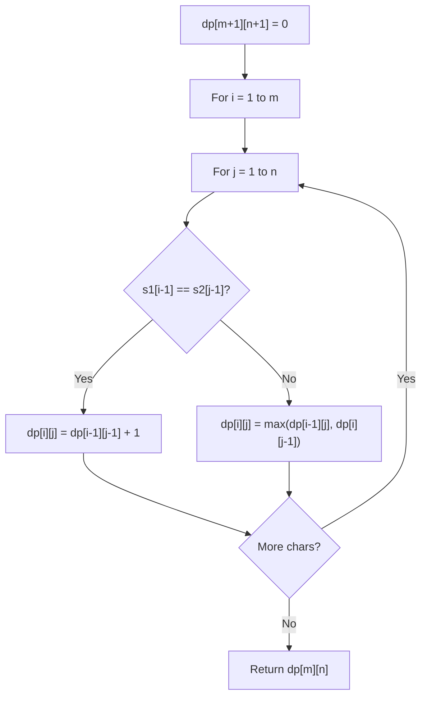

# Problem 1638: Count Substrings That Differ by One Character

**Difficulty:** Medium  
**Tags:** Hash Table, String, Dynamic Programming, Enumeration  
**Pattern:** Dynamic Programming (String)  
**Link:** [leetcode.com/problems/count-substrings-that-differ-by-one-character](https://leetcode.com/problems/count-substrings-that-differ-by-one-character/)

## Description

Given two strings `s` and `t`, find the number of ways you can choose a non-empty substring of `s` and replace a **single character** by a different character such that the resulting substring is a substring of `t`. In other words, find the number of substrings in `s` that differ from some substring in `t` by **exactly** one character.

For example, the underlined substrings in `"computer"` and `"computation"` only differ by the `'e'`/`'a'`, so this is a valid way.

Return *the number of substrings that satisfy the condition above.*

A **substring** is a contiguous sequence of characters within a string.

 

Example 1:

```

**Input:** s = "aba", t = "baba"
**Output:** 6
**Explanation:** The following are the pairs of substrings from s and t that differ by exactly 1 character:
("aba", "baba")
("aba", "baba")
("aba", "baba")
("aba", "baba")
("aba", "baba")
("aba", "baba")
The underlined portions are the substrings that are chosen from s and t.

```

​​Example 2:

```

**Input:** s = "ab", t = "bb"
**Output:** 3
**Explanation:** The following are the pairs of substrings from s and t that differ by 1 character:
("ab", "bb")
("ab", "bb")
("ab", "bb")
​​​​The underlined portions are the substrings that are chosen from s and t.

```

 

**Constraints:**

	- `1 <= s.length, t.length <= 100`
	- `s` and `t` consist of lowercase English letters only.

## Approach: Dynamic Programming (String)

Compare or match two strings using a 2D DP table. dp[i][j] represents the answer for substrings s1[0..i-1] and s2[0..j-1]. Common patterns: LCS, edit distance, regex matching.

## Pseudocode

```
1. Create dp[m+1][n+1]
2. Initialize base cases
3. For i from 1 to m:
   For j from 1 to n:
     If s1[i-1] == s2[j-1]: dp[i][j] = dp[i-1][j-1] + 1
     Else: dp[i][j] = best of (dp[i-1][j], dp[i][j-1], dp[i-1][j-1])
4. Return dp[m][n]
```

## Algorithm Flow



## Complexity Analysis

- **Time:** O(m * n)
- **Space:** O(m * n)

## Solution (Python3)

```python
class Solution:
    def countSubstrings(self, s: str, t: str) -> int:
        # String DP - O(m*n) time and space
        m, n = len(s), len(t)
        dp = [[0] * (n + 1) for _ in range(m + 1)]
        for i in range(1, m + 1):
            for j in range(1, n + 1):
                if s[i-1] == t[j-1]:
                    dp[i][j] = dp[i-1][j-1] + 1
                else:
                    dp[i][j] = max(dp[i-1][j], dp[i][j-1])
        return dp[m][n]
```

## Solution (C++)

```cpp
#include <algorithm>
#include <string>
#include <vector>
using namespace std;

class Solution {
public:
    int countSubstrings(string& s, string& t) {
        // String DP - O(m*n) time and space
        int m = s.size(), n = t.size();
        vector<vector<int>> dp(m + 1, vector<int>(n + 1, 0));
        for (int i = 1; i <= m; i++) {
            for (int j = 1; j <= n; j++) {
                if (s[i-1] == t[j-1])
                    dp[i][j] = dp[i-1][j-1] + 1;
                else
                    dp[i][j] = max(dp[i-1][j], dp[i][j-1]);
            }
        }
        return dp[m][n];
    }
};
```
