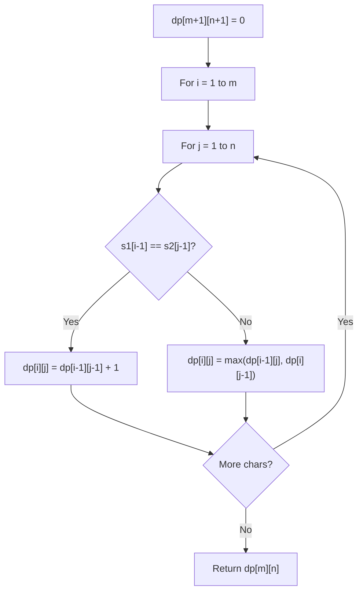

# Problem 1639: Number of Ways to Form a Target String Given a Dictionary

**Difficulty:** Hard  
**Tags:** Array, String, Dynamic Programming  
**Pattern:** Dynamic Programming (String)  
**Link:** [leetcode.com/problems/number-of-ways-to-form-a-target-string-given-a-dictionary](https://leetcode.com/problems/number-of-ways-to-form-a-target-string-given-a-dictionary/)

## Description

You are given a list of strings of the **same length** `words` and a string `target`.

Your task is to form `target` using the given `words` under the following rules:

	- `target` should be formed from left to right.
	- To form the `i^th` character (**0-indexed**) of `target`, you can choose the `k^th` character of the `j^th` string in `words` if `target[i] = words[j][k]`.
	- Once you use the `k^th` character of the `j^th` string of `words`, you **can no longer** use the `x^th` character of any string in `words` where `x <= k`. In other words, all characters to the left of or at index `k` become unusuable for every string.
	- Repeat the process until you form the string `target`.

**Notice** that you can use **multiple characters** from the **same string** in `words` provided the conditions above are met.

Return *the number of ways to form `target` from `words`*. Since the answer may be too large, return it **modulo** `10^9 + 7`.

 

Example 1:

```

**Input:** words = ["acca","bbbb","caca"], target = "aba"
**Output:** 6
**Explanation:** There are 6 ways to form target.
"aba" -> index 0 ("acca"), index 1 ("bbbb"), index 3 ("caca")
"aba" -> index 0 ("acca"), index 2 ("bbbb"), index 3 ("caca")
"aba" -> index 0 ("acca"), index 1 ("bbbb"), index 3 ("acca")
"aba" -> index 0 ("acca"), index 2 ("bbbb"), index 3 ("acca")
"aba" -> index 1 ("caca"), index 2 ("bbbb"), index 3 ("acca")
"aba" -> index 1 ("caca"), index 2 ("bbbb"), index 3 ("caca")

```

Example 2:

```

**Input:** words = ["abba","baab"], target = "bab"
**Output:** 4
**Explanation:** There are 4 ways to form target.
"bab" -> index 0 ("baab"), index 1 ("baab"), index 2 ("abba")
"bab" -> index 0 ("baab"), index 1 ("baab"), index 3 ("baab")
"bab" -> index 0 ("baab"), index 2 ("baab"), index 3 ("baab")
"bab" -> index 1 ("abba"), index 2 ("baab"), index 3 ("baab")

```

 

**Constraints:**

	- `1 <= words.length <= 1000`
	- `1 <= words[i].length <= 1000`
	- All strings in `words` have the same length.
	- `1 <= target.length <= 1000`
	- `words[i]` and `target` contain only lowercase English letters.

## Approach: Dynamic Programming (String)

Compare or match two strings using a 2D DP table. dp[i][j] represents the answer for substrings s1[0..i-1] and s2[0..j-1]. Common patterns: LCS, edit distance, regex matching.

## Pseudocode

```
1. Create dp[m+1][n+1]
2. Initialize base cases
3. For i from 1 to m:
   For j from 1 to n:
     If s1[i-1] == s2[j-1]: dp[i][j] = dp[i-1][j-1] + 1
     Else: dp[i][j] = best of (dp[i-1][j], dp[i][j-1], dp[i-1][j-1])
4. Return dp[m][n]
```

## Algorithm Flow



## Complexity Analysis

- **Time:** O(m * n)
- **Space:** O(m * n)

## Solution (Python3)

```python
class Solution:
    def numWays(self, words: List[str], target: str) -> int:
        # String DP - O(m*n) time and space
        m, n = len(words), len(target)
        dp = [[0] * (n + 1) for _ in range(m + 1)]
        for i in range(1, m + 1):
            for j in range(1, n + 1):
                if words[i-1] == target[j-1]:
                    dp[i][j] = dp[i-1][j-1] + 1
                else:
                    dp[i][j] = max(dp[i-1][j], dp[i][j-1])
        return dp[m][n]
```

## Solution (C++)

```cpp
#include <algorithm>
#include <string>
#include <vector>
using namespace std;

class Solution {
public:
    int numWays(vector<string>& words, string& target) {
        // String DP - O(m*n) time and space
        int m = words.size(), n = target.size();
        vector<vector<int>> dp(m + 1, vector<int>(n + 1, 0));
        for (int i = 1; i <= m; i++) {
            for (int j = 1; j <= n; j++) {
                if (words[i-1] == target[j-1])
                    dp[i][j] = dp[i-1][j-1] + 1;
                else
                    dp[i][j] = max(dp[i-1][j], dp[i][j-1]);
            }
        }
        return dp[m][n];
    }
};
```
