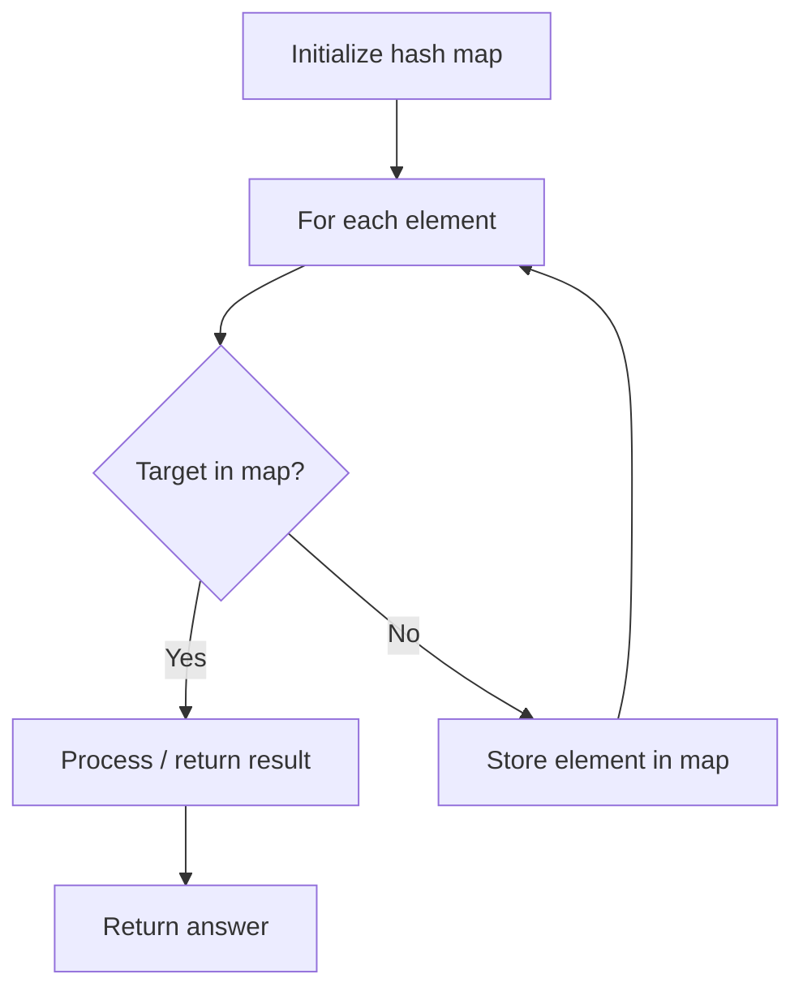

# Problem 1640: Check Array Formation Through Concatenation

**Difficulty:** Easy  
**Tags:** Array, Hash Table  
**Pattern:** Hash Map Lookup  
**Link:** [leetcode.com/problems/check-array-formation-through-concatenation](https://leetcode.com/problems/check-array-formation-through-concatenation/)

## Description

You are given an array of **distinct** integers `arr` and an array of integer arrays `pieces`, where the integers in `pieces` are **distinct**. Your goal is to form `arr` by concatenating the arrays in `pieces` **in any order**. However, you are **not** allowed to reorder the integers in each array `pieces[i]`.

Return `true` *if it is possible **to form the array *`arr`* from *`pieces`. Otherwise, return `false`.

 

Example 1:

```

**Input:** arr = [15,88], pieces = [[88],[15]]
**Output:** true
**Explanation:** Concatenate [15] then [88]

```

Example 2:

```

**Input:** arr = [49,18,16], pieces = [[16,18,49]]
**Output:** false
**Explanation:** Even though the numbers match, we cannot reorder pieces[0].

```

Example 3:

```

**Input:** arr = [91,4,64,78], pieces = [[78],[4,64],[91]]
**Output:** true
**Explanation:** Concatenate [91] then [4,64] then [78]

```

 

**Constraints:**

	- `1 <= pieces.length <= arr.length <= 100`
	- `sum(pieces[i].length) == arr.length`
	- `1 <= pieces[i].length <= arr.length`
	- `1 <= arr[i], pieces[i][j] <= 100`
	- The integers in `arr` are **distinct**.
	- The integers in `pieces` are **distinct** (i.e., If we flatten pieces in a 1D array, all the integers in this array are distinct).

## Approach: Hash Map Lookup

Use a hash map (dictionary) to store elements for O(1) lookup. Iterate through the input, checking membership or counting frequencies in the map.

## Pseudocode

```
1. Initialize hash map
2. Iterate through elements:
   a. Check if target/complement exists in map
   b. If found: process result
   c. Otherwise: store element in map
3. Return result
```

## Algorithm Flow



## Complexity Analysis

- **Time:** O(n)
- **Space:** O(n)

## Solution (Python3)

```python
class Solution:
    def canFormArray(self, arr: List[int], pieces: List[List[int]]) -> bool:
        # Hash map approach - O(n) time, O(n) space
        seen = {}
        for i, val in enumerate(arr):
            complement = pieces - val
            if complement in seen:
                return [seen[complement], i]
            seen[val] = i
        return False
```

## Solution (C++)

```cpp
#include <string>
#include <unordered_map>
#include <vector>
using namespace std;

class Solution {
public:
    bool canFormArray(vector<int>& arr, vector<vector<int>>& pieces) {
        // Hash map approach - O(n) time, O(n) space
        unordered_map<int, int> seen;
        for (int i = 0; i < arr.size(); i++) {
            int complement = pieces - arr[i];
            if (seen.count(complement)) {
                return {seen[complement], i};
            }
            seen[arr[i]] = i;
        }
        return false;
    }
};
```
