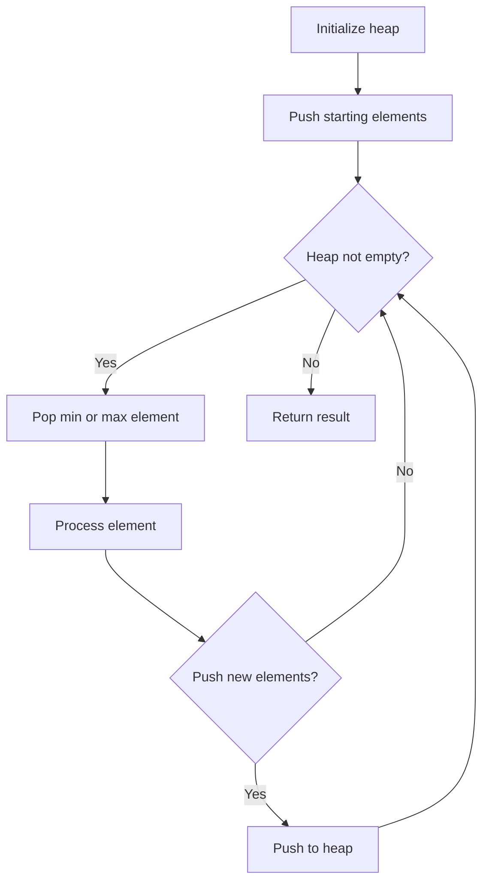
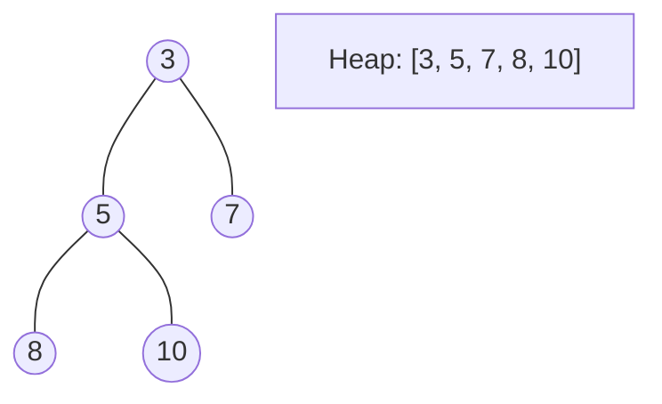
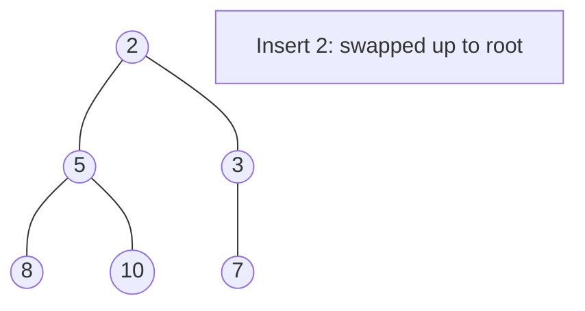
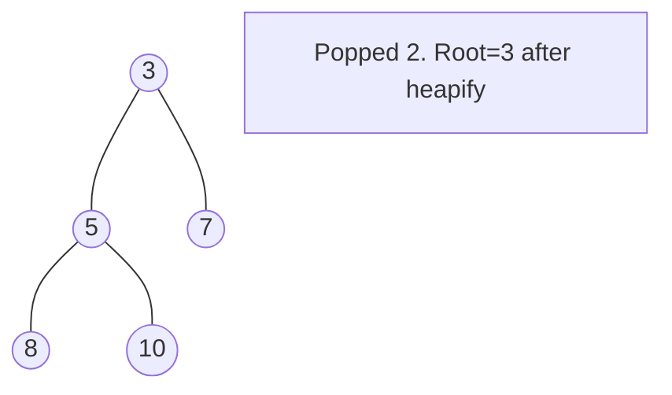

# Problem 1642: Furthest Building You Can Reach

**Difficulty:** Medium  
**Tags:** Array, Greedy, Heap (Priority Queue)  
**Pattern:** Heap / Greedy  
**Link:** [leetcode.com/problems/furthest-building-you-can-reach](https://leetcode.com/problems/furthest-building-you-can-reach/)

## Description

You are given an integer array `heights` representing the heights of buildings, some `bricks`, and some `ladders`.

You start your journey from building `0` and move to the next building by possibly using bricks or ladders.

While moving from building `i` to building `i+1` (**0-indexed**),

	- If the current building's height is **greater than or equal** to the next building's height, you do **not** need a ladder or bricks.
	- If the current building's height is **less than** the next building's height, you can either use **one ladder** or `(h[i+1] - h[i])` **bricks**.

*Return the furthest building index (0-indexed) you can reach if you use the given ladders and bricks optimally.*

 

Example 1:

```

**Input:** heights = [4,2,7,6,9,14,12], bricks = 5, ladders = 1
**Output:** 4
**Explanation:** Starting at building 0, you can follow these steps:
- Go to building 1 without using ladders nor bricks since 4 >= 2.
- Go to building 2 using 5 bricks. You must use either bricks or ladders because 2 < 7.
- Go to building 3 without using ladders nor bricks since 7 >= 6.
- Go to building 4 using your only ladder. You must use either bricks or ladders because 6 < 9.
It is impossible to go beyond building 4 because you do not have any more bricks or ladders.

```

Example 2:

```

**Input:** heights = [4,12,2,7,3,18,20,3,19], bricks = 10, ladders = 2
**Output:** 7

```

Example 3:

```

**Input:** heights = [14,3,19,3], bricks = 17, ladders = 0
**Output:** 3

```

 

**Constraints:**

	- `1 <= heights.length <= 10^5`
	- `1 <= heights[i] <= 10^6`
	- `0 <= bricks <= 10^9`
	- `0 <= ladders <= heights.length`

## Approach: Heap / Greedy

Use ladders for largest climbs (heap). Use bricks for the rest. Min-heap of size ladders.

## Pseudocode

```
1. Initialize heap (min or max)
2. Push initial elements onto heap
3. While heap not empty and condition:
   a. Pop top element (min or max)
   b. Process element
   c. Push new elements if needed
4. Return result
```

## Algorithm Flow



## Visual State Transitions

**Heap Operations (Min-Heap):**

**Frame 1: Initial heap**


**Frame 2: Insert 2 - bubble up**


**Frame 3: Pop minimum (2) - heapify down**



## Complexity Analysis

- **Time:** O(n log L)
- **Space:** O(L)

## Solution (Python3)

```python
import heapq

class Solution:
    def furthestBuilding(self, heights: list[int], bricks: int, ladders: int) -> int:
        heap = []
        for i in range(len(heights) - 1):
            diff = heights[i + 1] - heights[i]
            if diff <= 0:
                continue
            heapq.heappush(heap, diff)
            if len(heap) > ladders:
                bricks -= heapq.heappop(heap)
            if bricks < 0:
                return i
        return len(heights) - 1
```

## Solution (C++)

```cpp
#include <queue>
#include <string>
#include <vector>
using namespace std;

class Solution {
public:
    int furthestBuilding(vector<int>& heights, int bricks, int ladders) {
        // Heap/Priority Queue - O(n log k) time
        priority_queue<int, vector<int>, greater<int>> pq;
        for (int val : heights) {
            pq.push(val);
            if ((int)pq.size() > bricks)
                pq.pop();
        }
        return pq.empty() ? 0 : pq.top();
    }
};
```
