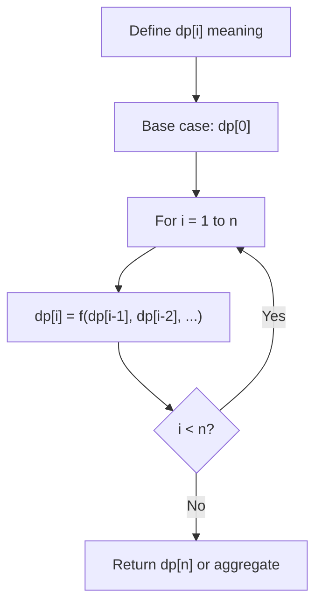
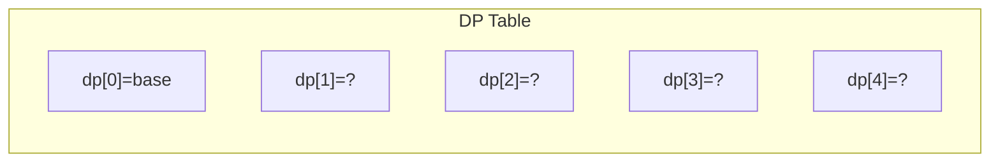
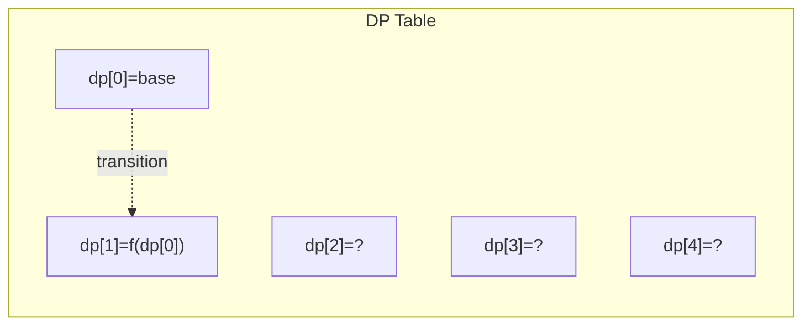
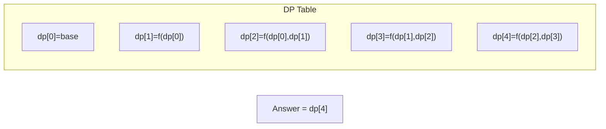

# Problem 1643: Kth Smallest Instructions

**Difficulty:** Hard  
**Tags:** Array, Math, Dynamic Programming, Combinatorics  
**Pattern:** Dynamic Programming (1D)  
**Link:** [leetcode.com/problems/kth-smallest-instructions](https://leetcode.com/problems/kth-smallest-instructions/)

## Description

Bob is standing at cell `(0, 0)`, and he wants to reach `destination`: `(row, column)`. He can only travel **right** and **down**. You are going to help Bob by providing **instructions** for him to reach `destination`.

The **instructions** are represented as a string, where each character is either:

	- `'H'`, meaning move horizontally (go **right**), or
	- `'V'`, meaning move vertically (go **down**).

Multiple **instructions** will lead Bob to `destination`. For example, if `destination` is `(2, 3)`, both `"HHHVV"` and `"HVHVH"` are valid **instructions**.

However, Bob is very picky. Bob has a lucky number `k`, and he wants the `k^th` **lexicographically smallest instructions** that will lead him to `destination`. `k` is **1-indexed**.

Given an integer array `destination` and an integer `k`, return *the *`k^th`* **lexicographically smallest instructions** that will take Bob to *`destination`.

 

Example 1:

```

**Input:** destination = [2,3], k = 1
**Output:** "HHHVV"
**Explanation:** All the instructions that reach (2, 3) in lexicographic order are as follows:
["HHHVV", "HHVHV", "HHVVH", "HVHHV", "HVHVH", "HVVHH", "VHHHV", "VHHVH", "VHVHH", "VVHHH"].

```

Example 2:

****

```

**Input:** destination = [2,3], k = 2
**Output:** "HHVHV"

```

Example 3:

****

```

**Input:** destination = [2,3], k = 3
**Output:** "HHVVH"

```

 

**Constraints:**

	- `destination.length == 2`
	- `1 <= row, column <= 15`
	- `1 <= k <= nCr(row + column, row)`, where `nCr(a, b)` denotes `a` choose `b`​​​​​.

## Approach: Dynamic Programming (1D)

Break the problem into overlapping subproblems. Define dp[i] as the optimal value for the subproblem ending at or considering index i. Build the solution bottom-up, using previously computed dp values.

## Pseudocode

```
1. Define dp[i] = optimal value for subproblem i
2. Base case: dp[0] = initial value
3. For i from 1 to n:
   a. dp[i] = recurrence(dp[i-1], dp[i-2], ...)
4. Return dp[n] or max/min of dp
```

## Algorithm Flow



## Visual State Transitions

**1D Dynamic Programming Table Build:**

**Frame 1: Initialize base cases**


**Frame 2: Fill dp[1] from dp[0]**


**Frame 3: Fill remaining cells**



## Complexity Analysis

- **Time:** O(n)
- **Space:** O(n)

## Solution (Python3)

```python
class Solution:
    def kthSmallestPath(self, destination: List[int], k: int) -> str:
        # Dynamic programming (1D) - O(n) time, O(n) space
        if not destination:
            return 0
        n = len(destination) if isinstance(destination, list) else destination
        dp = [0] * (n + 1)
        dp[0] = 1  # base case
        for i in range(1, n + 1):
            dp[i] = dp[i-1]  # transition (customize per problem)
            if i >= 2:
                dp[i] += dp[i-2]
        return dp[n]
```

## Solution (C++)

```cpp
#include <string>
#include <vector>
using namespace std;

class Solution {
public:
    string kthSmallestPath(vector<int>& destination, int k) {
        // Dynamic programming (1D) - O(n) time, O(n) space
        int n = destination;
        if (n <= 0) return 0;
        vector<int> dp(n + 1, 0);
        dp[0] = 1;
        for (int i = 1; i <= n; i++) {
            dp[i] = dp[i-1];
            if (i >= 2) dp[i] += dp[i-2];
        }
        return dp[n];
    }
};
```
