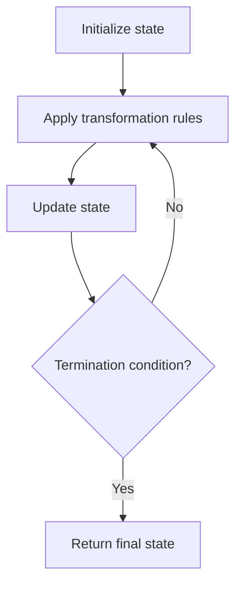

# Problem 1646: Get Maximum in Generated Array

**Difficulty:** Easy  
**Tags:** Array, Simulation  
**Pattern:** Simulation  
**Link:** [leetcode.com/problems/get-maximum-in-generated-array](https://leetcode.com/problems/get-maximum-in-generated-array/)

## Description

You are given an integer `n`. A **0-indexed** integer array `nums` of length `n + 1` is generated in the following way:

	- `nums[0] = 0`
	- `nums[1] = 1`
	- `nums[2 * i] = nums[i]` when `2 <= 2 * i <= n`
	- `nums[2 * i + 1] = nums[i] + nums[i + 1]` when `2 <= 2 * i + 1 <= n`

Return** ***the **maximum** integer in the array *`nums`​​​.

 

Example 1:

```

**Input:** n = 7
**Output:** 3
**Explanation:** According to the given rules:
  nums[0] = 0
  nums[1] = 1
  nums[(1 * 2) = 2] = nums[1] = 1
  nums[(1 * 2) + 1 = 3] = nums[1] + nums[2] = 1 + 1 = 2
  nums[(2 * 2) = 4] = nums[2] = 1
  nums[(2 * 2) + 1 = 5] = nums[2] + nums[3] = 1 + 2 = 3
  nums[(3 * 2) = 6] = nums[3] = 2
  nums[(3 * 2) + 1 = 7] = nums[3] + nums[4] = 2 + 1 = 3
Hence, nums = [0,1,1,2,1,3,2,3], and the maximum is max(0,1,1,2,1,3,2,3) = 3.

```

Example 2:

```

**Input:** n = 2
**Output:** 1
**Explanation:** According to the given rules, nums = [0,1,1]. The maximum is max(0,1,1) = 1.

```

Example 3:

```

**Input:** n = 3
**Output:** 2
**Explanation:** According to the given rules, nums = [0,1,1,2]. The maximum is max(0,1,1,2) = 2.

```

 

**Constraints:**

	- `0 <= n <= 100`

## Approach: Simulation

Simulate the process described in the problem step by step. Follow the rules exactly, tracking state at each step.

## Pseudocode

```
1. Initialize state (grid, pointers, counters)
2. For each step / iteration:
   a. Apply the transformation rules
   b. Update state
   c. Check termination condition
3. Return final state or result
```

## Algorithm Flow



## Complexity Analysis

- **Time:** O(n) or O(n * k)
- **Space:** O(n)

## Solution (Python3)

```python
class Solution:
    def getMaximumGenerated(self, n: int) -> int:
        # Simulation approach - follow the rules step by step
        result = 0
        for i in range(len(n) if isinstance(n, list) else n):
            # Simulate each step
            pass
        return result
```

## Solution (C++)

```cpp
#include <string>
#include <vector>
using namespace std;

class Solution {
public:
    int getMaximumGenerated(int n) {
        // Simulation approach
        int n = n.size();
        for (int i = 0; i < n; i++) {
            // Simulate each step
        }
        return 0;
    }
};
```
