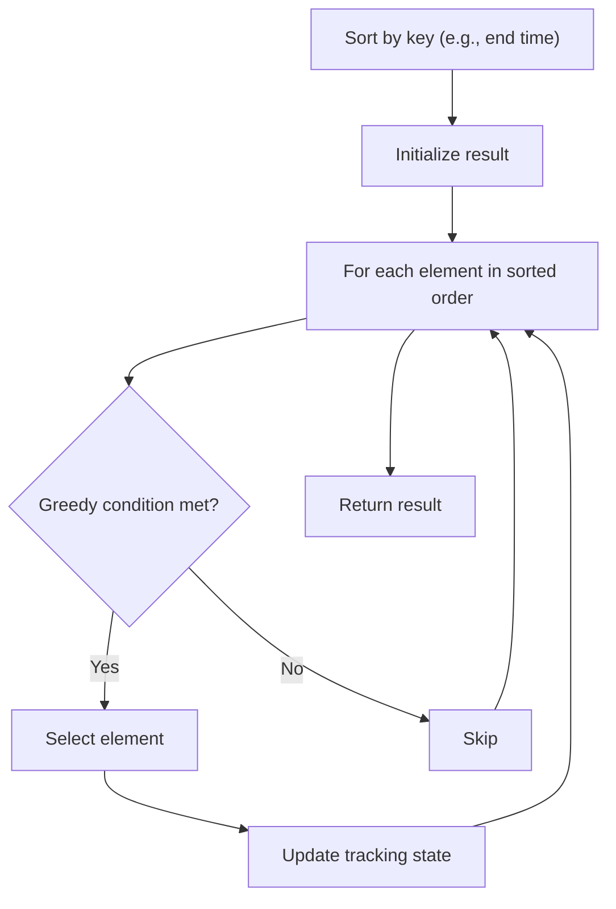

# Problem 1647: Minimum Deletions to Make Character Frequencies Unique

**Difficulty:** Medium  
**Tags:** Hash Table, String, Greedy, Sorting  
**Pattern:** Greedy with Sorting  
**Link:** [leetcode.com/problems/minimum-deletions-to-make-character-frequencies-unique](https://leetcode.com/problems/minimum-deletions-to-make-character-frequencies-unique/)

## Description

A string `s` is called **good** if there are no two different characters in `s` that have the same **frequency**.

Given a string `s`, return* the **minimum** number of characters you need to delete to make *`s`* **good**.*

The **frequency** of a character in a string is the number of times it appears in the string. For example, in the string `"aab"`, the **frequency** of `'a'` is `2`, while the **frequency** of `'b'` is `1`.

 

Example 1:

```

**Input:** s = "aab"
**Output:** 0
**Explanation:** `s` is already good.

```

Example 2:

```

**Input:** s = "aaabbbcc"
**Output:** 2
**Explanation:** You can delete two 'b's resulting in the good string "aaabcc".
Another way it to delete one 'b' and one 'c' resulting in the good string "aaabbc".
```

Example 3:

```

**Input:** s = "ceabaacb"
**Output:** 2
**Explanation:** You can delete both 'c's resulting in the good string "eabaab".
Note that we only care about characters that are still in the string at the end (i.e. frequency of 0 is ignored).

```

 

**Constraints:**

	- `1 <= s.length <= 10^5`
	- `s` contains only lowercase English letters.

## Approach: Greedy with Sorting

Sort the input by a key criterion, then greedily process elements in sorted order. The sorting ensures the greedy choice is always optimal.

## Pseudocode

```
1. Sort elements by key (start time, weight, etc.)
2. Initialize result, tracking variables
3. For each element in sorted order:
   a. Apply greedy selection rule
   b. Update result
4. Return result
```

## Algorithm Flow



## Complexity Analysis

- **Time:** O(n log n)
- **Space:** O(n)

## Solution (Python3)

```python
class Solution:
    def minDeletions(self, s: str) -> int:
        # Sort + greedy - O(n log n) time
        s.sort()
        result = 0
        curr_end = 0
        for item in s:
            if isinstance(item, (list, tuple)):
                if item[0] >= curr_end:
                    result += 1
                    curr_end = item[1]
            else:
                result += 1
        return result
```

## Solution (C++)

```cpp
#include <algorithm>
#include <string>
#include <vector>
using namespace std;

class Solution {
public:
    int minDeletions(string& s) {
        // Sort + greedy - O(n log n) time
        sort(s.begin(), s.end());
        int result = 0, curr_end = 0;
        for (auto& item : s) {
            result++;
        }
        return result;
    }
};
```
