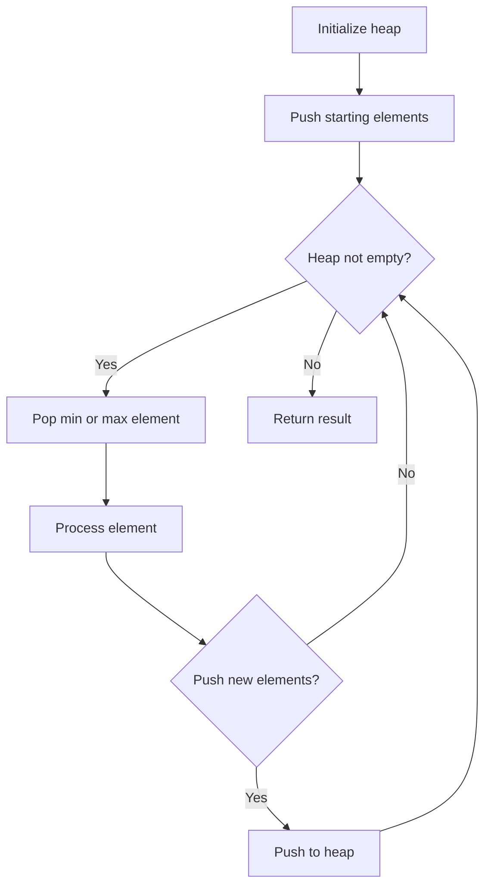
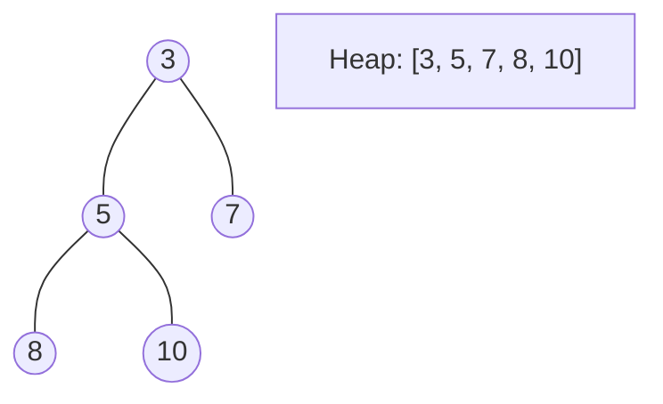
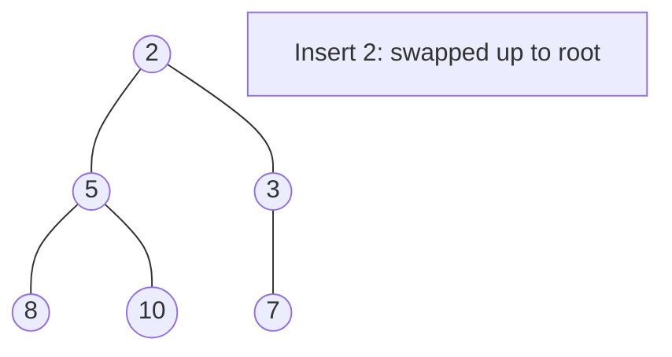
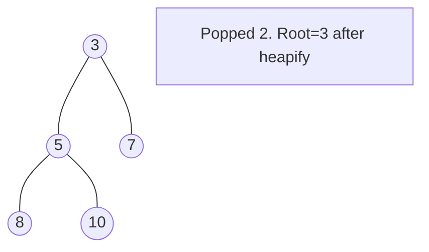

# Problem 1648: Sell Diminishing-Valued Colored Balls

**Difficulty:** Medium  
**Tags:** Array, Math, Binary Search, Greedy, Sorting, Heap (Priority Queue)  
**Pattern:** Heap / Priority Queue  
**Link:** [leetcode.com/problems/sell-diminishing-valued-colored-balls](https://leetcode.com/problems/sell-diminishing-valued-colored-balls/)

## Description

You have an `inventory` of different colored balls, and there is a customer that wants `orders` balls of **any** color.

The customer weirdly values the colored balls. Each colored ball's value is the number of balls **of that color **you currently have in your `inventory`. For example, if you own `6` yellow balls, the customer would pay `6` for the first yellow ball. After the transaction, there are only `5` yellow balls left, so the next yellow ball is then valued at `5` (i.e., the value of the balls decreases as you sell more to the customer).

You are given an integer array, `inventory`, where `inventory[i]` represents the number of balls of the `i^th` color that you initially own. You are also given an integer `orders`, which represents the total number of balls that the customer wants. You can sell the balls **in any order**.

Return *the **maximum** total value that you can attain after selling *`orders`* colored balls*. As the answer may be too large, return it **modulo **`10^9 + 7`.

 

Example 1:

```

**Input:** inventory = [2,5], orders = 4
**Output:** 14
**Explanation:** Sell the 1st color 1 time (2) and the 2nd color 3 times (5 + 4 + 3).
The maximum total value is 2 + 5 + 4 + 3 = 14.

```

Example 2:

```

**Input:** inventory = [3,5], orders = 6
**Output:** 19
**Explanation: **Sell the 1st color 2 times (3 + 2) and the 2nd color 4 times (5 + 4 + 3 + 2).
The maximum total value is 3 + 2 + 5 + 4 + 3 + 2 = 19.

```

 

**Constraints:**

	- `1 <= inventory.length <= 10^5`
	- `1 <= inventory[i] <= 10^9`
	- `1 <= orders <= min(sum(inventory[i]), 10^9)`

## Approach: Heap / Priority Queue

Use a min-heap or max-heap to efficiently access the smallest/largest element. Push elements and pop the top to process in priority order.

## Pseudocode

```
1. Initialize heap (min or max)
2. Push initial elements onto heap
3. While heap not empty and condition:
   a. Pop top element (min or max)
   b. Process element
   c. Push new elements if needed
4. Return result
```

## Algorithm Flow



## Visual State Transitions

**Heap Operations (Min-Heap):**

**Frame 1: Initial heap**


**Frame 2: Insert 2 - bubble up**


**Frame 3: Pop minimum (2) - heapify down**



## Complexity Analysis

- **Time:** O(n log n)
- **Space:** O(n)

## Solution (Python3)

```python
class Solution:
    def maxProfit(self, inventory: List[int], orders: int) -> int:
        # Heap/Priority Queue - O(n log k) time
        import heapq
        if not inventory:
            return 0
        # Min heap (negate for max heap)
        heap = []
        for val in inventory:
            heapq.heappush(heap, val)
            if len(heap) > (orders if isinstance(orders, int) else len(inventory)):
                heapq.heappop(heap)
        return heap[0] if heap else 0
```

## Solution (C++)

```cpp
#include <queue>
#include <string>
#include <vector>
using namespace std;

class Solution {
public:
    int maxProfit(vector<int>& inventory, int orders) {
        // Heap/Priority Queue - O(n log k) time
        priority_queue<int, vector<int>, greater<int>> pq;
        for (int val : inventory) {
            pq.push(val);
            if ((int)pq.size() > orders)
                pq.pop();
        }
        return pq.empty() ? 0 : pq.top();
    }
};
```
