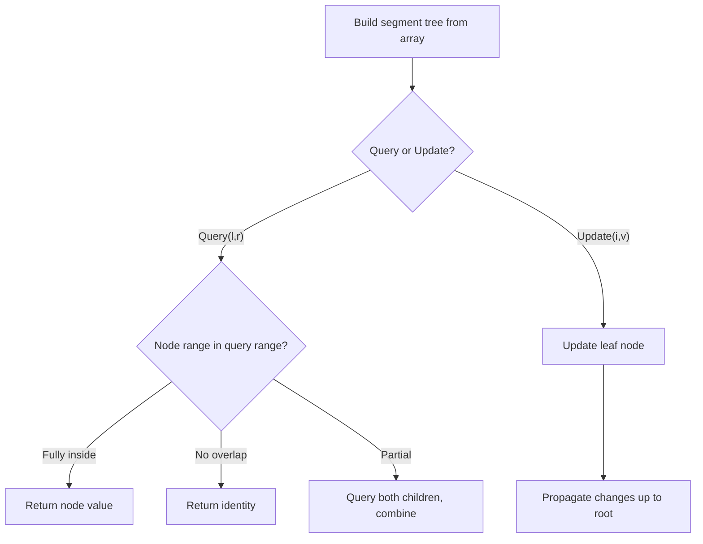

# Problem 1649: Create Sorted Array through Instructions

**Difficulty:** Hard  
**Tags:** Array, Binary Search, Divide and Conquer, Binary Indexed Tree, Segment Tree, Merge Sort, Ordered Set  
**Pattern:** Segment Tree  
**Link:** [leetcode.com/problems/create-sorted-array-through-instructions](https://leetcode.com/problems/create-sorted-array-through-instructions/)

## Description

Given an integer array `instructions`, you are asked to create a sorted array from the elements in `instructions`. You start with an empty container `nums`. For each element from **left to right** in `instructions`, insert it into `nums`. The **cost** of each insertion is the **minimum** of the following:


	- The number of elements currently in `nums` that are **strictly less than** `instructions[i]`.
	- The number of elements currently in `nums` that are **strictly greater than** `instructions[i]`.


For example, if inserting element `3` into `nums = [1,2,3,5]`, the **cost** of insertion is `min(2, 1)` (elements `1` and `2` are less than `3`, element `5` is greater than `3`) and `nums` will become `[1,2,3,3,5]`.


Return *the **total cost** to insert all elements from *`instructions`* into *`nums`. Since the answer may be large, return it **modulo** `10^9 + 7`


 

Example 1:


```

**Input:** instructions = [1,5,6,2]
**Output:** 1
**Explanation:** Begin with nums = [].
Insert 1 with cost min(0, 0) = 0, now nums = [1].
Insert 5 with cost min(1, 0) = 0, now nums = [1,5].
Insert 6 with cost min(2, 0) = 0, now nums = [1,5,6].
Insert 2 with cost min(1, 2) = 1, now nums = [1,2,5,6].
The total cost is 0 + 0 + 0 + 1 = 1.
```


Example 2:


```

**Input:** instructions = [1,2,3,6,5,4]
**Output:** 3
**Explanation:** Begin with nums = [].
Insert 1 with cost min(0, 0) = 0, now nums = [1].
Insert 2 with cost min(1, 0) = 0, now nums = [1,2].
Insert 3 with cost min(2, 0) = 0, now nums = [1,2,3].
Insert 6 with cost min(3, 0) = 0, now nums = [1,2,3,6].
Insert 5 with cost min(3, 1) = 1, now nums = [1,2,3,5,6].
Insert 4 with cost min(3, 2) = 2, now nums = [1,2,3,4,5,6].
The total cost is 0 + 0 + 0 + 0 + 1 + 2 = 3.

```


Example 3:


```

**Input:** instructions = [1,3,3,3,2,4,2,1,2]
**Output:** 4
**Explanation:** Begin with nums = [].
Insert 1 with cost min(0, 0) = 0, now nums = [1].
Insert 3 with cost min(1, 0) = 0, now nums = [1,3].
Insert 3 with cost min(1, 0) = 0, now nums = [1,3,3].
Insert 3 with cost min(1, 0) = 0, now nums = [1,3,3,3].
Insert 2 with cost min(1, 3) = 1, now nums = [1,2,3,3,3].
Insert 4 with cost min(5, 0) = 0, now nums = [1,2,3,3,3,4].
​​​​​​​Insert 2 with cost min(1, 4) = 1, now nums = [1,2,2,3,3,3,4].
​​​​​​​Insert 1 with cost min(0, 6) = 0, now nums = [1,1,2,2,3,3,3,4].
​​​​​​​Insert 2 with cost min(2, 4) = 2, now nums = [1,1,2,2,2,3,3,3,4].
The total cost is 0 + 0 + 0 + 0 + 1 + 0 + 1 + 0 + 2 = 4.

```


 

**Constraints:**


	- `1 <= instructions.length <= 10^5`
	- `1 <= instructions[i] <= 10^5`

## Approach: Segment Tree

Build a segment tree for range queries (sum, min, max) with point or range updates. Each node covers a range; queries are answered by combining relevant segments.

## Pseudocode

```
1. Build segment tree from array (O(n))
2. Query(l, r):
   - If node range within [l,r]: return node value
   - If no overlap: return identity
   - Else: combine query(left_child) and query(right_child)
3. Update(i, val): update leaf and propagate up
```

## Algorithm Flow



## Complexity Analysis

- **Time:** O(n log n) build, O(log n) query/update
- **Space:** O(n)

## Solution (Python3)

```python
class Solution:
    def createSortedArray(self, instructions: List[int]) -> int:
        # Segment tree for range queries - O(n log n) build, O(log n) query
        n = len(instructions)
        tree = [0] * (4 * n)
        
        def build(node, start, end):
            if start == end:
                tree[node] = instructions[start]
                return
            mid = (start + end) // 2
            build(2*node, start, mid)
            build(2*node+1, mid+1, end)
            tree[node] = tree[2*node] + tree[2*node+1]
        
        def query(node, start, end, l, r):
            if r < start or end < l:
                return 0
            if l <= start and end <= r:
                return tree[node]
            mid = (start + end) // 2
            return query(2*node, start, mid, l, r) + query(2*node+1, mid+1, end, l, r)
        
        build(1, 0, n-1)
        return 0
```

## Solution (C++)

```cpp
#include <functional>
#include <string>
#include <vector>
using namespace std;

class Solution {
public:
    int createSortedArray(vector<int>& instructions) {
        // Segment tree for range queries
        int n = instructions.size();
        vector<int> tree(4 * n, 0);
        function<void(int, int, int)> build = [&](int node, int s, int e) {
            if (s == e) { tree[node] = instructions[s]; return; }
            int mid = (s + e) / 2;
            build(2*node, s, mid);
            build(2*node+1, mid+1, e);
            tree[node] = tree[2*node] + tree[2*node+1];
        };
        function<int(int, int, int, int, int)> query = [&](int node, int s, int e, int l, int r) -> int {
            if (r < s || e < l) return 0;
            if (l <= s && e <= r) return tree[node];
            int mid = (s + e) / 2;
            return query(2*node, s, mid, l, r) + query(2*node+1, mid+1, e, l, r);
        };
        build(1, 0, n-1);
        return 0;
    }
};
```
