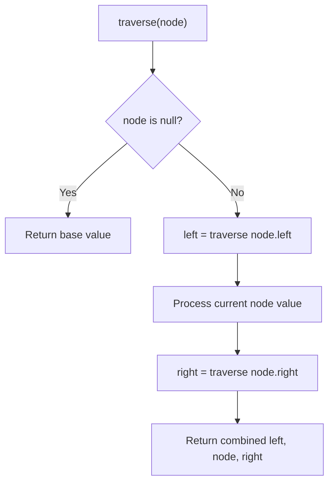

# Problem 1650: Lowest Common Ancestor of a Binary Tree III

**Difficulty:** Medium  
**Tags:** Hash Table, Two Pointers, Tree, Binary Tree  
**Pattern:** Tree Traversal  
**Link:** [leetcode.com/problems/lowest-common-ancestor-of-a-binary-tree-iii](https://leetcode.com/problems/lowest-common-ancestor-of-a-binary-tree-iii/)

## Description

*(Premium problem -- description requires LeetCode subscription)*

## Approach: Tree Traversal

Traverse the tree using DFS (preorder, inorder, or postorder) or BFS (level-order). At each node, compute or accumulate a value and recurse on children.

## Pseudocode

```
1. Define recursive function traverse(node):
   a. Base case: if node is null, return default
   b. Recurse on left child
   c. Process current node
   d. Recurse on right child
   e. Return combined result
2. Call traverse(root)
```

## Algorithm Flow



## Complexity Analysis

- **Time:** O(n)
- **Space:** O(h)

## Solution (Python3)

```python
class Solution:
    pass
```

## Solution (C++)

```cpp
class Solution {
public:
    // Design problem stub
};
```
