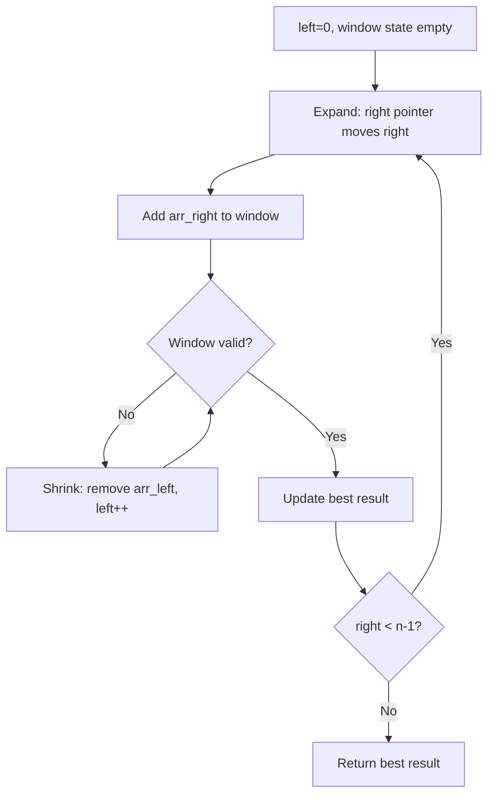
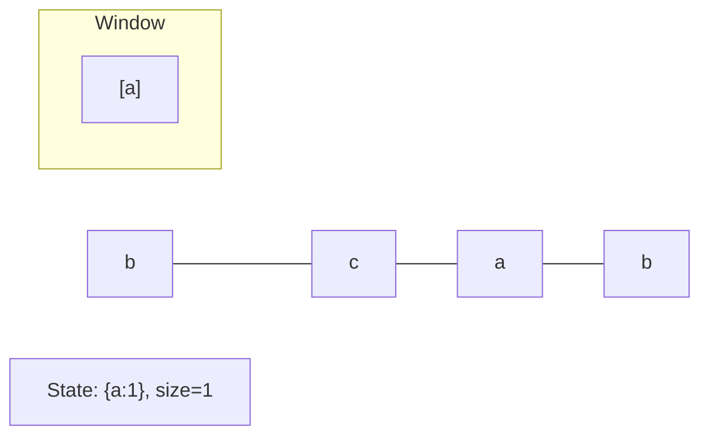
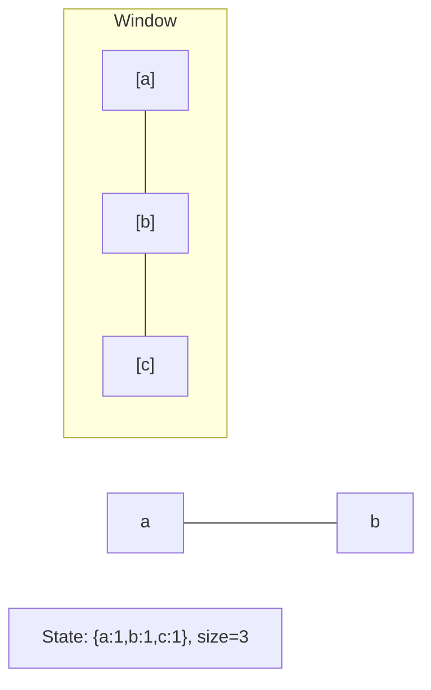
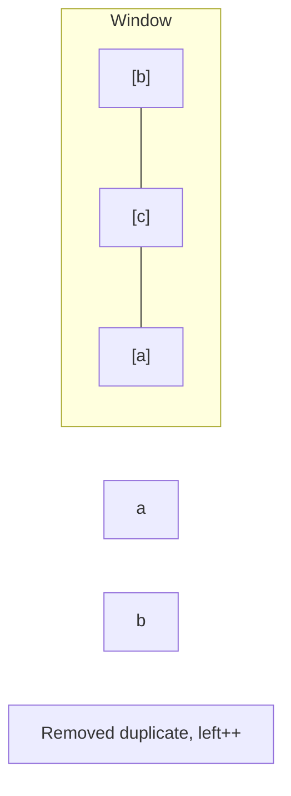
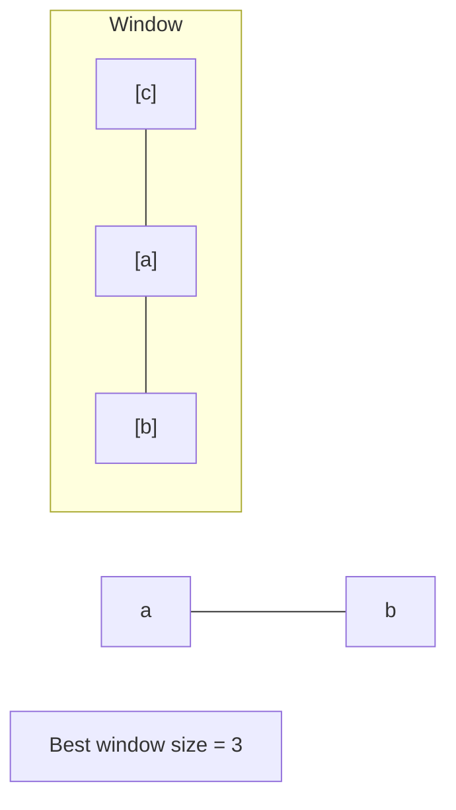

# Problem 1652: Defuse the Bomb

**Difficulty:** Easy  
**Tags:** Array, Sliding Window  
**Pattern:** Sliding Window  
**Link:** [leetcode.com/problems/defuse-the-bomb](https://leetcode.com/problems/defuse-the-bomb/)

## Description

You have a bomb to defuse, and your time is running out! Your informer will provide you with a **circular** array `code` of length of `n` and a key `k`.

To decrypt the code, you must replace every number. All the numbers are replaced **simultaneously**.

	- If `k > 0`, replace the `i^th` number with the sum of the **next** `k` numbers.
	- If `k < 0`, replace the `i^th` number with the sum of the **previous** `k` numbers.
	- If `k == 0`, replace the `i^th` number with `0`.

As `code` is circular, the next element of `code[n-1]` is `code[0]`, and the previous element of `code[0]` is `code[n-1]`.

Given the **circular** array `code` and an integer key `k`, return *the decrypted code to defuse the bomb*!

 

Example 1:

```

**Input:** code = [5,7,1,4], k = 3
**Output:** [12,10,16,13]
**Explanation:** Each number is replaced by the sum of the next 3 numbers. The decrypted code is [7+1+4, 1+4+5, 4+5+7, 5+7+1]. Notice that the numbers wrap around.

```

Example 2:

```

**Input:** code = [1,2,3,4], k = 0
**Output:** [0,0,0,0]
**Explanation:** When k is zero, the numbers are replaced by 0. 

```

Example 3:

```

**Input:** code = [2,4,9,3], k = -2
**Output:** [12,5,6,13]
**Explanation:** The decrypted code is [3+9, 2+3, 4+2, 9+4]. Notice that the numbers wrap around again. If k is negative, the sum is of the **previous** numbers.

```

 

**Constraints:**

	- `n == code.length`
	- `1 <= n <= 100`
	- `1 <= code[i] <= 100`
	- `-(n - 1) <= k <= n - 1`

## Approach: Sliding Window

Maintain a window over the data using two pointers. Expand the right boundary to include new elements, and shrink the left boundary when the window constraint is violated. Track the optimal window.

## Pseudocode

```
1. Initialize left = 0, result = initial_value
2. For right in range(n):
   a. Add element at right to window state
   b. While window is invalid:
      - Remove element at left from window state
      - left++
   c. Update result = best of (result, window size/value)
3. Return result
```

## Algorithm Flow



## Visual State Transitions

**Sliding Window Step-by-Step:**

**Frame 1: Initial window (left=0, right=0)**


**Frame 2: Expand right (right=2)**


**Frame 3: Violation - shrink left**


**Frame 4: Continue expanding**



## Complexity Analysis

- **Time:** O(n)
- **Space:** O(k)

## Solution (Python3)

```python
class Solution:
    def decrypt(self, code: List[int], k: int) -> List[int]:
        # Sliding window approach - O(n) time, O(k) space
        from collections import defaultdict
        window = defaultdict(int)
        left = 0
        result = 0
        for right in range(len(code)):
            window[code[right]] += 1
            while len(window) > (k if isinstance(k, int) else len(code)):
                window[code[left]] -= 1
                if window[code[left]] == 0:
                    del window[code[left]]
                left += 1
            result = max(result, right - left + 1)
        return result
```

## Solution (C++)

```cpp
#include <algorithm>
#include <string>
#include <unordered_map>
#include <vector>
using namespace std;

class Solution {
public:
    vector<int> decrypt(vector<int>& code, int k) {
        // Sliding window approach - O(n) time, O(k) space
        unordered_map<char, int> window;
        int left = 0, result = 0;
        for (int right = 0; right < code.size(); right++) {
            window[code[right]]++;
            while ((int)window.size() > k) {
                window[code[left]]--;
                if (window[code[left]] == 0)
                    window.erase(code[left]);
                left++;
            }
            result = max(result, right - left + 1);
        }
        return result;
    }
};
```
