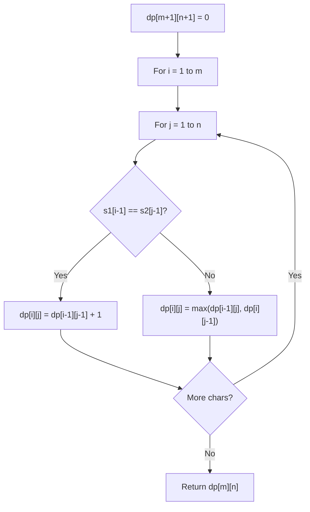

# Problem 1653: Minimum Deletions to Make String Balanced

**Difficulty:** Medium  
**Tags:** String, Dynamic Programming, Stack  
**Pattern:** Dynamic Programming (String)  
**Link:** [leetcode.com/problems/minimum-deletions-to-make-string-balanced](https://leetcode.com/problems/minimum-deletions-to-make-string-balanced/)

## Description

You are given a string `s` consisting only of characters `'a'` and `'b'`​​​​.

You can delete any number of characters in `s` to make `s` **balanced**. `s` is **balanced** if there is no pair of indices `(i,j)` such that `i < j` and `s[i] = 'b'` and `s[j]= 'a'`.

Return *the **minimum** number of deletions needed to make *`s`* **balanced***.

 

Example 1:

```

**Input:** s = "aababbab"
**Output:** 2
**Explanation:** You can either:
Delete the characters at 0-indexed positions 2 and 6 ("aababbab" -> "aaabbb"), or
Delete the characters at 0-indexed positions 3 and 6 ("aababbab" -> "aabbbb").

```

Example 2:

```

**Input:** s = "bbaaaaabb"
**Output:** 2
**Explanation:** The only solution is to delete the first two characters.

```

 

**Constraints:**

	- `1 <= s.length <= 10^5`
	- `s[i]` is `'a'` or `'b'`​​.

## Approach: Dynamic Programming (String)

Compare or match two strings using a 2D DP table. dp[i][j] represents the answer for substrings s1[0..i-1] and s2[0..j-1]. Common patterns: LCS, edit distance, regex matching.

## Pseudocode

```
1. Create dp[m+1][n+1]
2. Initialize base cases
3. For i from 1 to m:
   For j from 1 to n:
     If s1[i-1] == s2[j-1]: dp[i][j] = dp[i-1][j-1] + 1
     Else: dp[i][j] = best of (dp[i-1][j], dp[i][j-1], dp[i-1][j-1])
4. Return dp[m][n]
```

## Algorithm Flow



## Complexity Analysis

- **Time:** O(m * n)
- **Space:** O(m * n)

## Solution (Python3)

```python
class Solution:
    def minimumDeletions(self, s: str) -> int:
        # String DP - O(m*n) time and space
        m, n = len(s), len(s)
        dp = [[0] * (n + 1) for _ in range(m + 1)]
        for i in range(1, m + 1):
            for j in range(1, n + 1):
                if s[i-1] == s[j-1]:
                    dp[i][j] = dp[i-1][j-1] + 1
                else:
                    dp[i][j] = max(dp[i-1][j], dp[i][j-1])
        return dp[m][n]
```

## Solution (C++)

```cpp
#include <algorithm>
#include <string>
#include <vector>
using namespace std;

class Solution {
public:
    int minimumDeletions(string& s) {
        // String DP - O(m*n) time and space
        int m = s.size(), n = s.size();
        vector<vector<int>> dp(m + 1, vector<int>(n + 1, 0));
        for (int i = 1; i <= m; i++) {
            for (int j = 1; j <= n; j++) {
                if (s[i-1] == s[j-1])
                    dp[i][j] = dp[i-1][j-1] + 1;
                else
                    dp[i][j] = max(dp[i-1][j], dp[i][j-1]);
            }
        }
        return dp[m][n];
    }
};
```
