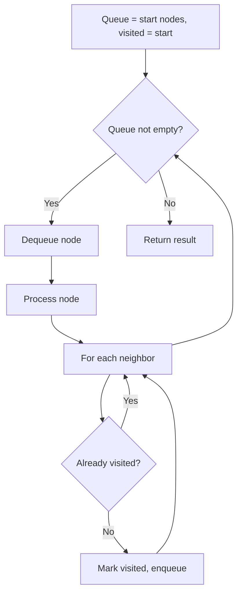
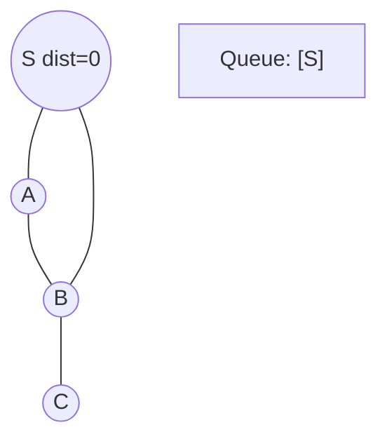
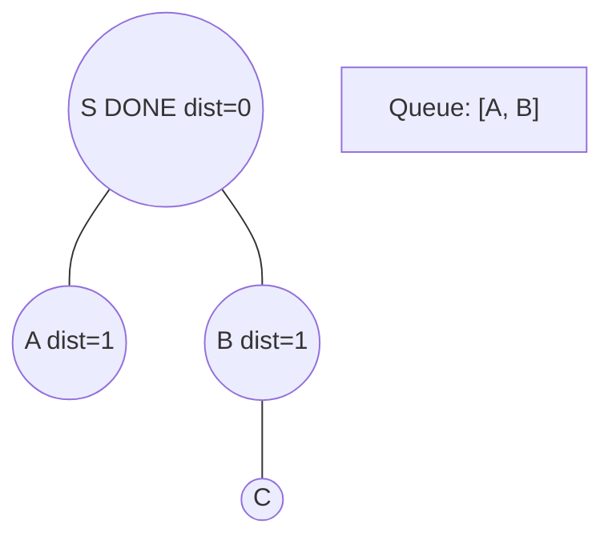
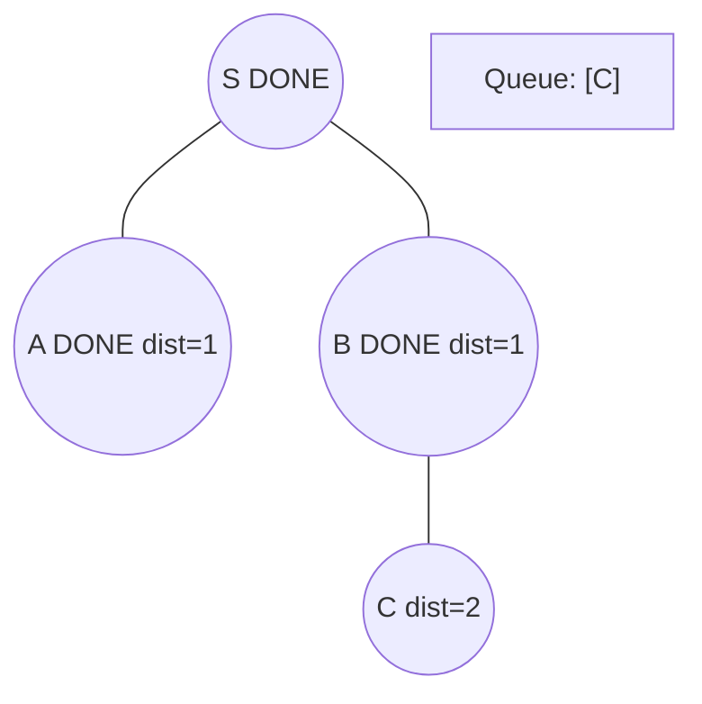
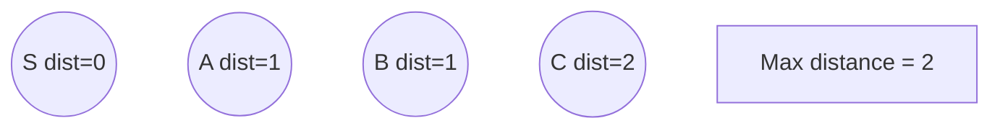

# Problem 1654: Minimum Jumps to Reach Home

**Difficulty:** Medium  
**Tags:** Array, Hash Table, Breadth-First Search  
**Pattern:** BFS Graph Traversal  
**Link:** [leetcode.com/problems/minimum-jumps-to-reach-home](https://leetcode.com/problems/minimum-jumps-to-reach-home/)

## Description

A certain bug's home is on the x-axis at position `x`. Help them get there from position `0`.

The bug jumps according to the following rules:

	- It can jump exactly `a` positions **forward** (to the right).
	- It can jump exactly `b` positions **backward** (to the left).
	- It cannot jump backward twice in a row.
	- It cannot jump to any `forbidden` positions.

The bug may jump forward **beyond** its home, but it **cannot jump** to positions numbered with **negative** integers.

Given an array of integers `forbidden`, where `forbidden[i]` means that the bug cannot jump to the position `forbidden[i]`, and integers `a`, `b`, and `x`, return *the minimum number of jumps needed for the bug to reach its home*. If there is no possible sequence of jumps that lands the bug on position `x`, return `-1.`

 

Example 1:

```

**Input:** forbidden = [14,4,18,1,15], a = 3, b = 15, x = 9
**Output:** 3
**Explanation:** 3 jumps forward (0 -> 3 -> 6 -> 9) will get the bug home.

```

Example 2:

```

**Input:** forbidden = [8,3,16,6,12,20], a = 15, b = 13, x = 11
**Output:** -1

```

Example 3:

```

**Input:** forbidden = [1,6,2,14,5,17,4], a = 16, b = 9, x = 7
**Output:** 2
**Explanation:** One jump forward (0 -> 16) then one jump backward (16 -> 7) will get the bug home.

```

 

**Constraints:**

	- `1 <= forbidden.length <= 1000`
	- `1 <= a, b, forbidden[i] <= 2000`
	- `0 <= x <= 2000`
	- All the elements in `forbidden` are distinct.
	- Position `x` is not forbidden.

## Approach: BFS Graph Traversal

Explore the graph breadth-first using a queue. Process nodes level by level; BFS finds shortest paths in unweighted graphs.

## Pseudocode

```
1. Initialize queue with start node(s), visited set
2. While queue not empty:
   a. Dequeue node
   b. Process node
   c. For each unvisited neighbor:
      - Mark visited, enqueue
3. Return result
```

## Algorithm Flow



## Visual State Transitions

**BFS Level-by-Level Traversal:**

**Frame 1: Start BFS from source**


**Frame 2: Process level 0, enqueue neighbors**


**Frame 3: Process level 1**


**Frame 4: All nodes reached**



## Complexity Analysis

- **Time:** O(V + E)
- **Space:** O(V)

## Solution (Python3)

```python
class Solution:
    def minimumJumps(self, forbidden: List[int], a: int, b: int, x: int) -> int:
        # BFS on graph - O(V+E) time
        from collections import deque
        if not forbidden:
            return 0
        visited = set()
        queue = deque([0])
        visited.add(0)
        dist = 0
        while queue:
            for _ in range(len(queue)):
                node = queue.popleft()
                # Process node
            dist += 1
        return dist
```

## Solution (C++)

```cpp
#include <queue>
#include <string>
#include <unordered_set>
#include <vector>
using namespace std;

class Solution {
public:
    int minimumJumps(vector<int>& forbidden, int a, int b, int x) {
        // BFS on graph - O(V+E) time
        if (forbidden.empty()) return 0;
        queue<int> q;
        unordered_set<int> visited;
        q.push(0);
        visited.insert(0);
        int dist = 0;
        while (!q.empty()) {
            int sz = q.size();
            for (int i = 0; i < sz; i++) {
                int node = q.front(); q.pop();
                // Process node
            }
            dist++;
        }
        return dist;
    }
};
```
