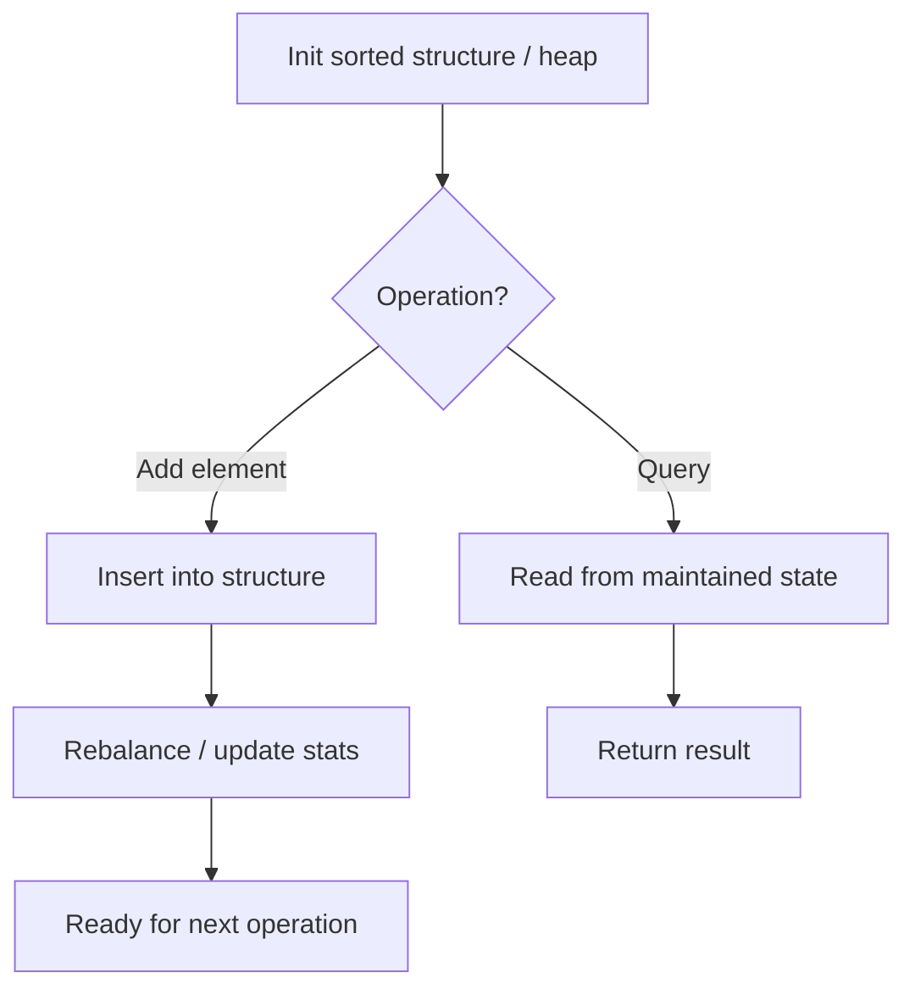

# Problem 1656: Design an Ordered Stream

**Difficulty:** Easy  
**Tags:** Array, Hash Table, Design, Data Stream  
**Pattern:** Data Stream Design  
**Link:** [leetcode.com/problems/design-an-ordered-stream](https://leetcode.com/problems/design-an-ordered-stream/)

## Description

There is a stream of `n` `(idKey, value)` pairs arriving in an **arbitrary** order, where `idKey` is an integer between `1` and `n` and `value` is a string. No two pairs have the same `id`.

Design a stream that returns the values in **increasing order of their IDs** by returning a **chunk** (list) of values after each insertion. The concatenation of all the **chunks** should result in a list of the sorted values.

Implement the `OrderedStream` class:

	- `OrderedStream(int n)` Constructs the stream to take `n` values.
	- `String[] insert(int idKey, String value)` Inserts the pair `(idKey, value)` into the stream, then returns the **largest possible chunk** of currently inserted values that appear next in the order.

 

Example:

****

```

**Input**
["OrderedStream", "insert", "insert", "insert", "insert", "insert"]
[[5], [3, "ccccc"], [1, "aaaaa"], [2, "bbbbb"], [5, "eeeee"], [4, "ddddd"]]
**Output**
[null, [], ["aaaaa"], ["bbbbb", "ccccc"], [], ["ddddd", "eeeee"]]

**Explanation**
// Note that the values ordered by ID is ["aaaaa", "bbbbb", "ccccc", "ddddd", "eeeee"].
OrderedStream os = new OrderedStream(5);
os.insert(3, "ccccc"); // Inserts (3, "ccccc"), returns [].
os.insert(1, "aaaaa"); // Inserts (1, "aaaaa"), returns ["aaaaa"].
os.insert(2, "bbbbb"); // Inserts (2, "bbbbb"), returns ["bbbbb", "ccccc"].
os.insert(5, "eeeee"); // Inserts (5, "eeeee"), returns [].
os.insert(4, "ddddd"); // Inserts (4, "ddddd"), returns ["ddddd", "eeeee"].
// Concatentating all the chunks returned:
// [] + ["aaaaa"] + ["bbbbb", "ccccc"] + [] + ["ddddd", "eeeee"] = ["aaaaa", "bbbbb", "ccccc", "ddddd", "eeeee"]
// The resulting order is the same as the order above.

```

 

**Constraints:**

	- `1 <= n <= 1000`
	- `1 <= id <= n`
	- `value.length == 5`
	- `value` consists only of lowercase letters.
	- Each call to `insert` will have a unique `id.`
	- Exactly `n` calls will be made to `insert`.

## Approach: Data Stream Design

Design for streaming data: elements arrive one at a time and queries must be answered efficiently. Use sorted structures, heaps, or running aggregations.

## Pseudocode

```
1. Initialize: sorted list, heap, or aggregation state
2. addNum(val):
   - Insert into sorted structure
   - Update running stats
3. query():
   - Read from maintained state
   - Return in O(1) or O(log n)
```

## Algorithm Flow



## Complexity Analysis

- **Time:** O(log n) per operation
- **Space:** O(n)

## Solution (Python3)

```python
class OrderedStream:
    def __init__(self, n: int):
        # Initialize data structure
        self.n = n

    def insert(self, idKey: int, value: str) -> List[str]:
        return []

```

## Solution (C++)

```cpp
#include <string>
#include <vector>
using namespace std;

class OrderedStream {
public:
    OrderedStream(int n) {
        // Initialize
    }

    vector<string> insert(int idKey, string& value) {
        return {};
    }

};
```
