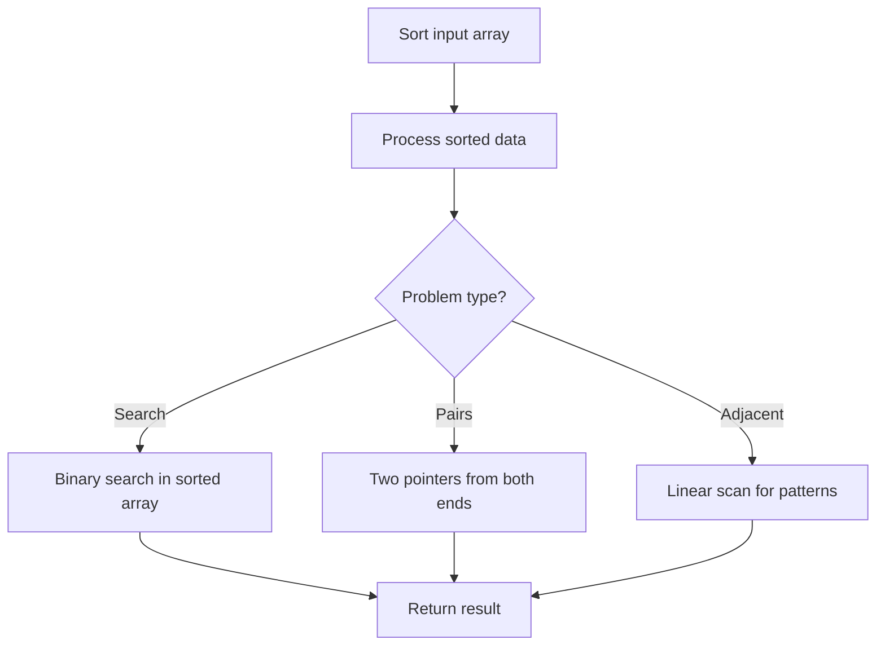

# Problem 1657: Determine if Two Strings Are Close

**Difficulty:** Medium  
**Tags:** Hash Table, String, Sorting, Counting  
**Pattern:** Hash Map / String  
**Link:** [leetcode.com/problems/determine-if-two-strings-are-close](https://leetcode.com/problems/determine-if-two-strings-are-close/)

## Description

Two strings are considered **close** if you can attain one from the other using the following operations:

	- Operation 1: Swap any two **existing** characters.

	
		For example, `abcde -> aecdb`
	
	
	- Operation 2: Transform **every** occurrence of one **existing** character into another **existing** character, and do the same with the other character.
	
		For example, `aacabb -> bbcbaa` (all `a`'s turn into `b`'s, and all `b`'s turn into `a`'s)
	
	

You can use the operations on either string as many times as necessary.

Given two strings, `word1` and `word2`, return `true`* if *`word1`* and *`word2`* are **close**, and *`false`* otherwise.*

 

Example 1:

```

**Input:** word1 = "abc", word2 = "bca"
**Output:** true
**Explanation:** You can attain word2 from word1 in 2 operations.
Apply Operation 1: "abc" -> "acb"
Apply Operation 1: "acb" -> "bca"

```

Example 2:

```

**Input:** word1 = "a", word2 = "aa"
**Output:** false
**Explanation: **It is impossible to attain word2 from word1, or vice versa, in any number of operations.

```

Example 3:

```

**Input:** word1 = "cabbba", word2 = "abbccc"
**Output:** true
**Explanation:** You can attain word2 from word1 in 3 operations.
Apply Operation 1: "cabbba" -> "caabbb"
Apply Operation 2: "caabbb" -> "baaccc"
Apply Operation 2: "baaccc" -> "abbccc"

```

 

**Constraints:**

	- `1 <= word1.length, word2.length <= 10^5`
	- `word1` and `word2` contain only lowercase English letters.

## Approach: Hash Map / String

Two strings are close if they have same character sets and same sorted frequency lists.

## Pseudocode

```
1. Sort the input array
2. Process sorted data:
   - Use binary search for lookups
   - Use two pointers for pair finding
   - Scan for adjacent patterns
3. Return result
```

## Algorithm Flow



## Complexity Analysis

- **Time:** O(n)
- **Space:** O(1)

## Solution (Python3)

```python
class Solution:
    def closeStrings(self, word1: str, word2: str) -> bool:
        from collections import Counter
        if len(word1) != len(word2):
            return False
        c1, c2 = Counter(word1), Counter(word2)
        return set(c1.keys()) == set(c2.keys()) and sorted(c1.values()) == sorted(c2.values())
```

## Solution (C++)

```cpp
#include <algorithm>
#include <string>
#include <vector>
using namespace std;

class Solution {
public:
    bool closeStrings(string& word1, string& word2) {
        // Sort-based approach - O(n log n) time
        sort(word1.begin(), word1.end());
        vector<vector<int>> result;
        result.push_back(word1[0]);
        for (int i = 1; i < (int)word1.size(); i++) {
            if (word1[i][0] <= result.back()[1]) {
                result.back()[1] = max(result.back()[1], word1[i][1]);
            } else {
                result.push_back(word1[i]);
            }
        }
        return result;
    }
};
```
