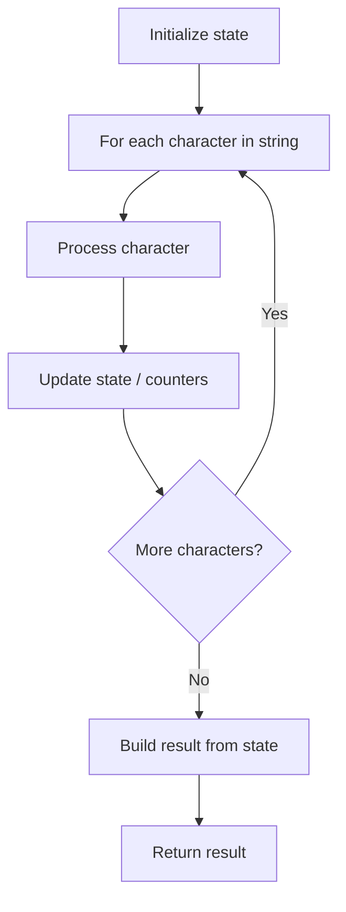

# Problem 1662: Check If Two String Arrays are Equivalent

**Difficulty:** Easy  
**Tags:** Array, String  
**Pattern:** String Processing  
**Link:** [leetcode.com/problems/check-if-two-string-arrays-are-equivalent](https://leetcode.com/problems/check-if-two-string-arrays-are-equivalent/)

## Description

Given two string arrays `word1` and `word2`, return* *`true`* if the two arrays **represent** the same string, and *`false`* otherwise.*

A string is **represented** by an array if the array elements concatenated **in order** forms the string.

 

Example 1:

```

**Input:** word1 = ["ab", "c"], word2 = ["a", "bc"]
**Output:** true
**Explanation:**
word1 represents string "ab" + "c" -> "abc"
word2 represents string "a" + "bc" -> "abc"
The strings are the same, so return true.
```

Example 2:

```

**Input:** word1 = ["a", "cb"], word2 = ["ab", "c"]
**Output:** false

```

Example 3:

```

**Input:** word1  = ["abc", "d", "defg"], word2 = ["abcddefg"]
**Output:** true

```

 

**Constraints:**

	- `1 <= word1.length, word2.length <= 10^3`
	- `1 <= word1[i].length, word2[i].length <= 10^3`
	- `1 <= sum(word1[i].length), sum(word2[i].length) <= 10^3`
	- `word1[i]` and `word2[i]` consist of lowercase letters.

## Approach: String Processing

Process the string character by character. Common techniques: two pointers, sliding window, hash map for frequencies, stack for matching.

## Pseudocode

```
1. Initialize result / tracking state
2. Iterate through string characters:
   a. Process character based on rules
   b. Update state (counters, pointers, stack)
3. Build and return result
```

## Algorithm Flow



## Complexity Analysis

- **Time:** O(n)
- **Space:** O(n)

## Solution (Python3)

```python
class Solution:
    def arrayStringsAreEqual(self, word1: List[str], word2: List[str]) -> bool:
        # String processing approach - O(n) time
        result = []
        for ch in word1:
            if ch.isalnum():
                result.append(ch.lower())
        # Check palindrome or process
        processed = ''.join(result)
        return processed == processed[::-1] if isinstance(False, bool) else processed
```

## Solution (C++)

```cpp
#include <algorithm>
#include <cctype>
#include <string>
#include <vector>
using namespace std;

class Solution {
public:
    bool arrayStringsAreEqual(vector<string>& word1, vector<string>& word2) {
        // String processing approach - O(n) time
        string processed;
        for (char ch : word1) {
            if (isalnum(ch)) {
                processed += tolower(ch);
            }
        }
        string rev = processed;
        reverse(rev.begin(), rev.end());
        return processed == rev;
    }
};
```
