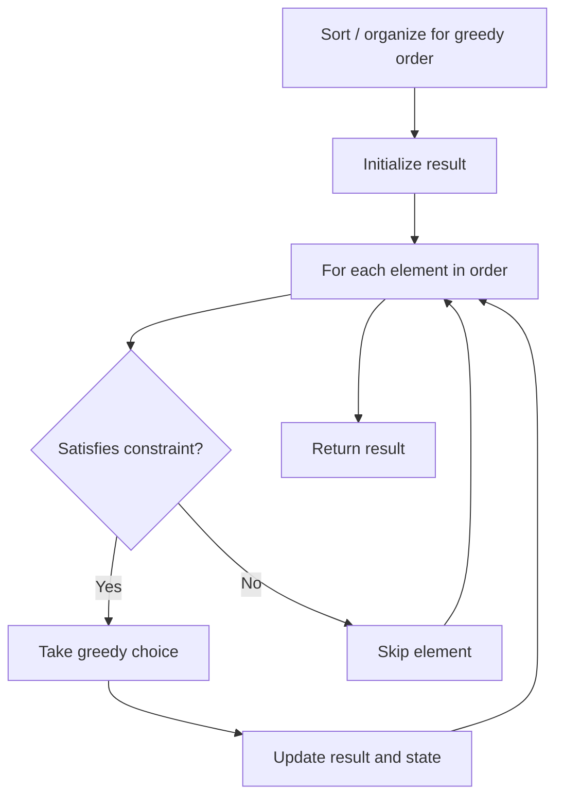

# Problem 1663: Smallest String With A Given Numeric Value

**Difficulty:** Medium  
**Tags:** String, Greedy  
**Pattern:** Greedy  
**Link:** [leetcode.com/problems/smallest-string-with-a-given-numeric-value](https://leetcode.com/problems/smallest-string-with-a-given-numeric-value/)

## Description

The **numeric value** of a **lowercase character** is defined as its position `(1-indexed)` in the alphabet, so the numeric value of `a` is `1`, the numeric value of `b` is `2`, the numeric value of `c` is `3`, and so on.

The **numeric value** of a **string** consisting of lowercase characters is defined as the sum of its characters' numeric values. For example, the numeric value of the string `"abe"` is equal to `1 + 2 + 5 = 8`.

You are given two integers `n` and `k`. Return *the **lexicographically smallest string** with **length** equal to `n` and **numeric value** equal to `k`.*

Note that a string `x` is lexicographically smaller than string `y` if `x` comes before `y` in dictionary order, that is, either `x` is a prefix of `y`, or if `i` is the first position such that `x[i] != y[i]`, then `x[i]` comes before `y[i]` in alphabetic order.

 

Example 1:

```

**Input:** n = 3, k = 27
**Output:** "aay"
**Explanation:** The numeric value of the string is 1 + 1 + 25 = 27, and it is the smallest string with such a value and length equal to 3.

```

Example 2:

```

**Input:** n = 5, k = 73
**Output:** "aaszz"

```

 

**Constraints:**

	- `1 <= n <= 10^5`
	- `n <= k <= 26 * n`

## Approach: Greedy

Make the locally optimal choice at each step, trusting it leads to a global optimum. Greedy works when the problem has the greedy-choice property and optimal substructure.

## Pseudocode

```
1. Sort or organize data for greedy ordering
2. Initialize result
3. For each element in greedy order:
   a. If element satisfies constraint:
      - Take the greedy choice
      - Update result and state
4. Return result
```

## Algorithm Flow



## Complexity Analysis

- **Time:** O(n log n)
- **Space:** O(1)

## Solution (Python3)

```python
class Solution:
    def getSmallestString(self, n: int, k: int) -> str:
        # Greedy approach - O(n) time
        result = 0
        curr_max = 0
        for i in range(len(n)):
            if isinstance(n[i], int):
                curr_max = max(curr_max, n[i])
                result = max(result, curr_max)
            else:
                result += 1
        return result
```

## Solution (C++)

```cpp
#include <algorithm>
#include <string>
#include <vector>
using namespace std;

class Solution {
public:
    string getSmallestString(int n, int k) {
        // Greedy approach - O(n) time
        int result = 0, curr_max = 0;
        for (int i = 0; i < (int)n.size(); i++) {
            curr_max = max(curr_max, n[i]);
            result = max(result, curr_max);
        }
        return result;
    }
};
```
